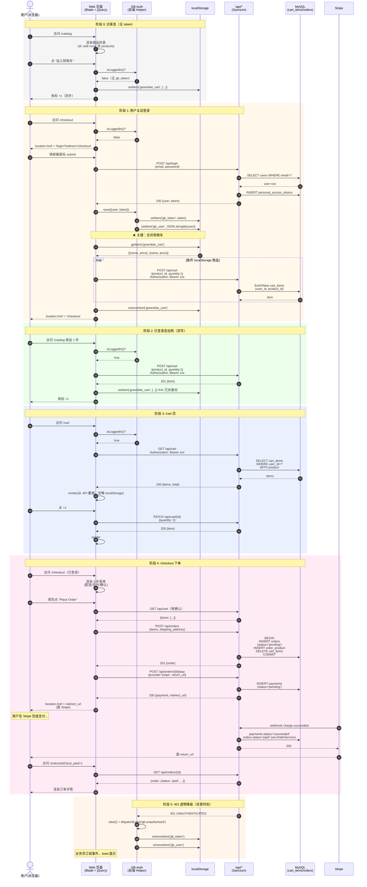

# ADR-0007: Web 端下单与支付链路打通（双轨制数据流）

> **元信息**：作者 architect-agent (bravo) | 版本 1.0 | 日期 2026-06-15 (Asia/Hong_Kong)
> **框架**：fdd-bmad-custom（Architect 阶段产物：Architecture Decision Record）
> **基线状态**：Sprint 1 Week 2 起草，状态：已提议
> **评审触发**：`STATUS-UPDATE-2026-06-12-v1.2.md` §"Web 前端链路断裂" + `DAY5-GAP-REPORT-2026-06-15.md` §3
> **关联文档**：
> - `docs/bmad/api-contract.md` §2.1（Auth）、§2.4（Cart）、§2.5（Order）
> - `docs/bmad/architecture.md` §3 鉴权层（Sanctum token 模式）
> - `docs/bmad/order-state-machine.md` 附录 A（7 态 SSOT）
> - ADR-0005（订单状态机）、ADR-0006（AI 菜单缓存）

---

## §1 背景与现状问题（Context）

Sprint 1 已交付"完整 API 后端"（`Api/AuthController`、`Api/CartController`、`Api/OrderController` + 6 张核心 migrations + 7 态订单状态机），但**前端 Web 链路仍停留在 Day 0 假数据状态**，导致"商品浏览 → 加购 → 看购物车 → 下单 → 支付"主路径走不通。Day 5 站会已识别此为 P0 阻断项。

经逐文件事实核查（路径：`D:/FreshToday-AI/`），确认以下 4 个明确的"假链路点"：

### §1.1 现状问题清单

| # | 文件:行 | 问题类型 | 详细描述 | 影响范围 |
|---|---|---|---|---|
| 1.1.a | `routes/web.php:25-27` | 路由占位 | `GET /cart` 直接 `return view('welcome')`，**没有挂到 cart 模板** | 用户访问 `/cart` 看到的是首页（绿色 banner + 假新闻），与导航栏"购物车"按钮语义不符 |
| 1.1.b | `resources/views/catalog.blade.php:21` | **字段名错误（运行时崩）** | 模板写 `$product->carbonFootprint`（驼峰），但 `Product` 模型 `$fillable` 与 DB 列均为 `carbon_footprint`（snake_case）。Eloquent 默认不做 camelCase 转换，访问会抛 `Undefined property: Product::$carbonFootprint` | **`/catalog` 整个页面 500**，商品列表 0 张能渲染（Day 2 之后未做端到端校验） |
| 1.1.c | `resources/views/cart.blade.php` 整体 | 模板已就绪但未挂 | 文件 257 行完整实现（聚合 / 数量增减 / 删除 / 免运费进度条 / lucide 图标），但 `routes/web.php` 第 25 行没引用 → **死代码** | 实际不可达；同时模板里用 `localStorage('greenbite_cart')` 假购物车 |
| 1.1.d | `resources/views/auth.blade.php:64-68` | 假鉴权交互 | 表单 submit 后 `alert('Simulating Login...')` + `location.href = '/catalog'`，**完全没有打 `/api/login`** | 用户即使填了正确账号密码也无法获取 Sanctum token；后续 `Authorization: Bearer` 永远是空 |
| 1.1.e | `resources/views/checkout.blade.php:349-366` | 假下单链路 | `placeOrder()` 用 `setTimeout(2000)` 模拟"处理中"，然后 `localStorage.removeItem('greenbite_cart')` + 生成 `GB-XXX` 假订单号 + `goStep(4)` 显示成功页 | **从未真正调用 `/api/orders` POST** → 库存不会扣、订单不会落库、支付不会触发；且 `/checkout` 路由根本没注册（`web.php` 全文搜不到） |

### §1.2 根因分析

1. **后端 API 已就绪但前端未对接**：Sprint 0~Sprint 1 Week 1 重心在领域逻辑（订单状态机 / 支付幂等 / AI 缓存），Web 模板是 Day 0 写死的假数据 demo，未在 Sprint 1 列入 backlog。
2. **"无 Vite 构建"的开发范式**：项目 `public/` 目录没有构建产物，所有 JS 通过 CDN jQuery + `<script>` 内联在 Blade 里（参见 `resources/views/cart.blade.php:110-255` 254 行内联脚本）。这种"全栈 Blade"范式下，**前端鉴权只能走 web session 或前端 JS 调 API 两条路**——而 `bootstrap/app.php:20` 显式注释了"不启用 statefulApi()"，确认走 token 鉴权，所以前端 JS 必须自己存 token。
3. **未登录态没人管**：用户从 `/catalog` 加购直接写 localStorage，整条路径从未触发"未登录态需要登录"的分叉。

### §1.3 业务诉求

| 诉求 | 优先级 | 验收信号 |
|---|---|---|
| 用户能在 Web 端完成"浏览→加购→结算→支付"主路径 | P0 | 端到端测试：未登录加购 1 件商品 → 跳登录 → 登录后购物车保留 → 跳结算 → 调起支付 → 收到 Stripe webhook → 订单状态变 `paid` |
| 前后端解耦：Web 是"薄壳"，核心业务全在 API | P0 | Web 控制器 ≤ 50 行 / 端点；任何业务字段改 1 处（API）即生效 |
| 兼容现状 localStorage 体验（已能加购） | P1 | 未登录访客加购行为与今天 100% 一致，不破坏 Day 0 demo |
| 支持登录瞬间合并 localStorage 购物车到后端 | P1 | 登录成功后跳转 `/cart`，看到的商品数 = localStorage 数 + 后端已存数 |

### §1.4 不在本 ADR 范围

- **AI 菜单生成链路**（`/survey` → `/dashboard`）：与本 ADR 正交，留 ADR-0006 范围
- **订阅链路**（`/subscriptions`）：与本 ADR 正交，留 Sprint 2 处理
- **管理后台**：完全不在 MVP 范围
- **真实 Stripe 联调**：本 ADR 只到"调起支付 + return_url 跳转"为止；webhook 落库与幂等已由 `PaymentService` 覆盖（参见 ADR-0004），不重复决策

---

## §2 决策（Decision）

我们采用 **"双轨制数据流 + Sanctum token 透明降级"** 方案：未登录态走 localStorage（保留现有 demo 体验），已登录态走 `/api/cart`（真实持久化），登录瞬间合并两轨。

### §2.1 双轨制核心规则

| 触发动作 | 未登录态（无 token） | 已登录态（有 token） |
|---|---|---|
| `/catalog` 加购 | 写 `localStorage('greenbite_cart')` | **同时**写 localStorage **+** POST `/api/cart` |
| `/cart` 列表渲染 | 从 localStorage 读 + 聚合 | 从 `/api/cart` GET 读（忽略 localStorage） |
| `/cart` 数量增减 | 操作 localStorage | PATCH `/api/cart/{id}` |
| `/cart` 删除 | 操作 localStorage | DELETE `/api/cart/{id}` |
| `/checkout` 访问 | 强制跳 `/login?redirect=/checkout` | 渲染结算页 |
| `/checkout` 下单 | 不可达（被守卫） | POST `/api/orders` → POST `/api/orders/{id}/pay` → 跳 `return_url` |
| `/login` 成功 | — | **合并购物车**：遍历 localStorage items → POST `/api/cart` → 清 localStorage → 跳原目标页 |
| `/logout` | — | POST `/api/logout` + 清 `gb_token` + 清 `gb_user` + 保留 `greenbite_cart`（匿名降级） |

### §2.2 鉴权透明层（Auth Helper）

新建前端 `AuthHelper`（建议内联到 `resources/views/layouts/app.blade.php` 的 `<script>` 块，所有页共享），核心 API：

```js
// 伪代码，仅描述行为契约（实施由 Golf 完成）
window.GB = window.GB || {};

GB.Auth = {
  getToken()       { return localStorage.getItem('gb_token'); },
  getUser()        { return JSON.parse(localStorage.getItem('gb_user') || 'null'); },
  isLoggedIn()     { return !!this.getToken(); },
  save({user, token}) {
    localStorage.setItem('gb_token', token);
    localStorage.setItem('gb_user', JSON.stringify(user));
  },
  clear() {
    localStorage.removeItem('gb_token');
    localStorage.removeItem('gb_user');
  },
  async logout() {
    if (this.getToken()) {
      try { await fetch('/api/logout', { method:'POST', headers: this.authHeader() }); }
      catch (e) { /* swallow; we still want to clear locally */ }
    }
    this.clear();
    window.location.href = '/';
  },
  authHeader() {
    const t = this.getToken();
    return t ? { 'Authorization': 'Bearer ' + t, 'Accept':'application/json' } : { 'Accept':'application/json' };
  },
  async apiFetch(path, opts = {}) {
    const res = await fetch(path, { ...opts, headers: { ...this.authHeader(), ...(opts.headers||{}) } });
    if (res.status === 401) {
      this.clear();
      // 业务层负责决定跳不跳登录页；这里只发事件
      window.dispatchEvent(new CustomEvent('gb:unauthorized'));
    }
    return res;
  },
};
```

**关键约束**：
- 所有 web 页面发起的 API 请求**统一走 `GB.Auth.apiFetch()`**，禁止散落 `$.ajax` 各自拼 header
- 401 是**事件**不是跳转：业务层订阅 `gb:unauthorized` 决定如何提示（详情见 §6 风险点）
- `gb_token` 与 `gb_user` 是约定的两个 localStorage key（`gb_` 前缀避免与业务 key 冲突，`greenbite_cart` 是业务 key 保持原状）

### §2.3 关键设计点：登录态加购的"双写 + 后端为准"

为什么"加购要同时写 localStorage + API"而不是"只在登录时切到 API"？理由：

1. **页面无刷新**：用户加购后立刻看到角标 +1，不应因网络慢就感知不到
2. **离线降级**：API 失败时（500 / 网络断），localStorage 至少保留意图，刷新页面不会丢
3. **合并算法简单**：登录瞬间用 localStorage 列表与 `/api/cart` 做"按 product_id 取大"的合并（`max(localStorage.qty, server.qty)`），避免重复

**反例**：如果只在登录态写 API，则未登录态加购 → 登录 → 合并 = 0 步，简单；但用户体验是"加购有延迟感"，违背 §1.3 P0 验收第 1 条。

### §2.4 状态切换点速查

| 事件 | 切换动作 | 文件位置 |
|---|---|---|
| 用户成功 `POST /api/login` | `GB.Auth.save()` + 合并购物车 + 跳 `?redirect=` | `resources/views/auth.blade.php`（待改） |
| 任意 `apiFetch` 返 401 | `GB.Auth.clear()` + 发 `gb:unauthorized` 事件 | `GB.Auth.apiFetch()` |
| 任何 `cart.apiFetch` 返 409 OUT_OF_STOCK | 提示 + 回滚 localStorage 该商品 | `GB.Cart` 抽象（详情见 §4） |

---

## §3 鉴权流程（Sign Up / Sign In / 401 / Logout）

### §3.1 注册（POST /api/register）

**前端流程**（`resources/views/auth.blade.php` 第 64 行 submit handler 改造）：

```
1. 用户填 name / email / password / password_confirmation / address（注册时显示）
2. JS 拦截 submit，preventDefault
3. POST /api/register
   body: { name, email, password, password_confirmation, locale: 'zh-HK' }
   header: GB.Auth.authHeader()  // 此时无 token，只发 Accept
4. 成功后：res.json() → { user, token }
5. GB.Auth.save({ user, token })
6. POST /api/cart/merge-from-local  ← 见 §6 风险点 P2；或前端循环 POST /api/cart
7. localStorage.removeItem('greenbite_cart')
8. window.location.href = (new URLSearchParams(location.search)).get('redirect') || '/catalog'
```

**后端契约**（已在 `app/Http/Controllers/Api/AuthController.php:21-44` 实现，**无需改**）：
- 返 201 + `{ user, token }`
- `user` 包含 `id / name / email / locale`
- `token` 是 Sanctum `createToken('api')->plainTextToken`（格式 `id|secret`）

### §3.2 登录（POST /api/login）

**前端流程**：

```
1. 用户填 email / password
2. POST /api/login
   body: { email, password }
3. 成功后同上 §3.1 第 4-8 步
4. 失败 401：display 'INVALID_CREDENTIALS' 错误（不弹 alert，原地显示）
5. 失败 422：display 字段级错误（email 格式 / 密码长度）
```

**后端契约**（`AuthController.php:46-66` 已有）：返 200 + `{ user, token }`；401 + `{ error: { code: 'INVALID_CREDENTIALS' } }`

### §3.3 401 全局处理

```
GB.Auth.apiFetch() 内部:
  if (res.status === 401) {
    GB.Auth.clear();
    window.dispatchEvent(new CustomEvent('gb:unauthorized', { detail: { path } }));
  }

业务页订阅（建议在 layouts/app.blade.php 注册一次）:
  window.addEventListener('gb:unauthorized', (e) => {
    // 静默处理：弹 toast，不强制跳
    showToast('登录已过期，请重新登录', 'warning');
    updateNavUI(); // 显示"登录"按钮
  });
```

**不强制跳的理由**：用户可能在长流程中（如结算填到一半），强制跳走会丢表单数据；用 toast 提示 + nav 角标变化即可，**主动权交给用户**。

**例外**：受保护页面（`/checkout`）的 401 由页面自己的控制器守卫处理（见 §5）。

### §3.4 登出（POST /api/logout）

**前端流程**（navbar 右上角"登出"按钮）：

```
1. 用户点 logout
2. GB.Auth.logout()  // 见 §2.2 伪代码
   - if token: POST /api/logout（撤销 Sanctum token，AuthController.php:68-73）
   - 不论成功失败都 GB.Auth.clear()
3. 保留 localStorage('greenbite_cart')  // 用户可继续以匿名态浏览
4. 跳 '/' 或当前页
```

**后端契约**（已有）：`POST /api/logout` 返 204；需要 `auth:sanctum` 中间件
- 错误码 401：token 已过期或被撤销，GB.Auth.clear() 兜底

### §3.5 跨域 / CSRF 备忘

| 调用方 | 鉴权方式 | 是否需要 CSRF token | 备注 |
|---|---|---|---|
| Web 页面 → `/api/*`（POST/PATCH/DELETE） | Bearer token | **否** | API 是 stateless 鉴权，CSRF 中间件不挂 API 路由（参见 `bootstrap/app.php:18-22`） |
| Web 页面 → `/checkout`（POST，web 路由） | web session | **是** | web 路由默认有 `web` 中间件组（含 `VerifyCsrfToken`），需 `<form>` 内 `@csrf` 或 `headers: { 'X-CSRF-TOKEN': csrfToken }` |
| 第三方 → `/api/webhooks/stripe` | HMAC 签名 | **否** | 参见 ADR-0004 签名校验 |

本 ADR 涉及的"前端调 `/api/*`"全部走 Bearer token，**完全不需要 CSRF**。

---

## §4 /cart 路由新行为

### §4.1 路由层（`routes/web.php` 改造）

```php
// 原
Route::get('/cart', function () { return view('welcome'); });  // L25-27

// 新
Route::get('/cart', [\App\Http\Controllers\Web\CartController::class, 'show']);
// 不需要路由中间件：前端 JS 自己判断登录态
```

新建 `app/Http/Controllers/Web/CartController.php`（**仅作视图壳**）：

```php
class CartController extends Controller
{
    public function show()
    {
        // 不读数据，只渲染壳；前端 JS 决定从 API 还是 localStorage 拉
        return view('cart');
    }
}
```

**为什么 web controller 这么薄**：避免 web 路由搞 session 鉴权（Sanctum 不开 stateful），所有数据获取由前端 JS 用 Bearer token 调 API。

### §4.2 模板层（`resources/views/cart.blade.php` 改造）

保留现有 257 行布局 + 内联脚本**完全不变**作为"未登录态"路径。**追加**登录态逻辑块（在 `<script>` 末尾、render 之前）：

```js
// 新增代码（仅在登录态时执行）
const isLoggedIn = GB.Auth.isLoggedIn();
let cartSource = 'local';  // 'local' | 'api'

if (isLoggedIn) {
    cartSource = 'api';
    // 覆盖原 getCart/saveCart/changeQty/removeItem 走 API
    async function getApiCart() {
        const res = await GB.Auth.apiFetch('/api/cart');
        if (!res.ok) { cartSource = 'local'; return []; }
        const data = await res.json();
        return data.items.map(i => ({
            id: i.id,                    // 留 CartItem.id 给 PATCH/DELETE
            product_id: i.product_id,
            name: i.product.name,
            price: parseFloat(i.product.price),  // ⚠️ 见 §6 P0：API 返 string，模板要 number
            qty: i.quantity,
            stock: i.product.stock,
        }));
    }
    // ... 覆盖 changeQty/removeItem 调 PATCH/DELETE
    // 初始 await + render
}
```

### §4.3 数据流图（cart 页）

```
                 ┌─────────────────┐
                 │ GET /cart (web) │
                 │ → view('cart')  │
                 └────────┬────────┘
                          │
                ┌─────────┴─────────┐
                │                   │
        GB.Auth.isLoggedIn()?      │
                │                   │
            YES │                   │ NO
                ▼                   ▼
      GET /api/cart         localStorage.getItem
      (Bearer token)        ('greenbite_cart')
                │                   │
                └─────────┬─────────┘
                          ▼
                 统一 aggregate() + render()
                          │
                ┌─────────┴─────────┐
                │                   │
         用户点 +/-/删除           │
                │                   │
            YES │                   │ NO
                ▼                   ▼
       PATCH/DELETE /api/cart   修改 localStorage
                │                   │
                └─────────┬─────────┘
                          ▼
                     重新 render()
```

### §4.4 关键不变量

1. **`greenbite_cart` localStorage key 永不丢**：登录态也保留一份（双写），登出后自动降级可见
2. **登录态以 API 数据为准**：即使 localStorage 里有遗留项，`/cart` 页**忽略**它（避免用户疑惑"为什么页面显示 3 件但支付按钮变 2 件"）
3. **合并逻辑只在登录瞬间发生**（见 §3.1 第 6 步），不在 `/cart` 页发生
4. **API 返 401 立即降级**：从 `api` 切回 `local` 源，并 toast 提示（不丢用户当前在操作的商品）

---

## §5 /checkout 流程

### §5.1 路由层（新增）

```php
// routes/web.php 新增
Route::get('/checkout', [\App\Http\Controllers\Web\CheckoutController::class, 'show'])
    ->name('checkout.show');

// 不需要 POST 路由：结算页表单数据全部走 API
// 但 web 路由默认有 CSRF 中间件，如果未来要做"web form 提交"，需 @csrf
```

新建 `app/Http/Controllers/Web/CheckoutController.php`：

```php
class CheckoutController extends Controller
{
    public function show(Request $request)
    {
        // 未登录：跳 /login?redirect=/checkout
        // 已登录：渲染壳
        // 注意：这里"未登录判断"必须靠客户端发 token 的隐含信号？
        // 不行：web 路由不解析 Authorization header
        // 妥协方案：前端在加载时检查，缺则跳；后端不强求
        return view('checkout');
    }
}
```

**决策：未登录守卫放在前端**。理由：
- Web 路由无 token 解析能力（`auth:sanctum` 中间件挂的是 API 路由组）
- 即使放后端也只检查 cookie（无 session），徒增复杂度
- 前端 `<script>` 顶部 `if (!GB.Auth.isLoggedIn()) location.href = '/login?redirect=/checkout'` 一行解决

### §5.2 模板层（`resources/views/checkout.blade.php` 改造）

保留现有 372 行布局 **删掉** 内联 script 第 209-369 行的所有 `setTimeout` 假下单逻辑，**替换为**真实 API 调用：

```js
// 删除：原 placeOrder() 里的 setTimeout
// 删除：原 initSummary() 里读 URL 参数 total 的兜底（已登录走 API 不需要）
// 新增：
async function placeOrder() {
    const btn = $('#place-order-btn');
    btn.prop('disabled', true).html('<i class="animate-spin">...</i> Processing...');

    try {
        // 1. 拿后端购物车（已登录态保证与后端一致）
        const cartRes = await GB.Auth.apiFetch('/api/cart');
        const { items } = await cartRes.json();
        if (items.length === 0) {
            alert('购物车为空');
            return;
        }

        // 2. 创建订单
        const orderRes = await GB.Auth.apiFetch('/api/orders', {
            method: 'POST',
            headers: { 'Content-Type': 'application/json' },
            body: JSON.stringify({
                items: items.map(i => ({ product_id: i.product_id, quantity: i.quantity })),
                shipping_address: {
                    name:  $('#d-name').val(),
                    phone: $('#d-phone').val(),
                    address: $('#d-address').val(),
                    district: $('#d-district').val(),
                    date: $('#d-date').val(),
                    notes: $('#d-notes').val(),
                },
            }),
        });
        if (!orderRes.ok) throw await orderRes.json();
        const { order } = await orderRes.json();

        // 3. 调起支付
        const payRes = await GB.Auth.apiFetch(`/api/orders/${order.id}/pay`, {
            method: 'POST',
            headers: { 'Content-Type': 'application/json' },
            body: JSON.stringify({
                provider: selectedMethodToProvider(),  // 'card' → 'stripe' 映射
                return_url: `${location.origin}/orders/${order.id}?just_paid=1`,
            }),
        });
        const { redirect_url } = await payRes.json();

        // 4. 跳支付网关
        window.location.href = redirect_url;
    } catch (e) {
        showError(e.error?.message || '下单失败，请重试');
        btn.prop('disabled', false).html('Place Order');
    }
}
```

### §5.3 状态机联动（不动 order-state-machine.md）

下单成功 → 订单 `pending` → `/api/orders/{id}/pay` 返 `redirect_url`（不直接改状态）→ 用户支付 → Stripe webhook → `PaymentService::handleWebhook()` → 状态机转 `paid` → 用户从 return_url 跳回 `/orders/{id}?just_paid=1` → 看到 `paid` 状态。

> 此链路**完全是 API 端的事**，web checkout 模板不碰状态字段。状态机 SSOT 仍是 `docs/bmad/order-state-machine.md` 附录 A 的 7 态，本 ADR 不引入新状态。

### §5.4 支付方式映射

| 前端 `selectedMethod` | API `provider` | 备注 |
|---|---|---|
| `card` | `stripe` | Stripe Checkout（已实现于 `PaymentService::createIntent`） |
| `fps` | `payme` | PayMe HK（mock，参见 ADR-0001 待补） |
| `payme` | `alipay_hk` | Alipay HK（mock） |

**当前 Sprint 1 范围**：仅 `card` → `stripe` 走真实流程；其他两种前端可选但后端 mock 返 `redirect_url` 立即回 `/orders/{id}`。

---

## §6 风险点与对策

| ID | 风险 | 等级 | 对策 | 实施方 |
|---|---|---|---|---|
| **R-P0-01** | `cart.blade.php` 第 21 行 `$product->carbonFootprint` 字段名错，**当前 /catalog 页 500** | P0 | 改 snake_case：`$product->carbon_footprint`（或加 Eloquent `protected $casts` 的 attribute 映射，**不推荐**增加复杂度） | Golf |
| **R-P0-02** | API 返 `product.price` 是 `string`（"99.00"），模板 `parseFloat` 已有，但若漏转会出现 `"99.00 * 2 = "99.002"` 字符串拼接 | P0 | **统一在 `GB.Cart.aggregate()` 入口转 number**；`getApiCart` 显式 `parseFloat(i.product.price)`（已在 §4.2 伪代码标记） | Golf |
| **R-P0-03** | localStorage 购物车没有 product_id（只有 name + price），登录后合并无法精确去重 | P0 | **改造 `addToCart` 数据结构**：localStorage 存 `{ product_id, name, price, qty }`（与 API 对齐）。旧版 `{ name, price }` 数组视为遗留，登录时丢弃 | Golf |
| **R-P1-04** | 登录瞬间合并 N 件商品要发 N 个 POST `/api/cart` 请求，N 大时慢 | P1 | 加后端聚合端点 `POST /api/cart/bulk`（接受 `items: [{product_id, quantity}]`，循环 firstOrNew）；先前端循环实现，Sprint 2 优化 | Bravo（API） + Golf（前端循环兜底） |
| **R-P1-05** | 双写时网络失败：localStorage 写成功 + API 写失败 → 登录后看到 0 件（因为以 API 为准） | P1 | `GB.Cart.add()` 用 `try { await POST } catch { 保留 localStorage }`，并 toast "已加入购物车（离线）"；登录合并时**对失败的 item 重新 POST** | Golf |
| **R-P1-06** | `/checkout` 未登录态跳 `/login`，但用户从 `/cart` 点"Proceed to Checkout"是 GET 跳转，不是表单 POST，不带 CSRF | P1 | 不需要 CSRF（GET 跳 + URL query 参数 `?redirect=`）；web 路由 GET 永远不在 CSRF 范围内 | N/A |
| **R-P2-07** | Sanctum token 长期有效（默认无过期），泄露风险 | P2 | Sprint 2 加 `expiration` 配置（建议 7 天）+ 前端定期 `POST /api/refresh`；本 ADR 不阻塞 | Echo（DevOps 配置） |
| **R-P2-08** | 401 toast 与 401 跳登录逻辑混用，UX 不一致 | P2 | 规则：表单页（`/checkout`、`/subscriptions`）401 → 跳 `/login?redirect=当前页`；浏览页（`/cart`、`/catalog`）401 → toast + nav 按钮变"登录" | Golf |
| **R-P2-09** | `cart.blade.php` 现版本用 `greenbite_cart` 单 key 存"未聚合的原始数组"，与 §2.3 设计的"聚合后存"格式不一致 | P2 | 维持现状不变，§4.2 提到"登录态忽略 localStorage"，所以聚合 vs 原始的格式差异不影响功能 | N/A |
| **R-P2-10** | `/orders` 页（`web.php:21-23`）也是 `return view('orders')` 占位，**同样未通** | P2 | 不在本 ADR 范围（用户当前主诉是 checkout，订单详情页 Sprint 2 再做） | Dev-Sprint 2 |
| **R-P2-11** | `csrf-token` meta tag 是否在 `layouts/app.blade.php` 注入？未确认 | P2 | 检查 `resources/views/layouts/app.blade.php`：若缺 `<meta name="csrf-token">`，补上（虽然本 ADR 走 Bearer 不需要，但后续 web 表单 POST 会用） | Golf |

---

## §7 时序图：登录 → 浏览 → 加购 → 结算（Mermaid）



**图例说明**：
- 灰底 = 访客态
- 黄底 = 登录瞬间合并
- 绿底 = 已登录加购
- 蓝底 = 购物车页
- 粉底 = 结算下单
- 橘底 = 401 降级（可发生在任意阶段）

---

## §8 验收清单（Acceptance Checklist for Golf）

> **给 Golf（dev-agent）**：以下 18 条动作按顺序执行，每条都标了**改哪个文件、做什么、改完验证什么**。**不要求一次完成**，可以分 PR 提。

### §8.1 P0 必修（5 条）

- [ ] **C-01** 改 `resources/views/catalog.blade.php:21`
  - **改动**：`$product->carbonFootprint` → `$product->carbon_footprint`
  - **验证**：`GET /catalog` 返 200，商品卡左上角"leaf + 数字"正常显示
  - **关联**：R-P0-01

- [ ] **C-02** 改 `routes/web.php:25-27`
  - **改动**：`return view('welcome')` → `return view('cart')`（或通过新 `Web\CartController@show` 间接）
  - **验证**：`GET /cart` 渲染 cart 模板（空购物车态显示"Shop Now"按钮）
  - **关联**：§1.1.a / §4.1

- [ ] **C-03** 改 `resources/views/auth.blade.php:64-68`
  - **改动**：删 `alert()` + `location.href`，替换为真实 `POST /api/login`（成功存 token，失败 display 错误）
  - **验证**：用 `test@example.com / password` 登录，Network 看到 `/api/login` 200 + 后续页面 Network 有 `Authorization: Bearer xxx` 头
  - **关联**：§1.1.d / §3.2

- [ ] **C-04** 改 `resources/views/checkout.blade.php:349-366`（`placeOrder()` 函数体）
  - **改动**：删 `setTimeout` 假下单，按 §5.2 伪代码实现真实 3 步（POST orders → POST pay → 跳 redirect_url）
  - **验证**：用 Stripe test card `4242 4242 4242 4242` 完成支付，跳回 `/orders/{id}?just_paid=1` 时订单 status=paid
  - **关联**：§1.1.e / §5.2

- [ ] **C-05** 新建 `app/Http/Controllers/Web/CartController.php` 与 `CheckoutController.php`（薄壳）
  - **改动**：两个文件各 1 个 `show()` 方法（参见 §4.1 / §5.1）
  - **验证**：`php artisan route:list` 看到 `GET /cart` 和 `GET /checkout` 各挂上对应 controller
  - **关联**：§4.1 / §5.1

### §8.2 P1 重要（7 条）

- [ ] **C-06** 在 `resources/views/layouts/app.blade.php` 的 `<script>` 块**内联** `GB.Auth` 完整实现（见 §2.2）
  - **验证**：浏览器 console 输 `GB.Auth.isLoggedIn()` 返回正确布尔

- [ ] **C-07** 把 `resources/views/cart.blade.php:111-254` 内联脚本里所有 `fetch` / `$.ajax`（如有）改为 `GB.Auth.apiFetch()`
  - **验证**：登录后访问 `/cart`，Network 看 `/api/cart` 请求带 Bearer header

- [ ] **C-08** 在 `resources/views/cart.blade.php` 追加"已登录态"分支（见 §4.2 伪代码）
  - **关键**：登录态用 `getApiCart()` 覆盖原 `getCart()`，数量增减走 PATCH/DELETE
  - **验证**：登录后 `/cart` 显示的商品名/价/库存 = API 返的（不是 localStorage 的）

- [ ] **C-09** 在 `resources/views/checkout.blade.php:210` 顶部加未登录守卫
  - **改动**：`if (!GB.Auth.isLoggedIn()) { location.href = '/login?redirect=' + encodeURIComponent(location.pathname); return; }`
  - **验证**：登出态访问 `/checkout` → 跳 `/login?redirect=/checkout` → 登录成功 → 自动跳回 `/checkout`

- [ ] **C-10** 实现 `GB.Cart.mergeFromLocal()`（登录瞬间）
  - **逻辑**：遍历 `greenbite_cart` → 每个 item POST `/api/cart {product_id, quantity:1}` → 完成后 `removeItem`
  - **验证**：未登录加 2 件 → 登录 → 跳 `/cart` → API 返 2 件（不丢）
  - **关联**：§3.1 / R-P1-04

- [ ] **C-11** 在 navbar（layouts/app.blade.php）添加"登出"按钮（已登录态显示）
  - **改动**：调 `GB.Auth.logout()`，跳 `/`
  - **验证**：登出后 `localStorage.getItem('gb_token') === null` 且 `/api/cart` 调 401

- [ ] **C-12** 在 `resources/views/catalog.blade.php:29` 的 `addToCart(this.dataset.name, this.dataset.price)` 改造
  - **改动**：函数签名加 `productId` 参数；已登录态双写（localStorage + POST /api/cart）
  - **验证**：登录后点加购，Network 看 `POST /api/cart` 201 + 数据库 `cart_items` 新增一行
  - **关联**：§2.1 / §2.3

### §8.3 P2 锦上添花（6 条）

- [ ] **C-13** 改造 `localStorage('greenbite_cart')` 数据结构为 `[{product_id, name, price, qty}]`
  - **改动**：`addToCart` / `saveCart` / `getCart` / `aggregate` 全部适配
  - **验证**：合并登录时能精确按 product_id 去重（不依赖 name 字符串）
  - **关联**：R-P0-03

- [ ] **C-14** 401 全局事件订阅
  - **改动**：在 `layouts/app.blade.php` 底部 `<script>` 注册 `window.addEventListener('gb:unauthorized', ...)`，toast 提示
  - **验证**：手动 `localStorage.setItem('gb_token','fake')` 后访问 `/cart`，看到 toast "登录已过期"
  - **关联**：§3.3

- [ ] **C-15** 错误码统一显示
  - **改动**：把现有 `alert()` 全替换为页面内嵌 `<p class="text-red-500">`（按错误码映射文案，参见 `docs/bmad/api-contract.md` §1.2）
  - **验证**：登录失败 401 → 显示"邮箱或密码错误"（不弹 alert）

- [ ] **C-16** 检查 `resources/views/layouts/app.blade.php` 是否有 `<meta name="csrf-token" content="{{ csrf_token() }}">`
  - **若无**：补上（本 ADR 不强求，但未来 web form POST 用得上）

- [ ] **C-17** 写一个 e2e 测试用例 `tests/E2E/CheckoutFlowTest.php`（建议 Dusk 或纯 HTTP）
  - **场景**：注册 → 加购 2 件 → checkout → mock Stripe webhook → 断言 `orders.status='paid'`
  - **验证**：`php artisan test --filter=CheckoutFlowTest` 通过
  - **关联**：§1.3 P0 验收信号

- [ ] **C-18** 更新 `docs/bmad/api-contract.md` §2 端点总览表
  - **改动**：在 §1.2 错误码字典补 `INVALID_SIGNATURE 401`（P2-02 已挂 backlog）
  - **验证**：Foxtrot 评审通过

---

## §9 后续 ADR 候选（不在本 ADR 范围）

| 候选 ADR | 触发时机 | 内容 |
|---|---|---|
| ADR-0008 | Sprint 2 | Sanctum token 过期 + refresh 机制 |
| ADR-0009 | Sprint 2 | 后端 `POST /api/cart/bulk` 批量端点设计（替代前端 N 次循环） |
| ADR-0010 | Sprint 2 | 订单详情页 `/orders/{id}` 渲染策略（SSR 拉 vs SPA 拉） |
| ADR-0011 | Sprint 3 | 支付网关扩展（PayMe / Alipay HK）真实接入流程 |

---

## §10 评审与合并

- **评审人**：Foxtrot（reviewer-agent）
- **评审要点**：
  1. §2.3 双写策略是否会带来"两边数据不一致"问题 → 已通过 §4.2 "登录态以 API 为准"对冲
  2. §3.3 401 仅 toast 不跳转是否影响业务 → 已通过 §6 R-P2-08 区分"表单页 vs 浏览页"对冲
  3. §5.4 支付方式映射 `card → stripe` 是否需要前端先检查 `provider` 启用状态 → 不需要（PaymentService 已做 enable 检查）
- **合并阻塞**：必须 Bravo 完成 §4.1 / §5.1 web 控制器骨架后，Golf 才有 `Web\CartController@show` 可挂
- **回滚预案**：本 ADR 仅触及 web 路由 + Blade 模板 + 新建 web controller，**不动 API 任何代码**。回滚 = `git revert` PR 即可，无 DB migration 影响

---

## §11 变更日志

| 版本 | 日期 | 作者 | 变更 |
|---|---|---|---|
| 1.0 | 2026-06-15 | architect-agent (bravo) | 初稿：基于 Day 5 站会识别的"web 端下单链路断裂"问题起草 |

---

*— ADR-0007 维护：architect-agent · 2026-06-15 14:20 HKT · fdd-bmad-custom Architect 阶段产物*
