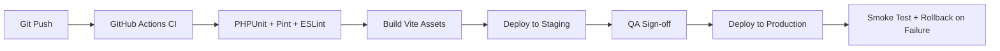

> **元信息**：创建人 architect-agent | 版本 v0.1 (Sprint 0) | 日期 2026-06-12
> **框架**：fdd-bmad-custom（BMAD 生命周期：Business → Model → Architect → Deliver）

# GreenBite 系统架构总览（architecture.md）

## 1. 架构目标

GreenBite（FreshToday-AI）是面向香港本地市场的有机农产品 + AI 个性化菜单订阅电商平台。Sprint 0 目标：

- 跑通"用户注册 → 健康问卷 → AI 生成今日菜单 → 购物车下单 → 支付 → 订阅复购"主链路
- 在 Laravel 12 + MySQL 8 之上保持 LAMP 风格的低运维成本
- 预留 LLM（Gemini API）调用通道与未来多租户/多区域扩展点

## 2. 系统架构图（请求流）

```mermaid
flowchart LR
    subgraph Client["浏览器 (Browser)"]
        UI[Blade + jQuery + Tailwind 4]
    end

    subgraph Edge["Web 边缘层"]
        Nginx[Nginx / Apache]
    end

    subgraph App["Laravel 12 应用层"]
        MW[Middleware: Auth / Locale / Throttle]
        Route[Router: routes/web.php & routes/api.php]
        Ctrl[Controllers: app/Http/Controllers]
        Svc[Services: app/Services]
        Mod[Models: app/Models (Eloquent)]
    end

    subgraph Data["数据与外部服务"]
        MySQL[(MySQL 8 主库)]
        Redis[(Redis 缓存/会话/队列)]
        Gemini[Gemini 2.5 Flash API]
        Pay[支付网关 (Stripe / PayMe 占位)]
    end

    UI -->|HTTP/HTML + jQuery AJAX| Nginx
    Nginx --> MW
    MW --> Route
    Route --> Ctrl
    Ctrl --> Svc
    Svc --> Mod
    Mod <-->|Eloquent ORM| MySQL
    Svc <-->|Cache / Session / Queue| Redis
    Svc -->|HTTPS POST:generateContent| Gemini
    Svc -->|Webhook + Redirect| Pay
    Pay -->|异步回调| Svc
```

**关键链路说明**

| 链路 | 用途 | 延迟目标 |
|---|---|---|
| Browser → Nginx → Laravel | 页面渲染 (SSR Blade) | < 200ms |
| Browser → Laravel API (JSON) | 购物车 / 订单 / 订阅交互 | < 300ms |
| Laravel → Gemini | AI 菜单生成 | < 3s（含降级 fallback） |
| Laravel → MySQL | 业务读写 | < 50ms |
| Laravel → Redis | Session / 菜单缓存 | < 10ms |

## 3. 模块划分（基于 Laravel 目录）

```mermaid
graph TD
    Root[app/]
    Root --> Http[Http/]
    Root --> Models[Models/]
    Root --> Services[Services/]
    Root --> Providers[Providers/]

    Http --> Ctrls[Controllers/]
    Http --> Req[Requests/ - FormRequest 验证]
    Http --> Res[Resources/ - API 资源转换]

    Ctrls --> AuthCtrl[AuthController]
    Ctrls --> ProductCtrl[ProductController]
    Ctrls --> SurveyCtrl[SurveyController]
    Ctrls --> CartCtrl[CartController]
    Ctrls --> OrderCtrl[OrderController]
    Ctrls --> MenuCtrl[MenuController]
    Ctrls --> SubCtrl[SubscriptionController]
    Ctrls --> PayCtrl[PaymentController]

    Models --> User[User]
    Models --> Product[Product / Category]
    Models --> Order[Order / OrderProduct]
    Models --> Sub[SubscriptionPlan / UserSubscription]
    Models --> Pref[UserPreference / DailyMenu]
    Models --> Cart[CartItem / Coupon]
    Models --> Pay[Payment / PointsTransaction]

    Services --> AiSvc[AiMenuService - Gemini 集成]
    Services --> OrderSvc[OrderService - 状态机驱动]
    Services --> SubSvc[SubscriptionService - 周期履约]
    Services --> PaySvc[PaymentService - 支付编排]
    Services --> NotifSvc[NotificationService - 邮件/推送]
```



**职责边界**

- `Controllers`：请求入口、参数校验、返回响应，不写业务逻辑
- `Services`：领域逻辑编排、跨模型事务、外部 API 封装
- `Models`：Eloquent 关系 + 访问器/修改器 + 局部作用域，禁止直接调外部服务
- `Requests/Resources`：输入校验与输出序列化层

## 4. 关键技术决策（ADR 摘要）

> 全量 ADR 见 `docs/bmad/adr/`（后续 Sprint 补全），本节列出 MVP 5 条关键决策。

### ADR-001：采用 Laravel 12 + 传统 Blade SSR，不引入 SPA 前端框架

- **背景**：MVP 优先 SEO、首屏速度与团队 jQuery 熟练度
- **决策**：服务端 Blade 模板 + 局部 jQuery 增强；交互复杂的购物车/订单用 AJAX 局部刷新
- **影响**：降低前端工程复杂度；SEO 友好；后续可渐进迁移到 Inertia/Vue

### ADR-002：MySQL 8 作为主存储 + Redis 作为缓存/会话层

- **背景**：商品、订单、订阅均需强事务保证
- **决策**：MySQL 8 (utf8mb4_0900_ai_ci, 8.0.36+) 主库，Redis 7 仅做 session / 队列 / 缓存
- **影响**：不依赖 PG 特有特性；分库分表延后到 Q3

### ADR-003：AI 菜单生成走 Gemini 2.5 Flash + Fallback 模板

- **背景**：AI 是核心差异化能力，但 API 不稳定且有成本
- **决策**：默认 `gemini-2.5-flash`，结果缓存 24h；调用失败或无 key 时降级为本地模板
- **影响**：用户感知 0 中断；token 成本可控；可平滑切换到自托管模型

### ADR-004：订单状态机驱动而非状态字段自由更新

- **背景**：订单涉及支付/库存/履约，强一致性要求高
- **决策**：见 `order-state-machine.md`；状态变更必须经 `OrderService::transition()`，触发器/守卫/回滚统一在 Service 层
- **影响**：避免"已发货又被取消"等非法态；审计日志可追溯

### ADR-005：订阅系统以"周期快照"而非"实时重算"实现

- **背景**：订阅履约 = 每周期生成订单 + 扣库存 + 扣支付
- **决策**：用户订阅时生成 `subscription_plan_product` 快照；每周期由队列任务 `SubscriptionFulfillJob` 生成新订单
- **影响**：计划变更不影响历史订单；队列失败可重试且幂等

## 5. 部署架构（三环境）

```mermaid
flowchart TB
    subgraph Dev["开发环境 (local)"]
        DevFE[php artisan serve :8000]
        DevBE[npm run dev :5173]
        DevDB[(MySQL 8 docker)]
        DevCache[(Redis docker)]
    end

    subgraph Staging["测试环境 (staging)"]
        StFE[Nginx + PHP-FPM :8080]
        StBE[Vite 静态资源]
        StDB[(MySQL 8 RDS)]
        StCache[(Redis ElastiCache)]
        StQueue[Queue Worker]
    end

    subgraph Prod["生产环境 (production)"]
        PrFE[Nginx + PHP-FPM × 2 (蓝绿)]
        PrBE[CDN 静态资源]
        PrDB[(MySQL 8 主从)]
        PrCache[(Redis Cluster)]
        PrQueue[Queue Worker × 2]
        PrObs[Prometheus + Grafana + Sentry]
    end
```

| 环境 | 用途 | 数据库 | 队列 | 监控 |
|---|---|---|---|---|
| **Dev** (local) | 开发者本地 | Docker MySQL 8 | `QUEUE_CONNECTION=sync` | xdebug + pail |
| **Staging** (HK-1) | QA / UAT / 预发 | RDS MySQL 8 t3.medium | Redis 队列 | Sentry staging |
| **Production** (HK-1) | 上线 | RDS MySQL 8 主从 + 自动备份 | Redis Cluster + 多消费者 | Sentry + Prometheus + Grafana + 业务告警 |

**部署流水线（占位）**



## 6. 非功能性需求（NFR）摘要

| 维度 | 目标 |
|---|---|
| 可用性 | 99.5%（生产） |
| 首屏 TTFB | < 200ms（staging） |
| API P95 | < 500ms（不含 AI） |
| AI 菜单 P95 | < 3s（含 fallback） |
| 数据备份 | RPO 1h / RTO 4h |
| 安全 | OWASP Top 10 基线 + CSRF + XSS + SQL 注入防护（Laravel 内建） |

## 7. 后续 Sprint 风险与待办

- **Sprint 1**：补全 Cart / Order / Subscription 控制器与 Service
- **Sprint 2**：支付网关集成（Stripe / PayMe），需要财务侧确认
- **Sprint 3**：Admin 后台（库存/订单/退款）
- **风险**：Gemini API 速率限制 → 已设计 fallback；香港 RDS 网络延迟 → 已选择 HK-1 区域
