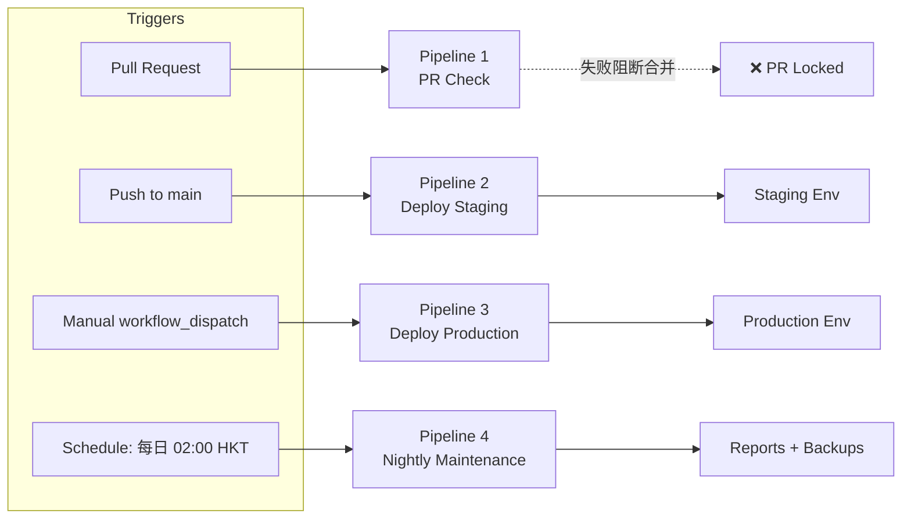

# GreenBite CI/CD 流水线 (Continuous Integration & Delivery)

| 字段 | 值 |
| --- | --- |
| 文档编号 | GB-OPS-CICD-001 |
| 创建人 | devops-agent |
| 版本 | 1.0.0 |
| 日期 | 2026-06-12 |
| 关联框架 | fdd-bmad-custom (BMAD Ops Domain) |
| 平台 | GitHub Actions |
| 目标 | PR / Staging / Production / Nightly 全链路自动化 |

---

## 1. 流水线总览



| Pipeline | 触发 | 平均耗时 | 失败处理 |
| --- | --- | --- | --- |
| 1. PR Check | `pull_request` opened/synchronize/reopened | 4-6 分钟 | 阻止 Merge + 评论报告 |
| 2. Deploy Staging | `push` to `main` | 8-10 分钟 | 自动回滚 + Slack 告警 |
| 3. Deploy Production | `workflow_dispatch` + Approval | 12-15 分钟 | 蓝绿回滚 + Incident 启动 |
| 4. Nightly | Cron `0 18 * * *` UTC (02:00 HKT) | 15-20 分钟 | 邮件 + Issue 跟踪 |

---

## 2. 共享约定 (Conventions)

### 2.1 Runner 规格

- **PR Check & Nightly**：`ubuntu-22.04` GitHub-hosted（节省成本）。
- **Deploy Staging & Production**：`ubuntu-22.04` self-hosted runner（Forge 出站白名单 + 缓存命中）。

### 2.2 缓存策略 (Cache)

| 缓存对象 | Key 模板 | 路径 | 命中条件 |
| --- | --- | --- | --- |
| Composer 依赖 | `composer-${{ hashFiles('composer.lock') }}` | `~/.composer/cache` | composer.lock 未变 |
| NPM 依赖 | `npm-${{ hashFiles('package-lock.json') }}` | `~/.npm` | package-lock.json 未变 |
| Laravel 启动缓存 | `artisan-cache-${{ github.sha }}` | `bootstrap/cache/` | 同 SHA 复用 |
| Vite Build 输出 | `vite-${{ hashFiles('vite.config.js') }}-${{ github.sha }}` | `public/build/` | 仅 Production Deploy 复用 |

### 2.3 Secrets 列表

| Secret 名称 | 用途 | 暴露范围 | 轮换周期 |
| --- | --- | --- | --- |
| `FORGE_API_TOKEN` | Forge REST API 调用 | Deploy Jobs | 90 天 |
| `FORGE_STAGING_SSH_KEY` | Staging 服务器 SSH 私钥 | Deploy Staging | 180 天 |
| `FORGE_PRODUCTION_SSH_KEY` | Production 服务器 SSH 私钥 | Deploy Production | 180 天 |
| `DEPLOY_APPROVER_TEAM` | GitHub Team slug (双因素) | Environment `production` | 静态 |
| `SLACK_WEBHOOK_OPS` | #ops-alerts 通知 | 所有 Deploy | 365 天 |
| `SENTRY_AUTH_TOKEN` | 上传 source map | Build Job | 90 天 |
| `SENTRY_DSN_PRODUCTION` | 错误监控 DSN | Production Env | 静态 |
| `GEMINI_API_KEY_PROD` | Gemini AI 调用 | Production Env | 180 天 |
| `STRIPE_SECRET_LIVE` | Stripe Live 密钥 | Production Env | 180 天 |
| `BACKUP_S3_BUCKET` | DB 备份 S3 | Nightly | 静态 |
| `BACKUP_S3_ACCESS_KEY` / `BACKUP_S3_SECRET_KEY` | S3 凭证 | Nightly | 90 天 |
| `SNYK_TOKEN` | 安全扫描 | Nightly | 180 天 |
| `CODECOV_TOKEN` | 覆盖率上报 | PR Check | 静态 |

### 2.4 必要环境 (Environments)

在 GitHub Repo Settings → Environments 创建：

- `staging`：无审批，部署 URL `https://staging.freshbite.hk`。
- `production`：必须 reviewer 团队 ≥ 1 人审批，等待超时 30 分钟。
- `nightly`：无审批，仅内部运行。

---

## 3. Pipeline 1 — PR Check

**目标**：在 Merge 前拦截 lint / test / build 失败，禁止破损代码进入 `main`。

**触发条件**

- `pull_request` 类型：`opened`、`synchronize`、`reopened`。
- 目标分支：`main`、`release/*`。
- 路径过滤：仅当 `app/**`、`resources/**`、`tests/**`、`composer.json`、`package.json` 变更时触发。

**完整 yml 配置**

```yaml
# .github/workflows/01-pr-check.yml
name: 1. PR Check

on:
  pull_request:
    types: [opened, synchronize, reopened]
    branches: [main, 'release/**']
    paths:
      - 'app/**'
      - 'resources/**'
      - 'tests/**'
      - 'database/**'
      - 'config/**'
      - 'routes/**'
      - 'composer.json'
      - 'composer.lock'
      - 'package.json'
      - 'package-lock.json'
      - '.github/workflows/**'

concurrency:
  group: pr-check-${{ github.event.pull_request.number }}
  cancel-in-progress: true

env:
  PHP_VERSION: '8.3'
  NODE_VERSION: '20'
  LARAVEL_VERSION: '12'

jobs:
  lint:
    name: Lint (Pint + ESLint + Stylelint)
    runs-on: ubuntu-22.04
    timeout-minutes: 5
    steps:
      - name: Checkout
        uses: actions/checkout@v4

      - name: Setup PHP
        uses: shivammathur/setup-php@v2
        with:
          php-version: ${{ env.PHP_VERSION }}
          extensions: mbstring, dom, fileinfo, mysql, redis, bcmath
          coverage: none

      - name: Cache Composer
        uses: actions/cache@v4
        with:
          path: ~/.composer/cache
          key: composer-${{ hashFiles('composer.lock') }}
          restore-keys: composer-

      - name: Install Composer Dependencies
        run: composer install --no-interaction --prefer-dist --no-progress

      - name: Laravel Pint (PHP CS Fixer)
        run: vendor/bin/pint --test

      - name: Setup Node
        uses: actions/setup-node@v4
        with:
          node-version: ${{ env.NODE_VERSION }}
          cache: 'npm'

      - name: Cache NPM
        uses: actions/cache@v4
        with:
          path: ~/.npm
          key: npm-${{ hashFiles('package-lock.json') }}
          restore-keys: npm-

      - name: Install NPM Dependencies
        run: npm ci --no-audit --no-fund

      - name: ESLint (JS)
        run: npx eslint resources/js --ext .js --max-warnings=0

      - name: Stylelint (CSS)
        run: npx stylelint "resources/css/**/*.css" --max-warnings=0

  static-analysis:
    name: Static Analysis (PHPStan level 8)
    runs-on: ubuntu-22.04
    timeout-minutes: 5
    needs: lint
    steps:
      - uses: actions/checkout@v4
      - uses: shivammathur/setup-php@v2
        with:
          php-version: ${{ env.PHP_VERSION }}
          extensions: mbstring, dom, fileinfo
      - uses: actions/cache@v4
        with:
          path: ~/.composer/cache
          key: composer-${{ hashFiles('composer.lock') }}
      - run: composer install --no-interaction --prefer-dist --no-progress
      - run: vendor/bin/phpstan analyse --memory-limit=1G --error-format=github

  test:
    name: PHPUnit + Feature Tests
    runs-on: ubuntu-22.04
    timeout-minutes: 10
    needs: lint
    services:
      mysql:
        image: mysql:8.0
        env:
          MYSQL_ROOT_PASSWORD: root
          MYSQL_DATABASE: greenbite_test
        ports: ['3306:3306']
        options: --health-cmd="mysqladmin ping" --health-interval=10s --health-timeout=5s --health-retries=5
      redis:
        image: redis:7-alpine
        ports: ['6379:6379']
        options: --health-cmd="redis-cli ping" --health-interval=10s --health-timeout=5s --health-retries=5
    env:
      APP_KEY: base64:$(php -r 'echo base64_encode(random_bytes(32));')
      APP_ENV: testing
      DB_CONNECTION: mysql
      DB_HOST: 127.0.0.1
      DB_PORT: 3306
      DB_DATABASE: greenbite_test
      DB_USERNAME: root
      DB_PASSWORD: root
      CACHE_DRIVER: redis
      QUEUE_CONNECTION: redis
      SESSION_DRIVER: redis
      MAIL_MAILER: array
      STRIPE_SECRET: sk_test_dummy
      GEMINI_API_KEY: dummy
    steps:
      - uses: actions/checkout@v4
      - uses: shivammathur/setup-php@v2
        with:
          php-version: ${{ env.PHP_VERSION }}
          extensions: mbstring, dom, fileinfo, mysql, redis, bcmath, gd, intl
      - uses: actions/cache@v4
        with:
          path: ~/.composer/cache
          key: composer-${{ hashFiles('composer.lock') }}
      - run: composer install --no-interaction --prefer-dist --no-progress
      - name: Copy .env
        run: cp .env.example .env
      - name: Generate Key
        run: php artisan key:generate
      - name: Wait for MySQL
        run: |
          for i in {1..30}; do
            mysqladmin ping -h 127.0.0.1 -uroot -proot && break
            sleep 2
          done
      - name: Run Migrations
        run: php artisan migrate --force
      - name: Run PHPUnit
        run: |
          vendor/bin/phpunit \
            --coverage-clover=coverage.xml \
            --coverage-text \
            --testdox
      - name: Upload Coverage to Codecov
        uses: codecov/codecov-action@v4
        with:
          token: ${{ secrets.CODECOV_TOKEN }}
          file: coverage.xml
          fail_ci_if_error: false

  build:
    name: Build Frontend Assets
    runs-on: ubuntu-22.04
    timeout-minutes: 5
    needs: lint
    steps:
      - uses: actions/checkout@v4
      - uses: actions/setup-node@v4
        with:
          node-version: ${{ env.NODE_VERSION }}
        cache: 'npm'
      - uses: actions/cache@v4
        with:
          path: ~/.npm
          key: npm-${{ hashFiles('package-lock.json') }}
      - run: npm ci --no-audit --no-fund
      - run: npm run build
      - name: Upload Build Artifact
        uses: actions/upload-artifact@v4
        with:
          name: build-output-${{ github.sha }}
          path: public/build/
          retention-days: 3

  pr-status:
    name: Aggregate PR Status
    runs-on: ubuntu-22.04
    timeout-minutes: 2
    needs: [lint, static-analysis, test, build]
    if: always()
    steps:
      - name: Check all jobs passed
        run: |
          if [ "${{ needs.lint.result }}" != "success" ] || \
             [ "${{ needs.static-analysis.result }}" != "success" ] || \
             [ "${{ needs.test.result }}" != "success" ] || \
             [ "${{ needs.build.result }}" != "success" ]; then
            echo "One or more required jobs failed."
            exit 1
          fi
          echo "All required checks passed. PR is ready for review."
```

**Secrets 使用**：仅 `CODECOV_TOKEN`（test job）。
**缓存策略**：`composer-${{ hashFiles('composer.lock') }}` + `npm-${{ hashFiles('package-lock.json') }}`。
**超时保护**：`concurrency.cancel-in-progress` 确保旧运行被取消。

---

## 4. Pipeline 2 — Deploy to Staging

**目标**：`main` 分支每次合并后自动部署到 Staging，QA 可立即验证。

**触发条件**

- `push` to `main`。
- 上游 `01-pr-check` 在最近一次 commit 中通过（用 `workflow_run` 触发更稳）。

**完整 yml 配置**

```yaml
# .github/workflows/02-deploy-staging.yml
name: 2. Deploy Staging

on:
  push:
    branches: [main]
  workflow_dispatch:

concurrency:
  group: deploy-staging
  cancel-in-progress: false

env:
  PHP_VERSION: '8.3'
  NODE_VERSION: '20'
  DEPLOY_PATH: /home/forge/freshbite-staging.hk
  STAGING_URL: https://staging.freshbite.hk

jobs:
  deploy:
    name: Deploy to Staging (Forge)
    runs-on: ubuntu-22.04
    timeout-minutes: 15
    environment:
      name: staging
      url: ${{ env.STAGING_URL }}
    steps:
      - name: Checkout
        uses: actions/checkout@v4

      - name: Setup PHP
        uses: shivammathur/setup-php@v2
        with:
          php-version: ${{ env.PHP_VERSION }}
          extensions: mbstring, dom, fileinfo, mysql, redis, bcmath

      - name: Cache Composer
        uses: actions/cache@v4
        with:
          path: ~/.composer/cache
          key: composer-${{ hashFiles('composer.lock') }}
          restore-keys: composer-

      - name: Setup Node
        uses: actions/setup-node@v4
        with:
          node-version: ${{ env.NODE_VERSION }}
        cache: 'npm'

      - name: Cache NPM
        uses: actions/cache@v4
        with:
          path: ~/.npm
          key: npm-${{ hashFiles('package-lock.json') }}
          restore-keys: npm-

      - name: Install Dependencies
        run: |
          composer install --no-dev --no-interaction --prefer-dist --optimize-autoloader
          npm ci --no-audit --no-fund

      - name: Build Frontend
        run: npm run build
        env:
          GEMINI_API_KEY: ${{ secrets.GEMINI_API_KEY_PROD }}

      - name: Run Pre-Deploy Tests (Smoke)
        run: |
          php artisan test --filter=Smoke
        env:
          APP_ENV: testing

      - name: SSH to Forge & Trigger Deploy
        uses: appleboy/ssh-action@v1
        with:
          host: ${{ secrets.FORGE_STAGING_HOST }}
          username: forge
          key: ${{ secrets.FORGE_STAGING_SSH_KEY }}
          script: |
            cd ${{ env.DEPLOY_PATH }}
            git pull origin main
            composer install --no-dev --no-interaction --prefer-dist --optimize-autoloader
            npm ci --no-audit --no-fund
            npm run build
            php artisan migrate --force
            php artisan config:cache
            php artisan route:cache
            php artisan view:cache
            php artisan event:cache
            php artisan storage:link
            php artisan queue:restart
            php artisan schedule:clear-cache
            php artisan optimize:clear
            php artisan up
            echo "STAGING_DEPLOY_OK"

      - name: Health Check
        id: health
        run: |
          sleep 5
          for i in {1..10}; do
            STATUS=$(curl -fsS -o /dev/null -w "%{http_code}" ${{ env.STAGING_URL }}/healthz || echo "000")
            if [ "$STATUS" = "200" ]; then
              echo "Health check passed on attempt $i"
              exit 0
            fi
            echo "Attempt $i: status=$STATUS, retrying..."
            sleep 5
          done
          echo "Health check failed after 10 attempts"
          exit 1

      - name: Notify Slack on Success
        if: success()
        uses: slackapi/slack-github-action@v1.27.0
        with:
          payload: |
            {
              "text": ":rocket: GreenBite Staging deployed by ${{ github.actor }} (<${{ github.server_url }}/${{ github.repository }}/actions/runs/${{ github.run_id }}|view run>)"
            }
        env:
          SLACK_WEBHOOK_URL: ${{ secrets.SLACK_WEBHOOK_OPS }}

      - name: Rollback on Failure
        if: failure()
        run: |
          echo "Deploy failed, triggering rollback..."
          curl -fsS -X POST "https://forge.laravel.com/api/v1/servers/${{ secrets.FORGE_SERVER_ID_STAGING }}/sites/${{ secrets.FORGE_SITE_ID_STAGING }}/rollback" \
            -H "Authorization: Bearer ${{ secrets.FORGE_API_TOKEN }}" \
            -H "Accept: application/json" \
            -H "Content-Type: application/json" \
            -d "{\"deploy_id\": \"latest\"}" || echo "Rollback API call failed, manual intervention required"

      - name: Notify Slack on Failure
        if: failure()
        uses: slackapi/slack-github-action@v1.27.0
        with:
          payload: |
            {
              "text": ":rotating_light: GreenBite Staging deploy FAILED! Branch=${{ github.ref }}, Actor=${{ github.actor }}. Auto-rollback attempted. <${{ github.server_url }}/${{ github.repository }}/actions/runs/${{ github.run_id }}|view run>"
            }
        env:
          SLACK_WEBHOOK_URL: ${{ secrets.SLACK_WEBHOOK_OPS }}
```

**Secrets 使用**：`FORGE_STAGING_HOST` / `FORGE_STAGING_SSH_KEY` / `GEMINI_API_KEY_PROD` / `SLACK_WEBHOOK_OPS` / `FORGE_SERVER_ID_STAGING` / `FORGE_SITE_ID_STAGING` / `FORGE_API_TOKEN`。
**缓存策略**：Composer + NPM 双缓存。
**健康检查**：连续 10 次 × 5 秒间隔的 `/healthz` 探测。

---

## 5. Pipeline 3 — Deploy to Production

**目标**：人工触发 + 审批后蓝绿部署到生产，5 分钟监控窗口内任意异常自动回滚。

**触发条件**

- `workflow_dispatch`（手动）。
- `Environment: production` 必须由 GitHub Team 中 ≥ 1 名 reviewer 批准。
- 等待审批超时：30 分钟。

**完整 yml 配置**

```yaml
# .github/workflows/03-deploy-production.yml
name: 3. Deploy Production

on:
  workflow_dispatch:
    inputs:
      release_tag:
        description: 'Git tag to deploy (e.g., v2026.06.12-rc1)'
        required: true
        type: string
      change_window:
        description: 'Change window justification'
        required: true
        type: string
      incident_link:
        description: 'Change/Incident ticket link'
        required: false
        type: string

concurrency:
  group: deploy-production
  cancel-in-progress: false

env:
  PHP_VERSION: '8.3'
  NODE_VERSION: '20'
  DEPLOY_PATH: /home/forge/freshbite.hk
  PRODUCTION_URL: https://www.freshbite.hk
  MONITOR_WINDOW_MIN: 5

jobs:
  preflight:
    name: Pre-flight Checks
    runs-on: ubuntu-22.04
    timeout-minutes: 5
    environment:
      name: production
    steps:
      - uses: actions/checkout@v4
        with:
          fetch-depth: 0
      - name: Verify tag exists
        run: |
          git fetch --tags
          if ! git rev-parse "${{ inputs.release_tag }}" >/dev/null 2>&1; then
            echo "Tag ${{ inputs.release_tag }} does not exist"
            exit 1
          fi
          echo "Tag verified: ${{ inputs.release_tag }}"
      - name: Check Staging health (last 30 min)
        run: |
          STAGING_STATUS=$(curl -fsS -o /dev/null -w "%{http_code}" https://staging.freshbite.hk/healthz || echo "000")
          if [ "$STAGING_STATUS" != "200" ]; then
            echo "Staging health check failed: $STAGING_STATUS"
            exit 1
          fi
          echo "Staging is healthy."

  backup:
    name: Pre-Deploy Database Backup
    runs-on: ubuntu-22.04
    timeout-minutes: 10
    needs: preflight
    steps:
      - uses: actions/checkout@v4
      - name: Trigger Forge On-Demand Backup
        run: |
          curl -fsS -X POST "https://forge.laravel.com/api/v1/servers/${{ secrets.FORGE_SERVER_ID_PRODUCTION }}/database-backups" \
            -H "Authorization: Bearer ${{ secrets.FORGE_API_TOKEN }}" \
            -H "Accept: application/json" \
            -d "{\"database\": \"freshbite_prod\"}" | tee backup-response.json
          cat backup-response.json
        env:
          FORGE_API_TOKEN: ${{ secrets.FORGE_API_TOKEN }}

  deploy:
    name: Blue-Green Deploy
    runs-on: ubuntu-22.04
    timeout-minutes: 20
    needs: [preflight, backup]
    environment:
      name: production
      url: ${{ env.PRODUCTION_URL }}
    steps:
      - name: Checkout target tag
        uses: actions/checkout@v4
        with:
          ref: ${{ inputs.release_tag }}
          fetch-depth: 1

      - name: Setup PHP
        uses: shivammathur/setup-php@v2
        with:
          php-version: ${{ env.PHP_VERSION }}
          extensions: mbstring, dom, fileinfo, mysql, redis, bcmath

      - name: Cache Composer
        uses: actions/cache@v4
        with:
          path: ~/.composer/cache
          key: composer-${{ hashFiles('composer.lock') }}

      - name: Setup Node
        uses: actions/setup-node@v4
        with:
          node-version: ${{ env.NODE_VERSION }}
        cache: 'npm'

      - name: Cache NPM
        uses: actions/cache@v4
        with:
          path: ~/.npm
          key: npm-${{ hashFiles('package-lock.json') }}

      - name: Install Dependencies
        run: |
          composer install --no-dev --no-interaction --prefer-dist --optimize-autoloader
          npm ci --no-audit --no-fund

      - name: Build Frontend (with Sentry source maps)
        run: |
          npx @sentry/cli releases new ${{ inputs.release_tag }} --org=${{ secrets.SENTRY_ORG }} --project=${{ secrets.SENTRY_PROJECT }} --auth-token=${{ secrets.SENTRY_AUTH_TOKEN }} || true
          npm run build
          npx @sentry/cli sourcemaps upload --release=${{ inputs.release_tag }} --org=${{ secrets.SENTRY_ORG }} --project=${{ secrets.SENTRY_PROJECT }} --auth-token=${{ secrets.SENTRY_AUTH_TOKEN }} public/build
          npx @sentry/cli releases finalize ${{ inputs.release_tag }} --org=${{ secrets.SENTRY_ORG }} --project=${{ secrets.SENTRY_PROJECT }} --auth-token=${{ secrets.SENTRY_AUTH_TOKEN }} || true

      - name: SSH Deploy (Blue-Green)
        uses: appleboy/ssh-action@v1
        with:
          host: ${{ secrets.FORGE_PRODUCTION_HOST }}
          username: forge
          key: ${{ secrets.FORGE_PRODUCTION_SSH_KEY }}
          script: |
            set -euo pipefail
            cd ${{ env.DEPLOY_PATH }}

            # 1. 启用维护模式（仅瞬时）
            php artisan down --retry=60

            # 2. 拉取目标 tag
            git fetch --tags
            git checkout ${{ inputs.release_tag }}

            # 3. 安装依赖
            composer install --no-dev --no-interaction --prefer-dist --optimize-autoloader
            npm ci --no-audit --no-fund
            npm run build

            # 4. 数据库迁移
            php artisan migrate --force

            # 5. 缓存
            php artisan config:cache
            php artisan route:cache
            php artisan view:cache
            php artisan event:cache
            php artisan storage:link

            # 6. 队列与调度
            php artisan queue:restart
            php artisan schedule:clear-cache

            # 7. 关闭维护模式
            php artisan up

            echo "PRODUCTION_DEPLOY_COMPLETE"

      - name: Post-Deploy Health Gate (5 min window)
        id: health_gate
        run: |
          echo "Starting 5-minute health gate..."
          END_TS=$(($(date +%s) + ${{ env.MONITOR_WINDOW_MIN }} * 60))
          FAIL_COUNT=0
          THRESHOLD=3
          while [ $(date +%s) -lt $END_TS ]; do
            STATUS=$(curl -fsS -o /dev/null -w "%{http_code}" ${{ env.PRODUCTION_URL }}/healthz || echo "000")
            if [ "$STATUS" != "200" ]; then
              FAIL_COUNT=$((FAIL_COUNT+1))
              echo "Health check failed: status=$STATUS, fail_count=$FAIL_COUNT"
              if [ $FAIL_COUNT -ge $THRESHOLD ]; then
                echo "Health gate FAILED (fail_count=$FAIL_COUNT >= $THRESHOLD)"
                echo "TRIGGER_ROLLBACK=true" >> $GITHUB_OUTPUT
                exit 1
              fi
            else
              echo "Health check OK: status=200"
            fi
            sleep 30
          done
          echo "TRIGGER_ROLLBACK=false" >> $GITHUB_OUTPUT
          echo "Health gate PASSED for ${{ env.MONITOR_WINDOW_MIN }} minutes"

      - name: Smoke Test (Critical Paths)
        run: |
          # 验证关键路径
          for path in "/" "/products" "/login" "/healthz"; do
            STATUS=$(curl -fsS -o /dev/null -w "%{http_code}" ${{ env.PRODUCTION_URL }}${path} || echo "000")
            echo "GET ${path} -> ${STATUS}"
            if [ "$STATUS" = "000" ] || [ "${STATUS:0:1}" = "5" ]; then
              echo "Smoke test failed on $path"
              exit 1
            fi
          done
          echo "Smoke test PASSED"

      - name: Auto Rollback
        if: failure() && steps.health_gate.outputs.TRIGGER_ROLLBACK == 'true'
        run: |
          echo "Triggering auto-rollback via Forge API..."
          curl -fsS -X POST "https://forge.laravel.com/api/v1/servers/${{ secrets.FORGE_SERVER_ID_PRODUCTION }}/sites/${{ secrets.FORGE_SITE_ID_PRODUCTION }}/rollback" \
            -H "Authorization: Bearer ${{ secrets.FORGE_API_TOKEN }}" \
            -H "Accept: application/json" \
            -d "{\"deploy_id\": \"previous\"}"
          echo "Rollback initiated."

      - name: Open Incident Issue
        if: failure()
        uses: actions/github-script@v7
        with:
          script: |
            const title = `[PROD-INCIDENT] Deploy rollback - ${{ inputs.release_tag }} - ${new Date().toISOString()}`;
            const body = `
            ## 部署失败回滚
            - Tag: ${{ inputs.release_tag }}
            - 触发人: ${{ github.actor }}
            - 变更说明: ${{ inputs.change_window }}
            - 关联工单: ${{ inputs.incident_link }}
            - Run: ${{ github.server_url }}/${{ github.repository }}/actions/runs/${{ github.run_id }}

            ## 复盘待办
            - [ ] 失败原因分析
            - [ ] 数据库状态检查
            - [ ] 用户影响面评估
            - [ ] 修复 PR 链接
            `;
            await github.rest.issues.create({
              owner: context.repo.owner,
              repo: context.repo.repo,
              title: title,
              body: body,
              labels: ['incident', 'production', 'rollback']
            });

      - name: Notify Slack (Success)
        if: success()
        uses: slackapi/slack-github-action@v1.27.0
        with:
          payload: |
            {
              "text": ":rocket: GreenBite Production ${{ inputs.release_tag }} deployed by ${{ github.actor }}. Change: ${{ inputs.change_window }}. <${{ github.server_url }}/${{ github.repository }}/actions/runs/${{ github.run_id }}|view run>"
            }
        env:
          SLACK_WEBHOOK_URL: ${{ secrets.SLACK_WEBHOOK_OPS }}

      - name: Notify Slack (Failure)
        if: failure()
        uses: slackapi/slack-github-action@v1.27.0
        with:
          payload: |
            {
              "text": ":fire: GreenBite Production deploy FAILED and auto-rolled back. Tag=${{ inputs.release_tag }}, Actor=${{ github.actor }}. Incident opened. <${{ github.server_url }}/${{ github.repository }}/actions/runs/${{ github.run_id }}|view run>"
            }
        env:
          SLACK_WEBHOOK_URL: ${{ secrets.SLACK_WEBHOOK_OPS }}
```

**Secrets 使用**：`FORGE_SERVER_ID_PRODUCTION` / `FORGE_SITE_ID_PRODUCTION` / `FORGE_PRODUCTION_HOST` / `FORGE_PRODUCTION_SSH_KEY` / `FORGE_API_TOKEN` / `SENTRY_ORG` / `SENTRY_PROJECT` / `SENTRY_AUTH_TOKEN` / `SLACK_WEBHOOK_OPS`。
**审批机制**：`environment: production` + GitHub Team `DEPLOY_APPROVER_TEAM`。
**健康门**：5 分钟窗口内失败 3 次即触发自动回滚。

---

## 6. Pipeline 4 — Nightly Maintenance

**目标**：每日凌晨 02:00 HKT 自动执行 DB 备份、安全扫描、依赖更新检查，输出日报。

**触发条件**

- Cron：`0 18 * * *` (UTC 18:00 = HKT 02:00)。
- `workflow_dispatch` 手动触发补跑。

**完整 yml 配置**

```yaml
# .github/workflows/04-nightly.yml
name: 4. Nightly Maintenance

on:
  schedule:
    - cron: '0 18 * * *'  # HKT 02:00
    # 注：GitHub Actions cron 为 UTC，HKT = UTC+8
  workflow_dispatch:

concurrency:
  group: nightly-maintenance
  cancel-in-progress: false

jobs:
  db-backup:
    name: Database Backup to S3
    runs-on: ubuntu-22.04
    timeout-minutes: 30
    steps:
      - uses: actions/checkout@v4
      - name: Configure AWS Credentials
        uses: aws-actions/configure-aws-credentials@v4
        with:
          aws-access-key-id: ${{ secrets.BACKUP_S3_ACCESS_KEY }}
          aws-secret-access-key: ${{ secrets.BACKUP_S3_SECRET_KEY }}
          aws-region: ap-east-1
      - name: Trigger Production DB Dump
        uses: appleboy/ssh-action@v1
        with:
          host: ${{ secrets.FORGE_PRODUCTION_HOST }}
          username: forge
          key: ${{ secrets.FORGE_PRODUCTION_SSH_KEY }}
          script: |
            set -euo pipefail
            cd /home/forge/freshbite.hk
            php artisan backup:run --only-db --filename=nightly-$(date +%Y%m%d)
            ls -lah storage/app/backups/
      - name: Sync to S3
        run: |
          aws s3 sync /tmp/forge-backup s3://${{ secrets.BACKUP_S3_BUCKET }}/db/nightly/$(date +%Y%m%d)/ \
            --storage-class STANDARD_IA \
            --server-side-encryption AES256
      - name: Verify Backup Integrity
        run: |
          echo "Backup verification..."
          aws s3 ls s3://${{ secrets.BACKUP_S3_BUCKET }}/db/nightly/$(date +%Y%m%d)/ --recursive | tee backup-manifest.txt
          if [ -z "$(cat backup-manifest.txt)" ]; then
            echo "ERROR: No backup files found in S3"
            exit 1
          fi
          echo "Backup verified."
      - name: Retention Cleanup (>30 days)
        run: |
          aws s3api delete-objects \
            --bucket ${{ secrets.BACKUP_S3_BUCKET }} \
            --delete "$(aws s3api list-object-versions \
              --bucket ${{ secrets.BACKUP_S3_BUCKET }} \
              --prefix db/nightly/ \
              --query '{Objects: [?IsLatest==false && LastModified<=`2026-05-01T00:00:00Z`].{Key: Key, VersionId: VersionId}}')"

  security-scan:
    name: Security Scan (Snyk + Composer Audit + NPM Audit)
    runs-on: ubuntu-22.04
    timeout-minutes: 15
    steps:
      - uses: actions/checkout@v4
      - name: Setup PHP & Composer
        uses: shivammathur/setup-php@v2
        with:
          php-version: '8.3'
          extensions: mbstring, dom, fileinfo
      - name: Setup Node
        uses: actions/setup-node@v4
        with:
          node-version: '20'
        cache: 'npm'
      - name: Install Dependencies
        run: |
          composer install --no-dev --no-interaction --prefer-dist
          npm ci --no-audit --no-fund
      - name: Composer Audit
        run: composer audit --format=json | tee composer-audit.json || true
      - name: NPM Audit
        run: npm audit --json | tee npm-audit.json || true
      - name: Snyk Open Source Scan
        uses: snyk/actions/php@master
        continue-on-error: true
        env:
          SNYK_TOKEN: ${{ secrets.SNYK_TOKEN }}
        with:
          args: --severity-threshold=high --json > snyk-report.json
      - name: Upload Reports
        uses: actions/upload-artifact@v4
        with:
          name: security-reports-${{ github.run_id }}
          path: |
            composer-audit.json
            npm-audit.json
            snyk-report.json
          retention-days: 30
      - name: Open Issue on High Severity
        if: failure()
        uses: actions/github-script@v7
        with:
          script: |
            await github.rest.issues.create({
              owner: context.repo.owner,
              repo: context.repo.repo,
              title: `[Security] High severity vulnerabilities detected - ${new Date().toISOString().split('T')[0]}`,
              body: 'Nightly security scan found high/critical vulnerabilities. See workflow run artifacts.',
              labels: ['security', 'nightly']
            });

  dependency-update-check:
    name: Dependency Update Check (Dependabot + Manual)
    runs-on: ubuntu-22.04
    timeout-minutes: 10
    steps:
      - uses: actions/checkout@v4
      - name: Check Outdated Composer Packages
        run: |
          composer outdated --no-interaction --no-dev --format=json | tee composer-outdated.json
        continue-on-error: true
      - name: Check Outdated NPM Packages
        run: |
          npm outdated --json | tee npm-outdated.json
        continue-on-error: true
      - name: Run Dependabot Version Updater (manual)
        uses: actions/github-script@v7
        with:
          script: |
            const today = new Date().toISOString().split('T')[0];
            const body = `
            ## 依赖更新建议 (${today})

            ### Composer (PHP)
            \`\`\`json
            ${require('fs').readFileSync('composer-outdated.json', 'utf8')}
            \`\`\`

            ### NPM (JS)
            \`\`\`json
            ${require('fs').readFileSync('npm-outdated.json', 'utf8')}
            \`\`\`
            `;
            await github.rest.issues.create({
              owner: context.repo.owner,
              repo: context.repo.repo,
              title: `[Deps] Outdated dependencies report - ${today}`,
              body: body,
              labels: ['dependencies', 'nightly']
            });

  report:
    name: Aggregate Nightly Report
    runs-on: ubuntu-22.04
    timeout-minutes: 5
    needs: [db-backup, security-scan, dependency-update-check]
    if: always()
    steps:
      - name: Send Slack Summary
        uses: slackapi/slack-github-action@v1.27.0
        with:
          payload: |
            {
              "text": ":night_with_stars: GreenBite Nightly Report\n• DB Backup: ${{ needs.db-backup.result }}\n• Security Scan: ${{ needs.security-scan.result }}\n• Dependency Check: ${{ needs.dependency-update-check.result }}\n<https://github.com/${{ github.repository }}/actions/runs/${{ github.run_id }}|View Run>"
            }
        env:
          SLACK_WEBHOOK_URL: ${{ secrets.SLACK_WEBHOOK_OPS }}
```

**Secrets 使用**：`BACKUP_S3_ACCESS_KEY` / `BACKUP_S3_SECRET_KEY` / `BACKUP_S3_BUCKET` / `FORGE_PRODUCTION_HOST` / `FORGE_PRODUCTION_SSH_KEY` / `SNYK_TOKEN` / `SLACK_WEBHOOK_OPS`。
**缓存策略**：本流水线较少依赖缓存（避免陈旧依赖引入风险）。
**定时注意**：HKT 02:00 = UTC 18:00，注意夏令时不影响 HKT。

---

## 7. 工作流文件位置

| Pipeline | 文件路径 |
| --- | --- |
| 1. PR Check | `.github/workflows/01-pr-check.yml` |
| 2. Deploy Staging | `.github/workflows/02-deploy-staging.yml` |
| 3. Deploy Production | `.github/workflows/03-deploy-production.yml` |
| 4. Nightly | `.github/workflows/04-nightly.yml` |

> 本文档为设计稿；正式生效前需由 architect-agent 复核命名约定、由 reviewer-agent 评审。

---

## 8. 关联文档

- `deployment.md` — 部署架构与流程
- `monitoring-and-runbooks.md` — 监控告警与故障应急
- `.github/dependabot.yml` — Dependabot 自动更新配置（由 devops-agent 单独维护）

## 9. 变更记录

| 版本 | 日期 | 作者 | 变更 |
| --- | --- | --- | --- |
| 1.0.0 | 2026-06-12 | devops-agent | 初版，4 条 Pipeline 完整定义 |
