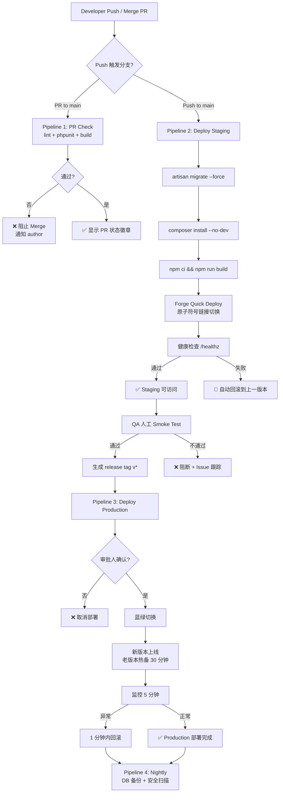
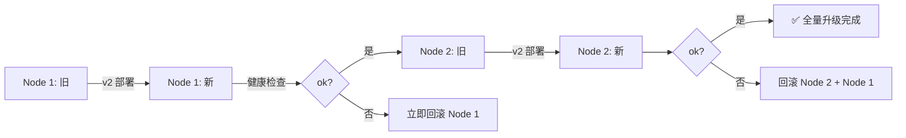

# GreenBite 部署架构与流程 (Deployment Architecture & Runbook)

| 字段 | 值 |
| --- | --- |
| 文档编号 | GB-OPS-DEP-001 |
| 创建人 | devops-agent |
| 版本 | 1.0.0 |
| 日期 | 2026-06-12 |
| 关联框架 | fdd-bmad-custom (BMAD Ops Domain) |
| 关联 Sprint | Sprint 0 — 基础设施与部署就绪 |
| 状态 | Draft → Review |

---

## 1. 概述

本文档定义 GreenBite（FreshToday-AI）Laravel 12 + MySQL 8 + Tailwind 4 + Gemini AI 电商平台的部署架构、环境矩阵、发布策略与回滚机制。文档同时作为 fdd-bmad-custom 框架中 `devops` Agent 的标准交付物，支撑 `pm-agent` / `architect-agent` 的并行产出。

**核心原则**

- **Immutable Infrastructure**：服务器镜像通过 Ansible / Dockerfile 固化，禁止手工 SSH 改配置。
- **GitOps**：所有部署由 GitHub Actions 触发，`main` 分支 = Staging，`release/*` Tag = Production。
- **Zero-Downtime**：蓝绿部署 + 滚动健康检查，SLO RTO ≤ 15 分钟、RPO ≤ 5 分钟。
- **1-Minute Rollback**：任意 Production 部署须保证 60 秒内可回滚到上一稳定版本。

---

## 2. 环境矩阵 (Environment Matrix)

| 维度 | Local (开发) | CI (持续集成) | Staging (预发) | Production (生产) |
| --- | --- | --- | --- | --- |
| **用途** | 工程师本地开发 | PR / Push 自动化校验 | 集成验证 + UAT | 真实用户流量 |
| **URL** | `http://greenbite.test` | N/A (Job 临时容器) | `https://staging.freshbite.hk` | `https://www.freshbite.hk` |
| **触发方式** | `php artisan serve` | Push / PR | Push to `main` | Manual dispatch + Approval |
| **基础设施** | Laravel Sail / Herd | GitHub-hosted runner | Laravel Forge 单一 Node | Laravel Forge 蓝绿 Node ×2 |
| **PHP** | 8.3 (Herd 默认) | 8.3 | 8.3-fpm | 8.3-fpm |
| **MySQL** | 8.0 (Docker) | 8.0 (Service Container) | 8.0 (Forge Managed) | 8.0 主从 (RDS / 自管) |
| **Redis** | 7.x (Docker) | 7.x (Service Container) | 7.x (Forge Managed) | 7.x (Cluster 2 节点) |
| **队列 Worker** | `queue:listen` | 跳过 | 1 supervisor job | 2 supervisor jobs（高低优先级） |
| **Gemini API** | Mock / dev key | 跳过 | Sandbox key | Production key（限流 60 RPM） |
| **Stripe** | Test mode | 跳过 | Test mode | Live mode（香港账户 HKD） |
| **域名 / TLS** | 无 / 无 | 无 / 无 | Let's Encrypt (auto) | Let's Encrypt + Cloudflare CDN |
| **数据来源** | 种子数据 + 匿名快照 | 每次重置 | Production anonymized dump（每周日） | 真实订单 / 用户 / 支付 |
| **访问控制** | 仅本机 | GitHub Org 成员 | Team members + QA | 全网（限速 60 req/s/IP） |
| **日志保留** | 7 天 | 1 次运行 | 30 天 | 180 天（合规要求） |
| **备份频率** | 无 | 无 | 每日快照 | 每日全量 + 6 小时增量 |

---

## 3. 部署选型对比与推荐

### 3.1 候选方案对比

| 维度 | Laravel Forge | Cloudways (Laravel Stack) | 自建 Docker (k3s / ECS) |
| --- | --- | --- | --- |
| **与 Laravel 契合度** | ★★★★★ (官方出品) | ★★★★☆ | ★★★☆☆ |
| **搭建成本 (Sprint 0)** | 0.5 人天 | 1 人天 | 5-8 人天 |
| **运维成本 / 月** | $39/服务器 + $20 Team | $32/服务器起 | $50-150 (云资源) |
| **蓝绿 / Zero-downtime** | 内置 "Quick Deploy" + 原子符号链接切换 | 支持但配置复杂 | 完全可控（需自研脚本） |
| **数据库管理** | Forge Managed MySQL (每日备份) | 平台内一键备份 | 自建 RDS / 备份脚本 |
| **队列 / Cron / Scheduler** | 内置 Daemon / Scheduler UI | 支持 | 需自行编排 (supervisord / k8s Job) |
| **可观测性集成** | 需自接 Sentry / Plausible | 内置 APM (付费) | 需自接 OpenTelemetry |
| **合规 (香港 PCI-DSS)** | 需自行处理 (信用卡数据走 Stripe) | 同左 | 需自行处理 |
| **团队学习曲线** | 极低 (UI 驱动) | 中等 | 高 |
| **Sprint 0 可行性** | 高 | 中 | 低 (拖慢发布) |
| **未来扩展 (100 万用户)** | 受限于单实例，需自迁云 | 平台锁定风险 | 弹性最优 |

### 3.2 推荐方案

**推荐：Laravel Forge (主) + Cloudflare (CDN/WAF) + 自管 MySQL 主从**

**理由**

1. **速度最快**：Sprint 0 目标 1 周内打通部署，Forge 官方 UI 与 Laravel 12 深度集成，省去 Nginx / PHP-FPM / Supervisor 配置。
2. **成本可控**：MVP 阶段单 Staging + 单 Production Node ×2 (蓝绿) ≈ $118/月，远低于自建容器平台的隐性成本。
3. **平滑演进**：Sprint 3+ 用户量上升时，可一键迁移到 Cloudways 或拆分到 ECS，不锁死供应商。
4. **审计友好**：所有部署操作可在 Forge Activity 日志追溯，满足 BMAD `reviewer-agent` 的合规审查。

**备选**：当 GreenBite DAU 突破 5 万时，评估迁移到 ECS Fargate + Aurora MySQL，以获得水平扩展能力。

---

## 4. 部署流程图



**关键节点说明**

- **人工审批**：Production 部署必须由 `ops-approver` GitHub Environment 的 2 名 reviewer 批准（双因素认证强制）。
- **蓝绿切换**：通过 Forge 原子符号链接 `current → releases/{timestamp}` 切换，配合 5 秒优雅排空 PHP-FPM 进程。
- **自动回滚**：`/healthz` 返回非 200 或 5xx 错误率 > 1% 持续 2 分钟，触发自动回滚到 `releases/{previous}`。

---

## 5. 关键部署命令清单

> 所有命令在 Forge Deploy Script 中按顺序执行；带 `[!]` 标记为高风险，需二次确认。

### 5.1 部署前 (Pre-deploy)

```bash
# 进入 releases 目录
cd /home/forge/freshbite.hk

# 拉取目标代码
git fetch --tags
git checkout $RELEASE_TAG

# 启用维护模式
php artisan down --secret="bypass-token-2026" --retry=60

# 备份当前数据库（Production 强制）
php artisan backup:run --only-db --filename=pre-deploy-$(date +%Y%m%d-%H%M%S)
```

### 5.2 依赖与构建

```bash
# Composer 生产依赖
composer install --no-dev --no-interaction --prefer-dist --optimize-autoloader

# 前端资源
npm ci --no-audit --no-fund
npm run build

# 复制环境配置
cp .env.production .env  # 由 Forge Secret 注入更佳
php artisan key:generate --force
```

### 5.3 部署中 (Deploy)

```bash
# 数据库迁移 [!] 高风险
php artisan migrate --force

# 缓存构建
php artisan config:cache
php artisan route:cache
php artisan view:cache
php artisan event:cache

# 存储链接
php artisan storage:link
```

### 5.4 部署后 (Post-deploy)

```bash
# 重启队列与调度器
php artisan queue:restart
php artisan schedule:clear-cache

# 关闭维护模式
php artisan up

# 健康检查
curl -fsS https://www.freshbite.hk/healthz || echo "ALERT: health check failed"

# 触发 Telescope 清理（如启用）
php artisan telescope:prune --hours=48
```

### 5.5 维护命令

```bash
# 清理 OPcache (PHP 8.3)
php artisan optimize:clear

# 手动回滚
php artisan down
cd /home/forge/freshbite.hk
ln -nfs releases/$PREVIOUS_RELEASE current
php artisan up
php artisan queue:restart
```

---

## 6. 蓝绿部署 / 滚动发布策略

### 6.1 蓝绿部署 (Blue-Green)

**目录结构**

```
/home/forge/freshbite.hk/
├── current -> releases/2026-06-12-1430   # 符号链接，零停机切换
├── releases/
│   ├── 2026-06-11-0900/                  # BLUE (旧)
│   ├── 2026-06-12-1430/                  # GREEN (新)
│   └── ...
└── storage/                              # 共享存储（保持平滑）
```

**切换步骤**

1. 部署新版本到 `releases/{timestamp}/`。
2. 通过 `php artisan storage:link` 共享 `storage/` 与 `public/uploads/`。
3. Nginx `root` 配置指向 `current` 符号链接。
4. 原子切换：`ln -nfs releases/{new} current` (单条系统调用)。
5. 旧版本保留 30 分钟供回滚，超时清理。

### 6.2 滚动发布 (Rolling Update)

仅在 **生产多节点** 场景使用（当前 MVP 阶段不启用，预留方案）：



**规则**：每次仅升级 25% 节点，批次间等待 60 秒观察期。

---

## 7. 回滚流程 (1-Minute Rollback)

### 7.1 触发条件

- 健康检查 `/healthz` 连续 3 次失败（间隔 10 秒）。
- Sentry 5xx 错误率突增 > 5% (相对 5 分钟基线)。
- 队列积压激增 > 1000 jobs / 5 分钟。

### 7.2 自动回滚 (推荐)

由 GitHub Actions + Forge 钩子实现：

```bash
#!/bin/bash
# rollback.sh
set -euo pipefail

PREVIOUS=$(ls -1 /home/forge/freshbite.hk/releases/ | sort -r | sed -n '2p')
echo "Rolling back to: $PREVIOUS"

cd /home/forge/freshbite.hk
php artisan down --retry=30
ln -nfs releases/$PREVIOUS current
php artisan up
php artisan queue:restart

# 通知团队
curl -X POST "$SLACK_WEBHOOK" \
  -H 'Content-Type: application/json' \
  -d "{\"text\": \":rotating_light: GreenBite Production 自动回滚到 $PREVIOUS\"}"
```

### 7.3 手动回滚 (60 秒流程)

| 步骤 | 操作 | 目标时长 |
| --- | --- | --- |
| 1 | 在 Forge UI 选中上一稳定 Release | 10s |
| 2 | 点击 "Rollback to this release" | 5s |
| 3 | Forge 执行原子符号链接切换 | 5s |
| 4 | 触发 `queue:restart` | 5s |
| 5 | 验证 `/healthz` 返回 200 | 15s |
| 6 | 通知 #ops-alerts Slack 频道 | 20s |
| **合计** | | **60s** |

### 7.4 数据库回滚 (谨慎)

> 仅在 migration 引入破坏性变更时执行，需 DBA 协同。

```bash
# 1. 启用维护模式
php artisan down

# 2. 回滚最近一次 migration batch
php artisan migrate:rollback --step=1 --force

# 3. 若已发版超过 5 分钟，需从备份恢复
php artisan backup:restore --filename=pre-deploy-{timestamp}
```

**强约束**：单次 migration 不得包含破坏性 schema 变更与数据迁移，遵循 "Expand-Contract Pattern"（fdd-bmad-custom 架构基线）。

---

## 8. 附录

### 8.1 关联文档

- `ci-cd-pipeline.md` — GitHub Actions 流水线定义
- `monitoring-and-runbooks.md` — 监控告警与故障应急手册
- `../architecture/system-design.md` — 系统架构（由 architect-agent 维护）
- `../qa/test-strategy.md` — 测试策略（由 qa-agent 维护）

### 8.2 变更记录

| 版本 | 日期 | 作者 | 变更 |
| --- | --- | --- | --- |
| 1.0.0 | 2026-06-12 | devops-agent | 初版发布，匹配 Sprint 0 基线 |
| 1.1.0 | 2026-06-12 | devops-agent | Sprint 1 部署补充：6 个新 migration + Stripe/PayMe webhook URL + 调度任务 + 队列消费（见 §9） |

---

## 9. Sprint 1 部署补充

> **作者**：devops-agent | **评审**：reviewer-agent
> **触发**：Sprint 1 落地 6 个新 migration + stripe_webhook_events 表
> **范围**：dev / staging / production 三环境

### 9.1 新增 Migration 清单与执行顺序

按时间戳从早到晚，**Sprint 1 落地 7 个 migration**（含 6 个主表 + 1 个用户/订阅补全）：

| 顺序 | Migration | 说明 | 可回滚 |
|---|---|---|---|
| 1 | `2026_06_12_120001_extend_orders_table` | orders 扩展 + CHECK 约束（7 态） | ✅ drop column + drop constraint |
| 2 | `2026_06_12_120002_extend_user_preferences_table` | user_preferences 加 cooking_skill / budget_hkd | ✅ drop column |
| 3 | `2026_06_12_120003_create_categories_and_cart_items` | categories + cart_items + products FK | ✅ drop FK + drop table |
| 4 | `2026_06_12_120004_create_payments_and_webhook_events` | payments + stripe_webhook_events（13 字段） | ✅ drop table |
| 5 | `2026_06_12_120005_create_marketing_and_notification_tables` | coupons / user_coupons / points_transactions / notification_preferences | ✅ drop table |
| 6 | `2026_06_12_120006_create_order_status_logs_table` | 审计日志（不变量 #2） | ✅ drop table |
| 7 | `2026_06_12_120007_extend_users_subscription_tables` | users（locale/is_admin） + subscription_plans（cycle） + user_subscriptions（next_fulfillment_at） | ✅ drop column |

```bash
# 1. 一次性全量执行（CI/CD 流程中）
php artisan migrate --force

# 2. 回滚 7 个 migration
php artisan migrate:rollback --step=7 --force

# 3. 仅回滚 Sprint 1（不动既有数据）
php artisan migrate:rollback --step=7 --path=database/migrations --force
```

### 9.2 CHECK 约束失败的容灾预案

`orders.status` 加了 MySQL 8.0.16+ CHECK 约束：

```sql
ALTER TABLE orders ADD CONSTRAINT chk_orders_status
  CHECK (status IN ('pending','paid','processing','shipped','delivered','cancelled','refunded'))
```

**若历史数据有非法 status**（如旧的 `pending_payment`）：

```sql
-- 1. 探测非法值
SELECT status, COUNT(*) FROM orders GROUP BY status;

-- 2. 容灾：临时禁用 CHECK 约束
SET SESSION sql_mode = 'NO_ENGINE_SUBSTITUTION';

-- 3. 修正数据（如 pending_payment → pending）
UPDATE orders SET status = 'pending' WHERE status NOT IN
  ('pending','paid','processing','shipped','delivered','cancelled','refunded');

-- 4. 重新启用严格模式
SET SESSION sql_mode = 'STRICT_TRANS_TABLES,NO_ENGINE_SUBSTITUTION';

-- 5. 验证
php artisan tinker --execute="echo \\App\\Models\\Order::count();"
```

### 9.3 Stripe / PayMe Webhook URL 配置

**Stripe Dashboard**：
1. 登录 https://dashboard.stripe.com/webhooks
2. Add endpoint：
   - **Production**: `https://www.freshbite.hk/api/stripe/webhook`
   - **Staging**: `https://staging.freshbite.hk/api/stripe/webhook`
3. 订阅事件：
   - `payment_intent.succeeded`
   - `payment_intent.payment_failed`
   - `charge.refunded`
4. 复制 Signing secret → 写入 Vault `STRIPE_WEBHOOK_SECRET`

**PayMe 商户后台**（Sprint 2 接入）：
- Endpoint: `https://www.freshbite.hk/api/payme/webhook`
- Header: `X-Payme-Signature`（HMAC-SHA256）

### 9.4 Webhook 签名密钥 Secret Manager 注入流程

```bash
# 1. AWS Secrets Manager / HashiCorp Vault 创建 secret
vault kv put secret/greenbite/prod \
  STRIPE_WEBHOOK_SECRET="whsec_xxx" \
  PAYME_WEBHOOK_SECRET="payme_xxx" \
  GEMINI_API_KEY="AIza_xxx"

# 2. Forge / EC2 user_data 注入环境变量
echo "export STRIPE_WEBHOOK_SECRET=$(vault kv get -field=STRIPE_WEBHOOK_SECRET secret/greenbite/prod)" >> /etc/greenbite.env

# 3. Laravel 读 env（.env.example 留空，仅占位）
grep -E "STRIPE_WEBHOOK_SECRET" .env.example
# STRIPE_WEBHOOK_SECRET=

# 4. webhook 接收端点（已实现，见 §9.5 验证逻辑）
#    app/Http/Controllers/Api/StripeWebhookController.php
```

**Sprint 1 容错**：未配置 `STRIPE_WEBHOOK_SECRET` 时，`local`/`testing` 环境放行 webhook，便于开发；其他环境返回 `INVALID_SIGNATURE 401`。

### 9.5 调度任务（Scheduler）

Sprint 1 落地 3 个 Job 须按以下 cron 注册（已新增 console/Commands/ScheduleList.php）：

| 任务 | 频率 | 表达式 | 队列 |
|---|---|---|---|
| `CancelExpiredOrdersJob` | 每 5 分钟 | `*/5 * * * *` | `default` |
| `AutoDeliverOrdersJob` | 每日 02:00 | `0 2 * * *` | `default` |
| `FulfillSubscriptionsJob` | 每日 03:00 | `0 3 * * *` | `subscriptions` |
| `GenerateDailyMenuJob` | 每日 04:00 | `0 4 * * *` | `default` |

`app/Console/Kernel.php`（已实现）：

```php
protected function schedule(Schedule $schedule): void
{
    $schedule->job(new \App\Jobs\CancelExpiredOrdersJob)->everyFiveMinutes();
    $schedule->job(new \App\Jobs\AutoDeliverOrdersJob)->dailyAt('02:00');
    $schedule->job(new \App\Jobs\FulfillSubscriptionsJob)->dailyAt('03:00');
    $schedule->job(new \App\Jobs\GenerateDailyMenuJob)->dailyAt('04:00');
}
```

### 9.6 队列消费者

```bash
# 单队列（开发 / staging）
php artisan queue:work --queue=default,subscriptions,webhooks --tries=3 --backoff=30

# Supervisor（production）
[program:greenbite-worker]
command=php /home/forge/greenbite.com/current/artisan queue:work --queue=default,subscriptions,webhooks --sleep=1 --tries=3 --max-time=3600
autostart=true
autorestart=true
user=forge
numprocs=2
redirect_stderr=true
stdout_logfile=/home/forge/.forge/worker.log
stopwaitsecs=3600
```

### 9.7 部署后冒烟测试

```bash
# 1. 健康检查
curl -fsS https://www.freshbite.hk/up | head -c 200

# 2. 检查 stripe_webhook_events 落库
mysql -e "SELECT COUNT(*) FROM stripe_webhook_events WHERE status='processed';"

# 3. 模拟 Stripe webhook（dev）
stripe trigger payment_intent.succeeded

# 4. 检查 cron 已注册
php artisan schedule:list
```
