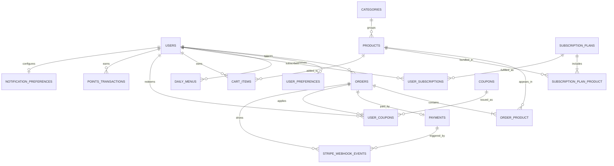

> **元信息**：创建人 architect-agent | 版本 v0.1 (Sprint 0) | 日期 2026-06-12
> **框架**：fdd-bmad-custom（Model 阶段产物：Domain Model → ER Diagram）
> **说明**：基础表（实线）= 已存在 migrations；扩展表（虚线建议）= Sprint 1+ 待补

# GreenBite 数据库 ER 图（er-diagram.md）

## 1. ER 总览

## 2. 字段详细定义

> 类型采用 MySQL 8 语法；`*` = 主键；`FK` = 外键；`IX` = 索引；`UQ` = 唯一约束

### 2.1 `users`（Laravel 内建，扩展字段）

| 字段 | 类型 | 约束 | 说明 |
|---|---|---|---|
| `id` | BIGINT UNSIGNED | * PK, auto_increment | |
| `name` | VARCHAR(255) | NOT NULL | 显示名 |
| `email` | VARCHAR(255) | NOT NULL, UQ | 登录账号 |
| `email_verified_at` | TIMESTAMP | NULL | |
| `password` | VARCHAR(255) | NOT NULL | bcrypt 哈希 |
| `phone` | VARCHAR(20) | NULL | 建议扩展（香港手机号） |
| `locale` | VARCHAR(8) | DEFAULT 'zh-HK' | 建议扩展（i18n） |
| `remember_token` | VARCHAR(100) | NULL | |
| `created_at` / `updated_at` | TIMESTAMP | | |

IX：`email` (UQ), `phone` (IX, 建议)

### 2.2 `categories`（建议扩展）

| 字段 | 类型 | 约束 | 说明 |
|---|---|---|---|
| `id` | BIGINT UNSIGNED | * PK | |
| `parent_id` | BIGINT UNSIGNED | FK→categories.id, NULL | 支持二级分类（如 蔬菜→叶菜） |
| `name` | VARCHAR(100) | NOT NULL | |
| `slug` | VARCHAR(120) | UQ | URL 友好 |
| `sort_order` | INT | DEFAULT 0 | |
| `created_at` / `updated_at` | TIMESTAMP | | |

IX：`slug` (UQ), `parent_id` (IX)

### 2.3 `products`（已存在）

| 字段 | 类型 | 约束 | 说明 |
|---|---|---|---|
| `id` | BIGINT UNSIGNED | * PK | |
| `category_id` | BIGINT UNSIGNED | FK→categories.id, NULL | |
| `name` | VARCHAR(255) | NOT NULL | |
| `description` | TEXT | NULL | |
| `price` | DECIMAL(10,2) | NOT NULL | HKD |
| `image` | VARCHAR(255) | NULL | |
| `carbon_footprint` | DECIMAL(8,3) | NULL | 单位 kg CO2e |
| `stock` | INT | DEFAULT 0 | |
| `is_organic` | BOOLEAN | DEFAULT 1, 建议扩展 | |
| `origin` | VARCHAR(100) | NULL, 建议扩展 | 香港本地农场 |
| `created_at` / `updated_at` | TIMESTAMP | | |

IX：`category_id` (IX), `name` (IX), `(is_organic, category_id)` 复合 (建议)

### 2.4 `user_preferences`（已存在 + 建议扩展）

| 字段 | 类型 | 约束 | 说明 |
|---|---|---|---|
| `id` | BIGINT UNSIGNED | * PK | |
| `user_id` | BIGINT UNSIGNED | FK→users.id ON DELETE CASCADE, UQ | 一对一 |
| `usage_purpose` | VARCHAR(100) | NULL | 用途：减脂/增肌/家庭日常 |
| `dietary_habits` | VARCHAR(100) | NULL | 饮食习惯：素食/低糖/无麸质 |
| `goals` | VARCHAR(100) | NULL | 目标：降碳/健康/塑形 |
| `allergies` | JSON | NULL, 建议扩展 | 过敏原数组 |
| `household_size` | TINYINT | DEFAULT 1, 建议扩展 | 家庭人数 |
| `cooking_skill` | ENUM('Beginner','Intermediate','Advanced') | NULL, 建议扩展 | 烹饪水平（e2e-scenarios S1 Q4 断言） |
| `budget_hkd` | DECIMAL(8,2) | NULL, 建议扩展 | 每周预算 HKD（e2e-scenarios S1 Q6 断言） |
| `created_at` / `updated_at` | TIMESTAMP | | |

IX：`user_id` (UQ)

> 与 e2e-scenarios.md S1 的字段对齐说明：经 pm-agent + reviewer-agent 联合决议（FOLLOW-UP-2026-06-12），**采用方案 A**——ER 新增 `cooking_skill` 与 `budget_hkd` 两字段，保留 E2E 题目不变。理由：符合"先测后码"ATDD 精神，AI 菜单生成能基于预算+技能做更精准的推荐。

### 2.5 `daily_menus`（已存在）

| 字段 | 类型 | 约束 | 说明 |
|---|---|---|---|
| `id` | BIGINT UNSIGNED | * PK | |
| `user_id` | BIGINT UNSIGNED | FK→users.id ON DELETE CASCADE | |
| `menu_content` | TEXT | NOT NULL | Gemini 生成内容 |
| `date` | DATE | NOT NULL | 菜单所属日期 |
| `source` | ENUM('gemini','fallback') | DEFAULT 'gemini', 建议扩展 | 区分 AI/降级 |
| `tokens_used` | INT | DEFAULT 0, 建议扩展 | 成本追踪 |
| `created_at` / `updated_at` | TIMESTAMP | | |

IX：`(user_id, date)` (UQ) — 同一天仅一份菜单

### 2.6 `orders`（已存在 + 建议扩展）

| 字段 | 类型 | 约束 | 说明 |
|---|---|---|---|
| `id` | BIGINT UNSIGNED | * PK | |
| `user_id` | BIGINT UNSIGNED | FK→users.id ON DELETE CASCADE | |
| `order_no` | VARCHAR(32) | UQ, 建议扩展 | 业务单号（如 GB20260612xxxxx） |
| `status` | VARCHAR(32) | DEFAULT 'pending' | 状态机（见 order-state-machine.md 附录 A：7 态枚举 pending/paid/processing/shipped/delivered/cancelled/refunded） |
| `total_price` | DECIMAL(10,2) | DEFAULT 0 | |
| `discount_amount` | DECIMAL(10,2) | DEFAULT 0, 建议扩展 | |
| `shipping_address` | JSON | NULL, 建议扩展 | 香港地址结构化 |
| `tracking_no` | VARCHAR(64) | NULL, 建议扩展 | 物流单号 |
| `user_subscription_id` | BIGINT UNSIGNED | FK→user_subscriptions.id, NULL, 建议扩展 | 标记订阅生成订单 |
| `placed_at` | TIMESTAMP | NULL, 建议扩展 | 下单时间 |
| `paid_at` | TIMESTAMP | NULL, 建议扩展 | |
| `created_at` / `updated_at` | TIMESTAMP | | |

IX：`user_id` (IX), `order_no` (UQ), `status` (IX), `(user_id, status)` 复合 (IX)
CHK：`status IN ('pending','paid','processing','shipped','delivered','cancelled','refunded')`（Sprint 1 迁移时加，详见 order-state-machine.md §A.1）

### 2.7 `order_product`（已存在 pivot）

| 字段 | 类型 | 约束 | 说明 |
|---|---|---|---|
| `id` | BIGINT UNSIGNED | * PK | |
| `order_id` | BIGINT UNSIGNED | FK→orders.id ON DELETE CASCADE | |
| `product_id` | BIGINT UNSIGNED | FK→products.id ON DELETE CASCADE | |
| `quantity` | INT | DEFAULT 1 | |
| `price` | DECIMAL(10,2) | DEFAULT 0 | 下单时快照价 |
| `created_at` / `updated_at` | TIMESTAMP | | |

IX：`(order_id, product_id)` (UQ), `product_id` (IX)

### 2.8 `subscription_plans`（已存在 + 建议扩展）

| 字段 | 类型 | 约束 | 说明 |
|---|---|---|---|
| `id` | BIGINT UNSIGNED | * PK | |
| `name` | VARCHAR(255) | NOT NULL | 如 "周套餐" / "月套餐" |
| `description` | TEXT | NULL | |
| `price` | DECIMAL(10,2) | NOT NULL | |
| `duration` | INT | NOT NULL | 单位 天 |
| `cycle` | ENUM('weekly','biweekly','monthly') | DEFAULT 'weekly', 建议扩展 | 履约周期 |
| `is_active` | BOOLEAN | DEFAULT 1, 建议扩展 | |
| `created_at` / `updated_at` | TIMESTAMP | | |

IX：`is_active` (IX)

### 2.9 `subscription_plan_product`（已存在 pivot）

| 字段 | 类型 | 约束 | 说明 |
|---|---|---|---|
| `id` | BIGINT UNSIGNED | * PK | |
| `subscription_plan_id` | BIGINT UNSIGNED | FK→subscription_plans.id ON DELETE CASCADE | |
| `product_id` | BIGINT UNSIGNED | FK→products.id ON DELETE CASCADE | |
| `quantity` | INT | DEFAULT 1, 建议扩展 | 每次配送件数 |
| `created_at` / `updated_at` | TIMESTAMP | | |

IX：`(subscription_plan_id, product_id)` (UQ)

### 2.10 `user_subscriptions`（已存在 + 建议扩展）

| 字段 | 类型 | 约束 | 说明 |
|---|---|---|---|
| `id` | BIGINT UNSIGNED | * PK | |
| `user_id` | BIGINT UNSIGNED | FK→users.id ON DELETE CASCADE | |
| `subscription_plan_id` | BIGINT UNSIGNED | FK→subscription_plans.id ON DELETE CASCADE | |
| `start_date` | DATE | NOT NULL | |
| `end_date` | DATE | NULL | 续费时滚动更新 |
| `next_fulfillment_at` | DATE | NULL, 建议扩展 | 下次履约日期 |
| `status` | VARCHAR(32) | DEFAULT 'active' | active/paused/cancelled/expired |
| `auto_renew` | BOOLEAN | DEFAULT 1, 建议扩展 | |
| `created_at` / `updated_at` | TIMESTAMP | | |

IX：`user_id` (IX), `status` (IX), `next_fulfillment_at` (IX)

### 2.11 `cart_items`（建议扩展）

| 字段 | 类型 | 约束 | 说明 |
|---|---|---|---|
| `id` | BIGINT UNSIGNED | * PK | |
| `user_id` | BIGINT UNSIGNED | FK→users.id ON DELETE CASCADE | |
| `product_id` | BIGINT UNSIGNED | FK→products.id ON DELETE CASCADE | |
| `quantity` | INT | DEFAULT 1 | |
| `created_at` / `updated_at` | TIMESTAMP | | |

IX：`(user_id, product_id)` (UQ)

### 2.12 `payments`（建议扩展）

| 字段 | 类型 | 约束 | 说明 |
|---|---|---|---|
| `id` | BIGINT UNSIGNED | * PK | |
| `order_id` | BIGINT UNSIGNED | FK→orders.id ON DELETE CASCADE | |
| `provider` | VARCHAR(32) | NOT NULL | stripe/payme/alipay_hk |
| `provider_txn_id` | VARCHAR(128) | UQ | 支付网关单号 |
| `amount` | DECIMAL(10,2) | NOT NULL | |
| `currency` | CHAR(3) | DEFAULT 'HKD' | |
| `status` | ENUM('pending','succeeded','failed','refunded') | DEFAULT 'pending' | |
| `raw_response` | JSON | NULL | 支付网关原始回调 |
| `paid_at` | TIMESTAMP | NULL | |
| `created_at` / `updated_at` | TIMESTAMP | | |

IX：`order_id` (IX), `provider_txn_id` (UQ), `status` (IX)

### 2.13 `coupons`（建议扩展）

| 字段 | 类型 | 约束 | 说明 |
|---|---|---|---|
| `id` | BIGINT UNSIGNED | * PK | |
| `code` | VARCHAR(32) | UQ | 券码 |
| `name` | VARCHAR(100) | NOT NULL | |
| `type` | ENUM('fixed','percent') | NOT NULL | 固定金额/百分比 |
| `value` | DECIMAL(10,2) | NOT NULL | |
| `min_order_amount` | DECIMAL(10,2) | DEFAULT 0 | |
| `valid_from` | TIMESTAMP | NULL | |
| `valid_until` | TIMESTAMP | NULL | |
| `usage_limit` | INT | NULL | 总用量 |
| `used_count` | INT | DEFAULT 0 | |
| `is_active` | BOOLEAN | DEFAULT 1 | |
| `created_at` / `updated_at` | TIMESTAMP | | |

IX：`code` (UQ), `is_active` (IX)

### 2.14 `user_coupons`（建议扩展）

| 字段 | 类型 | 约束 | 说明 |
|---|---|---|---|
| `id` | BIGINT UNSIGNED | * PK | |
| `user_id` | BIGINT UNSIGNED | FK→users.id ON DELETE CASCADE | |
| `coupon_id` | BIGINT UNSIGNED | FK→coupons.id ON DELETE CASCADE | |
| `order_id` | BIGINT UNSIGNED | FK→orders.id, NULL | 实际使用订单 |
| `claimed_at` | TIMESTAMP | NOT NULL | 领取时间 |
| `used_at` | TIMESTAMP | NULL | 使用时间 |
| `status` | ENUM('claimed','used','expired') | DEFAULT 'claimed' | |

IX：`(user_id, coupon_id)` (UQ), `status` (IX)

### 2.15 `points_transactions`（建议扩展）

| 字段 | 类型 | 约束 | 说明 |
|---|---|---|---|
| `id` | BIGINT UNSIGNED | * PK | |
| `user_id` | BIGINT UNSIGNED | FK→users.id ON DELETE CASCADE | |
| `type` | ENUM('earn','redeem','expire','adjust') | NOT NULL | |
| `points` | INT | NOT NULL | 正负值 |
| `balance_after` | INT | NOT NULL | 交易后余额 |
| `reason` | VARCHAR(255) | NULL | 订单/活动/管理员调整 |
| `related_order_id` | BIGINT UNSIGNED | FK→orders.id, NULL | |
| `created_at` | TIMESTAMP | | |

IX：`user_id` (IX), `(user_id, created_at)` 复合 (IX)

### 2.16 `notification_preferences`（建议扩展）

| 字段 | 类型 | 约束 | 说明 |
|---|---|---|---|
| `id` | BIGINT UNSIGNED | * PK | |
| `user_id` | BIGINT UNSIGNED | FK→users.id ON DELETE CASCADE, UQ | 一对一 |
| `email_order` | BOOLEAN | DEFAULT 1 | 订单邮件 |
| `email_menu` | BOOLEAN | DEFAULT 1 | 每日菜单邮件 |
| `email_promo` | BOOLEAN | DEFAULT 0 | 营销邮件 |
| `sms_order` | BOOLEAN | DEFAULT 0 | 订单短信 |
| `push_enabled` | BOOLEAN | DEFAULT 1 | 浏览器推送 |
| `quiet_hours_start` | TIME | NULL | 勿扰起始 |
| `quiet_hours_end` | TIME | NULL | 勿扰结束 |
| `created_at` / `updated_at` | TIMESTAMP | | |

IX：`user_id` (UQ)

### 2.17 `stripe_webhook_events`（建议扩展，P0 #4 修复）

> 用途：支付网关 webhook 事件去重 + 重放保护，详见 api-contract.md §2.8 与 edge-cases D-05。
> 与 `payments` 表解耦：先落库去重，再驱动 `payments` 状态变更与 `OrderService::transition()`。

| 字段 | 类型 | 约束 | 说明 |
|---|---|---|---|
| `id` | BIGINT UNSIGNED | * PK | |
| `provider` | VARCHAR(32) | NOT NULL | `stripe` / `payme` / `alipay_hk` |
| `provider_event_id` | VARCHAR(128) | UQ, NOT NULL | 网关事件唯一 ID（Stripe `evt_xxx`） |
| `event_type` | VARCHAR(64) | NOT NULL | `payment_intent.succeeded` 等 |
| `payload` | JSON | NOT NULL | 网关原始 payload 完整快照 |
| `signature` | VARCHAR(255) | NULL | 签名头（用于事后审计与回放） |
| `received_at` | TIMESTAMP | NOT NULL | 接收时间 |
| `processed_at` | TIMESTAMP | NULL | 处理完成时间 |
| `status` | ENUM('received','processing','processed','failed','ignored') | DEFAULT 'received' | 处理状态 |
| `attempts` | TINYINT UNSIGNED | DEFAULT 0 | 已尝试次数（最大 5） |
| `last_error` | TEXT | NULL | 失败原因 |
| `related_payment_id` | BIGINT UNSIGNED | FK→payments.id, NULL | 关联支付单（去重后绑定） |
| `related_order_id` | BIGINT UNSIGNED | FK→orders.id, NULL | 关联订单（冗余便于排查） |
| `created_at` / `updated_at` | TIMESTAMP | | |

IX：`provider_event_id` (UQ), `(provider, event_type)` (IX), `status` (IX), `received_at` (IX)

## 3. 索引策略小结

- **热路径**：`products(category_id, is_organic)`、`orders(user_id, status)`、`daily_menus(user_id, date)`、`user_subscriptions(next_fulfillment_at)`
- **唯一约束**：`users.email`、`orders.order_no`、`payments.provider_txn_id`、`coupons.code`、`cart_items(user_id, product_id)`
- **外键级联**：用户删除时级联清理订单/订阅/偏好；订单删除时清理订单项/支付

## 4. 后续 Sprint 待补迁移

| 迁移 | Sprint | 依赖 |
|---|---|---|
| `categories` | Sprint 1 | 商品分类管理 |
| `cart_items` | Sprint 1 | 购物车功能 |
| `payments` | Sprint 2 | 支付网关 |
| `coupons` / `user_coupons` | Sprint 2 | 营销活动 |
| `points_transactions` | Sprint 3 | 积分体系 |
| `notification_preferences` | Sprint 1 | 通知中心 |
| 扩展字段（`orders.*`、`products.is_organic` 等） | Sprint 1 | 业务完善 |
