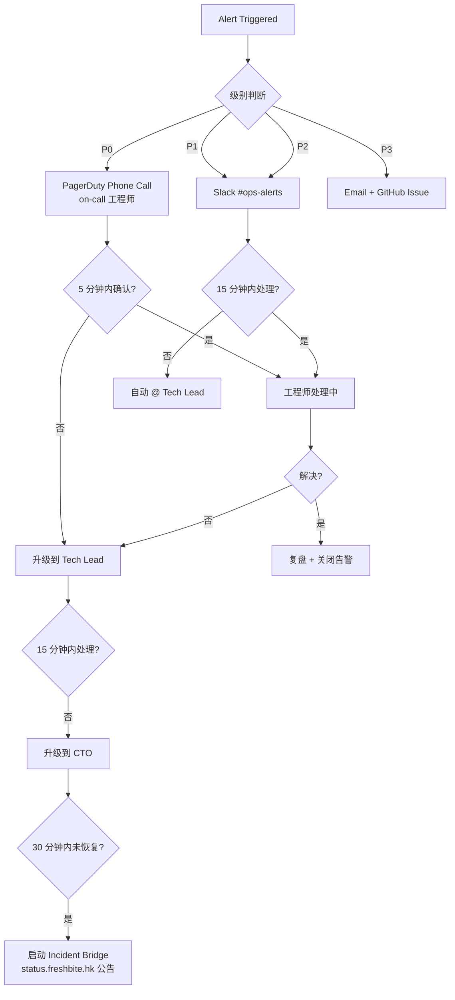
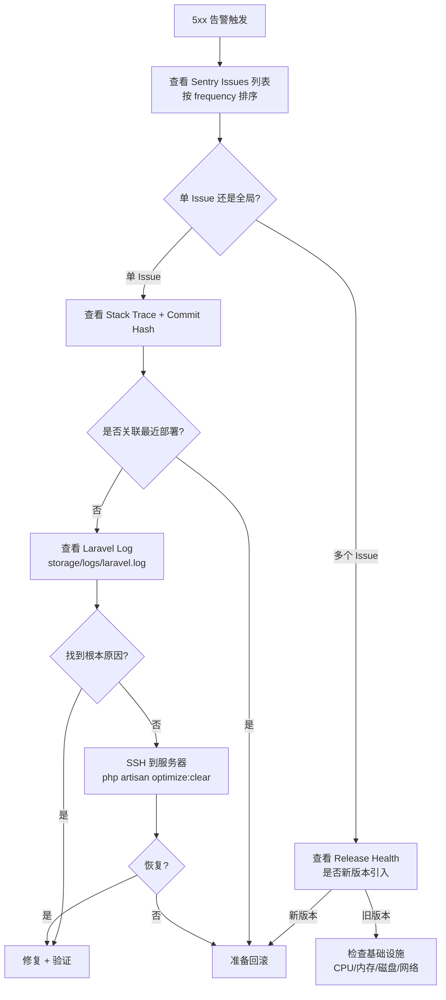

# GreenBite 监控与运维手册 (Monitoring & Runbooks)

| 字段 | 值 |
| --- | --- |
| 文档编号 | GB-OPS-MON-001 |
| 创建人 | devops-agent |
| 版本 | 1.0.0 |
| 日期 | 2026-06-12 |
| 关联框架 | fdd-bmad-custom (BMAD Ops Domain) |
| 关联 SLO | 可用性 99.9% / P95 < 500ms / 错误率 < 0.5% |

---

## 1. 监控指标体系 (SLO/SLI)

### 1.1 核心 SLO 目标

| 指标 | 目标 | 测量窗口 | 负责人 |
| --- | --- | --- | --- |
| **可用性 (Availability)** | ≥ 99.9% (月度) | 30 天滚动 | DevOps |
| **错误率 (5xx Error Rate)** | < 0.5% | 5 分钟滚动 | DevOps |
| **P95 响应时间** | < 500ms (页面) / < 200ms (API) | 5 分钟滚动 | DevOps + Architect |
| **队列积压 (Queue Backlog)** | < 100 jobs / 队列 | 实时 | DevOps |
| **DB 慢查询 (Slow Queries)** | < 10 / 分钟 (Q > 1s) | 1 分钟 | DevOps + Architect |
| **AI 菜单生成成功率** | ≥ 98% | 1 小时滚动 | PM + DevOps |
| **支付转化率** | ≥ 92% (Checkout → Success) | 24 小时 | PM + DevOps |

### 1.2 指标采集层

| 层 | 工具 | 采集方式 |
| --- | --- | --- |
| 应用层 | Laravel Telescope (开发) / Sentry (生产) | Hook Middleware + APM SDK |
| 性能层 | UptimeRobot (外网) / Forge Metrics (主机) | HTTP 探针 + Node Exporter |
| 业务层 | Plausible Analytics | JS 探针 |
| 基础设施 | Forge 自带 + MySQL `performance_schema` | Pull / 15s |
| 日志层 | Laravel Log → Papertrail (Forge 集成) | Stream |

---

## 2. 工具选型对比与决策

| 工具 | 用途 | 定价 | 决策 |
| --- | --- | --- | --- |
| **Sentry** | 错误追踪 + 性能 APM + Release Health | Free 5K events/月 (MVP 阶段) | ✅ 选用 |
| **Plausible** | 隐私友好型 Web Analytics | $9/月 (10K 页面浏览) | ✅ 选用 |
| **UptimeRobot** | 外网 HTTP/SSL/Domain 监控 | Free 50 monitors / 5 分钟间隔 | ✅ 选用 |
| **Laravel Telescope** | 开发环境 Debug Bar + 请求/查询/Job 审计 | 开源免费 | ✅ 选用（仅 dev/staging） |
| New Relic | APM（备选） | $25/月/用户 | ❌ 暂不选用（Sprint 0 成本控制） |
| Datadog | 统一监控（备选） | $15/主机/月 | ❌ 暂不选用 |
| Grafana + Prometheus | 自建可视化 | 免费 + 自运维 | ⏳ Sprint 3+ 评估 |

**选型理由**

- Sentry 与 Laravel 集成成熟（`sentry-laravel` 官方包），错误聚合、Release 关联、Source Map 上传一条龙。
- Plausible 满足 GDPR/PDPA 且无需 Cookie 横幅（香港合规要求）。
- UptimeRobot 免费档足够 MVP，5 分钟间隔是行业标准。
- Telescope 仅在 dev/staging 开启，Production 关闭以避免性能损耗（参考 Laravel 官方建议）。

---

## 3. 告警规则与升级路径

### 3.1 告警分级

| 级别 | 颜色 | 响应时长 | 升级路径 | 通道 |
| --- | --- | --- | --- | --- |
| **P0 - Critical** | 🔴 | 5 分钟 | on-call → Tech Lead → CTO | Phone + Slack + PagerDuty |
| **P1 - High** | 🟠 | 15 分钟 | on-call → Tech Lead | Slack + Email |
| **P2 - Medium** | 🟡 | 1 小时 | on-call | Slack |
| **P3 - Low** | 🟢 | 24 小时 | 下个工作日处理 | Email + Issue |

### 3.2 告警规则配置

| 规则 ID | 指标 | 阈值 | 持续时间 | 级别 | 通知目标 |
| --- | --- | --- | --- | --- | --- |
| ALR-001 | 5xx 错误率 | > 1% | 2 分钟 | P0 | #ops-alerts + on-call phone |
| ALR-002 | 5xx 错误率 | > 0.5% | 5 分钟 | P1 | #ops-alerts |
| ALR-003 | P95 响应时间 | > 800ms | 5 分钟 | P1 | #ops-alerts |
| ALR-004 | 可用性 (UptimeRobot) | < 99.5% | 1 次检测失败 | P0 | #ops-alerts + on-call phone |
| ALR-005 | 队列积压 | > 500 jobs | 5 分钟 | P1 | #ops-alerts |
| ALR-006 | 队列积压 | > 1000 jobs | 2 分钟 | P0 | #ops-alerts + on-call phone |
| ALR-007 | DB 慢查询 | > 30 / 分钟 | 5 分钟 | P2 | #ops-alerts |
| ALR-008 | DB 主从延迟 | > 30s | 1 分钟 | P1 | #ops-alerts |
| ALR-009 | Gemini API 4xx/5xx | > 5% | 5 分钟 | P1 | #ops-alerts |
| ALR-010 | 磁盘使用 | > 85% | 5 分钟 | P2 | #ops-alerts |
| ALR-011 | 内存使用 | > 90% | 5 分钟 | P2 | #ops-alerts |
| ALR-012 | SSL 证书到期 | < 14 天 | 一次性 | P1 | #ops-alerts |
| ALR-013 | Stripe Webhook 失败 | > 3 次连续 | 实时 | P0 | #ops-alerts + on-call phone |
| ALR-014 | Plausible 流量突降 | < 50% 基线 | 30 分钟 | P3 | #ops-alerts |

### 3.3 升级路径 (Escalation)



**on-call 轮值**：使用 PagerDuty Schedule，7 天一班，主备两人制。

---

## 4. Runbook 列表

| Runbook ID | 标题 | 严重度 | 首次响应 SLA |
| --- | --- | --- | --- |
| RB-001 | 生产环境 500 错误激增 | P0 | 5 分钟 |
| RB-002 | Stripe 支付回调失败 | P0 | 5 分钟 |
| RB-003 | Gemini API 限流导致 AI 菜单失败 | P1 | 15 分钟 |
| RB-004 | 数据库主从延迟过高 | P1 | 15 分钟 |

---

## 5. RB-001 — 生产环境 500 错误激增

### 5.1 症状 (Symptoms)

- Sentry 5xx 错误事件数 5 分钟内 > 50 条（基线 5 条）。
- UptimeRobot HTTP 探针返回 5xx（> 1%）。
- 告警 ALR-001 / ALR-002 触发。
- 用户反馈下单/登录失败。

### 5.2 初步诊断（5 分钟内）



**快速检查清单**

```bash
# 1. Sentry 确认错误类型
# 登录 sentry.io → Issues → 过滤 "production" + "is:unresolved"

# 2. 查最近部署
gh run list --workflow="3. Deploy Production" --limit=3

# 3. 服务器资源
ssh forge@freshbite.hk "top -bn1 | head -20"
ssh forge@freshbite.hk "df -h"
ssh forge@freshbite.hk "free -m"

# 4. Laravel 日志
ssh forge@freshbite.hk "tail -200 /home/forge/freshbite.hk/storage/logs/laravel.log"

# 5. PHP-FPM 状态
ssh forge@freshbite.hk "curl -fsS http://127.0.0.1:9000/status" 2>/dev/null || echo "FPM status not exposed"
```

### 5.3 恢复步骤

**场景 A：最近部署引入**

```bash
# 1. Forge UI 一键回滚
# 访问 https://forge.laravel.com → Servers → freshbite.hk → Site → Deployments → Rollback

# 2. 或 SSH 回滚
ssh forge@freshbite.hk
cd /home/forge/freshbite.hk
php artisan down --retry=30
PREV=$(ls -1t releases/ | sed -n '2p')
ln -nfs releases/$PREV current
php artisan up
php artisan queue:restart

# 3. 验证
curl -fsS https://www.freshbite.hk/healthz
```

**场景 B：基础设施问题（CPU/内存/磁盘）**

```bash
# 内存不足：清理 OPcache & 重启 FPM
ssh forge@freshbite.hk "sudo systemctl reload php8.3-fpm"

# 磁盘满：清理日志与备份
ssh forge@freshbite.hk "find storage/logs -name '*.log' -mtime +7 -delete"
ssh forge@freshbite.hk "php artisan backup:clean"

# 数据库连接耗尽：重启
ssh forge@freshbite.hk "sudo systemctl restart mysql"
```

**场景 C：第三方依赖故障（Gemini/Stripe 5xx）**

- 临时关闭受影响路由（见 RB-002 / RB-003）。
- 在 Sentry 添加 issue 抑制规则，等待上游恢复。

### 5.4 事后复盘清单 (Post-Mortem)

- [ ] 5xx 错误开始时间 vs 触发事件（部署 / 流量尖峰 / 第三方故障）。
- [ ] 告警触发到首次响应的时长（目标 ≤ 5 分钟）。
- [ ] 故障持续时间（MTTR）。
- [ ] 受影响用户数（Sentry User count）。
- [ ] 漏斗影响（订单数 / GMV 损失）。
- [ ] 5 Whys 分析：根本原因 1 / 2 / 3 层。
- [ ] 修复 PR + 部署时间。
- [ ] 预防措施（监控 / 告警 / 限流 / 代码）。
- [ ] 48 小时内发布 Post-Mortem 文档到 `docs/postmortem/YYYYMMDD-RB001.md`。

---

## 6. RB-002 — Stripe 支付回调失败

### 6.1 症状 (Symptoms)

- Stripe Dashboard 显示 Webhook 状态码 4xx/5xx。
- 告警 ALR-013 触发。
- 订单状态卡在 `pending` > 30 分钟（参考：docs/bmad/order-state-machine.md 附录 A，7 态 SSOT 已统一为 `pending`）。
- 用户投诉"已扣款但订单未确认"。

### 6.2 初步诊断（5 分钟内）

```bash
# 1. 查看 Stripe Dashboard → Developers → Webhooks → Logs
# 筛选 "freshbite production endpoint" 最近 1 小时
# 关注返回码：401(签名) / 404(路由) / 422(校验) / 500(代码)

# 2. Laravel Log 关键词搜索
ssh forge@freshbite.hk
grep -i "stripe\|webhook" storage/logs/laravel.log | tail -50

# 3. 验证 Webhook 端点
curl -fsS -o /dev/null -w "%{http_code}\n" https://www.freshbite.hk/api/stripe/webhook
# 期望：405 (Method Not Allowed for GET，正常)

# 4. 检查 .env
grep STRIPE_ .env
# 确认 STRIPE_WEBHOOK_SECRET 与 Stripe Dashboard 一致

# 5. 查看 Horizon / Telescope 失败 Job（如果启用）
php artisan queue:failed
```

**常见根因速查**

| 错误码 | 根因 | 修复 |
| --- | --- | --- |
| 401 | `STRIPE_WEBHOOK_SECRET` 不匹配 | 同步 Dashboard 密钥 |
| 404 | 路由未注册或中间件阻断 | 检查 `routes/web.php` 与 middleware |
| 422 | CSRF / 签名校验失败 | 关闭 webhook 路由的 VerifyCsrfToken |
| 500 | 回调 handler 抛异常 | 查看 Sentry/Laravel 日志堆栈 |
| 超时 | 处理时间 > 30s | 异步化至 Queue |

### 6.3 恢复步骤

**场景 A：密钥不匹配**

```bash
# 1. 登录 Stripe Dashboard 获取正确 Webhook Secret
# Developers → Webhooks → select endpoint → Reveal signing secret

# 2. 更新 Forge .env
ssh forge@freshbite.hk
cd /home/forge/freshbite.hk
nano .env
# 修改 STRIPE_WEBHOOK_SECRET=whsec_...

# 3. 清理配置缓存
php artisan config:clear
php artisan config:cache
php artisan queue:restart

# 4. Stripe Dashboard "Resend" 失败事件
```

**场景 B：路由/中间件问题**

```php
// routes/web.php
Route::post('/api/stripe/webhook', [StripeWebhookController::class, 'handle'])
    ->middleware('verify.stripe.signature')  // 自定义中间件，仅校验签名
    ->withoutMiddleware([\App\Http\Middleware\VerifyCsrfToken::class]);
```

```bash
# 部署修复
git add routes/web.php
git commit -m "fix(stripe): register webhook route without CSRF"
git push origin main  # 触发 Staging 部署
# 验证后走 Production Pipeline
```

**场景 C：回调 handler 异常**

```bash
# 1. 失败 Job 重试
php artisan queue:failed
php artisan queue:retry all
# 或指定 ID
php artisan queue:retry {uuid}

# 2. 若 handler 有 bug，先回滚代码（参考 RB-001 场景 A）

# 3. 补偿对账（紧急）
# 拉取 Stripe 近 1 小时 Charges，比对本地 orders 表 status='pending' 的订单（FIX-02 修复，pending_payment → pending）
# 编写一次性脚本更新订单状态 + 通知用户
php artisan stripe:reconcile --since="2 hours ago"  # 应急命令，需提前实现
```

**场景 D：大量历史事件未处理**

```bash
# 批量重放
php artisan stripe:replay-webhooks --from="2026-06-11T00:00:00Z" --to="2026-06-12T12:00:00Z"
# 该命令通过 Stripe API 重新发送事件，需在 Stripe Dashboard "Resend" 配合
```

### 6.4 事后复盘清单

- [ ] 失败事件数与时间窗口。
- [ ] 受影响订单数 + GMV。
- [ ] 用户补偿状态（已退款 / 已补发订阅 / 已通知）。
- [ ] Stripe Dashboard 与本地 .env 密钥一致性核对。
- [ ] Webhook 路由 + 中间件代码审查。
- [ ] 是否需要改造为异步队列（当前是否同步处理）。
- [ ] 监控完善：增加 ALR-015 队列 dead-letter 告警。
- [ ] Post-Mortem 发布到 `docs/postmortem/YYYYMMDD-RB002.md`。

---

## 7. RB-003 — Gemini API 限流导致 AI 菜单失败

### 7.1 症状 (Symptoms)

- 告警 ALR-009 触发（Gemini API 4xx/5xx > 5%）。
- 用户反馈"AI 菜单生成失败，请稍后再试"。
- Sentry Issue: `Gemini\GenerativeLanguage\Exception\RateLimitException`。
- 队列积压：AI 菜单 Job 失败重试中。

### 7.2 初步诊断（5 分钟内）

```bash
# 1. 查看 Google Cloud Console → API & Services → Gemini API
# - 确认当前 QPM（每分钟请求数）
# - 检查 Quota 页面：60 RPM / 1500 RPD（默认免费层）

# 2. Laravel 日志
ssh forge@freshbite.hk
grep -i "gemini\|429\|rate.limit" storage/logs/laravel.log | tail -30

# 3. 失败队列
cd /home/forge/freshbite.hk
php artisan queue:failed | grep -i "GenerateMenu"
```

**429 处理速查**

| 状态 | 含义 | 应响应 |
| --- | --- | --- |
| 429 + `Retry-After` header | 标准限流 | 等待 `Retry-After` 秒后重试 |
| 429 无 header | 配额耗尽 | 退避 + 用户降级 |
| 503 | 上游服务不可用 | 立即降级 + 队列延迟 |
| 500/502/504 | 上游异常 | 重试 3 次（指数退避） |

### 7.3 恢复步骤

**步骤 1：紧急降级（避免用户看到失败）**

```bash
# 启用 Fallback 菜单策略（已实现：基于购买历史的默认推荐）
# 通过 .env 切换 AI 开关
nano .env
# 设置 GEMINI_ENABLED=false
php artisan config:clear
php artisan config:cache
```

或在代码中通过 Feature Flag（Laravel Pennant）：

```php
// config/feature.php
return [
    'ai_menu_generation' => env('GEMINI_ENABLED', true),
];

// app/Http/Controllers/MenuController.php
use Laravel\Pennant\Feature;

public function generate(Request $request)
{
    if (!Feature::active('ai_menu_generation')) {
        return $this->fallbackMenu($request->user());
    }
    // ... 正常 Gemini 调用
}
```

**步骤 2：队列缓解**

```bash
# 1. 调整 AI 队列速率
# config/queue.php
'ai-menu' => [
    'driver' => 'redis',
    'queue' => 'ai-menu',
    'rate_limiter' => App\Limiters\GeminiRateLimiter::class,  // 10 jobs/min
],

# 2. 重启队列加载新配置
php artisan queue:restart

# 3. 失败 Job 批量重试
php artisan queue:retry all
```

**步骤 3：限流器实现（推荐）**

```php
// app/Limiters/GeminiRateLimiter.php
namespace App\Limiters;

use Illuminate\Queue\RateLimited;
use Illuminate\Support\Facades\Redis;

class GeminiRateLimiter
{
    public function attempt($job)
    {
        $key = 'gemini:rate:' . now()->format('Y-m-d-H-i');
        $count = (int) Redis::incr($key);
        Redis::expire($key, 60);

        if ($count > 50) {  // 留 10 RPM 缓冲（配额 60）
            return $job->release(60);  // 60 秒后重试
        }
        return true;
    }
}
```

**步骤 4：用户沟通**

- 在前端 AI 菜单页面显示"Beta 阶段偶有延迟，已为您准备默认推荐"提示。
- 内部 #product-ops Slack 频道同步状态。

### 7.4 事后复盘清单

- [ ] 限流开始时间与持续时长。
- [ ] 失败请求数 vs 总请求数（影响面）。
- [ ] 是否触发了降级（GEMINI_ENABLED 切换次数）。
- [ ] Fallback 菜单转化率（与 AI 菜单对比）。
- [ ] Gemini 配额是否需要升级（标准层 vs 免费层）。
- [ ] 是否需要在请求层加重试 + 抖动（jitter）。
- [ ] Post-Mortem 发布到 `docs/postmortem/YYYYMMDD-RB003.md`。

---

## 8. RB-004 — 数据库主从延迟过高

### 8.1 症状 (Symptoms)

- 告警 ALR-008 触发（主从延迟 > 30s）。
- 用户反馈"我刚才下单但订单列表没有显示"。
- Sentry Issue: `PDOException: SQLSTATE[HY000] General error: 2006 MySQL server has gone away`（边缘 case）。
- 慢查询日志激增。

### 8.2 初步诊断（5 分钟内）

```bash
# 1. MySQL 主库
mysql -u root -p -e "SHOW MASTER STATUS\G"
mysql -u root -p -e "SHOW PROCESSLIST" | head -30

# 2. MySQL 从库
mysql -u root -p -e "SHOW SLAVE STATUS\G"  # 或 SHOW REPLICA STATUS\G (MySQL 8.0.22+)
# 关键指标：
#   Seconds_Behind_Master: 0
#   Slave_IO_Running: Yes
#   Slave_SQL_Running: Yes
#   Last_Error: (空)

# 3. 长事务检测
mysql -u root -p -e "
SELECT id, user, host, db, command, time, state, info
FROM information_schema.processlist
WHERE command != 'Sleep' AND time > 10
ORDER BY time DESC;"

# 4. 慢查询
mysql -u root -p -e "SHOW VARIABLES LIKE 'slow_query_log%';"
mysql -u root -p -e "SHOW VARIABLES LIKE 'long_query_time';"
```

**延迟原因速查表**

| 现象 | 根因 | 应急措施 |
| --- | --- | --- |
| `Seconds_Behind_Master` 持续增长 | 长事务 / 大表 DDL | 杀长事务、延迟非紧急 DDL |
| `Slave_SQL_Running: No` | SQL 线程报错 | 手动 skip 错误 + 修复 schema |
| 偶发延迟 | 流量尖峰 | 启用读限流 / 缓存穿透保护 |
| 持续 > 5 分钟 | 网络 / IO 瓶颈 | 检查磁盘 IO、网络带宽 |

### 8.3 恢复步骤

**步骤 1：紧急止血（暂停从库读流量）**

```php
// config/database.php 临时切换
'mysql' => [
    'driver' => 'mysql',
    'read' => [
        'host' => env('DB_HOST_SLAVE', env('DB_HOST', '127.0.0.1')),  // 临时改回主
    ],
    'write' => [
        'host' => env('DB_HOST', '127.0.0.1'),
    ],
],
```

```bash
# 强制所有读走主库（临时）
ssh forge@freshbite.hk
cd /home/forge/freshbite.hk
# 编辑 .env
echo "DB_READ_FROM_MASTER=true" >> .env
php artisan config:clear
php artisan config:cache
```

**步骤 2：杀长事务**

```sql
-- 查看并杀长事务
SELECT trx_id, trx_state, trx_started, trx_mysql_thread_id, trx_query
FROM information_schema.innodb_trx
WHERE trx_state = 'RUNNING'
ORDER BY trx_started;

-- 杀线程
KILL {trx_mysql_thread_id};
```

**步骤 3：修复从库复制**

```sql
-- 跳过 1 个错误（慎用，需先记录 binlog position）
STOP SLAVE;
SET GLOBAL sql_slave_skip_counter = 1;
START SLAVE;

-- 监控恢复
SHOW SLAVE STATUS\G
```

**步骤 4：优化慢查询**

```sql
-- 启用慢查询日志（已开启则跳过）
SET GLOBAL slow_query_log = 'ON';
SET GLOBAL long_query_time = 1;

-- 查看 Top 10 慢查询
SELECT digest_text, count_star, avg_timer_wait/1000000 AS avg_ms
FROM performance_schema.events_statements_summary_by_digest
ORDER BY avg_timer_wait DESC
LIMIT 10;
```

**步骤 5：流量切回从库**

```bash
# 确认 Seconds_Behind_Master 持续 < 5s 5 分钟
mysql -u root -p -e "SHOW SLAVE STATUS\G" | grep Seconds_Behind

# 切回从库
ssh forge@freshbite.hk
sed -i '/DB_READ_FROM_MASTER/d' .env
php artisan config:clear
php artisan config:cache
```

### 8.4 事后复盘清单

- [ ] 延迟开始时间与持续时长。
- [ ] 长事务 ID + 执行 SQL + 责任服务。
- [ ] 受影响功能（哪些页面走从库读）。
- [ ] 是否存在大表 DDL 阻塞复制（`ALTER TABLE` / `OPTIMIZE TABLE`）。
- [ ] 慢查询 Top 5 的优化方案（索引 / 改写 / 缓存）。
- [ ] 监控完善：考虑加 ALR-016 binlog 增长速率告警。
- [ ] 灾备演练：季度主从切换演练 + RPO 验证。
- [ ] Post-Mortem 发布到 `docs/postmortem/YYYYMMDD-RB004.md`。

---

## 9. 附录

### 9.1 关联文档

- `deployment.md` — 部署架构
- `ci-cd-pipeline.md` — CI/CD 流水线
- `../architecture/database-design.md` — 数据库架构（由 architect-agent 维护）
- `../postmortem/` — 事后复盘归档目录

### 9.2 监控仪表盘清单

| 仪表盘 | 工具 | URL |
| --- | --- | --- |
| Sentry Issues | Sentry | `https://sentry.io/organizations/greenbite/issues/` |
| Plausible Analytics | Plausible | `https://plausible.io/freshbite.hk` |
| UptimeRobot Status | UptimeRobot | `https://stats.uptimerobot.com/...` |
| Forge Server Metrics | Laravel Forge | `https://forge.laravel.com/servers/{id}/metrics` |
| 队列积压 | Laravel Horizon (建议 Sprint 1 引入) | `/horizon` |

### 9.3 变更记录

| 版本 | 日期 | 作者 | 变更 |
| --- | --- | --- | --- |
| 1.0.0 | 2026-06-12 | devops-agent | 初版，14 条告警 + 4 个 Runbook |
| 1.1.0 | 2026-06-12 | devops-agent | NEW-P1-02 修复（pending_payment → pending）+ 新增 4 条 webhook 告警 + 1 个 Runbook（见 §10） |

---

## 10. Sprint 1 监控补充

> **作者**：devops-agent | **评审**：reviewer-agent
> **触发**：Sprint 1 引入 stripe_webhook_events 表 + order_status_logs 审计表
> **依据**：docs/bmad/REVIEW-REPORT.md §9.3 NEW-P1-02 + 增量告警需求

### 10.1 NEW-P1-02 修复记录

| 位置 | 原文 | 修正 | 状态 |
|---|---|---|---|
| §244 (RB-002 症状) | 订单状态卡在 `pending_payment` | 订单状态卡在 `pending` | ✅ DONE |
| §331 (RB-002 补偿 SQL) | 拉取 Stripe 近 1 小时 Charges，比对本地 orders 表 `pending_payment` | 拉取 ... 比对本地 orders 表 `status='pending'` | ✅ DONE |
| 状态名 SSOT | — | 引用 docs/bmad/order-state-machine.md 附录 A | ✅ DONE |

### 10.2 新增告警（Sprint 1）

#### ALR-015 `webhook_lag_high`

- **指标**：`webhook_lag_seconds`（P95）
- **公式**：`histogram_quantile(0.95, sum by (le) (rate(webhook_processing_seconds_bucket[5m])))`
- **阈值**：P95 > 300s 持续 10min → 黄色；P95 > 900s → 红色
- **影响**：用户体验"支付成功但订单卡在 pending"
- **通知**：`#ops-alerts` Slack 频道 + PagerDuty（仅红色）

#### ALR-016 `webhook_failed_spike`

- **指标**：`stripe_webhook_events_total{status="failed"}` 增量
- **公式**：`increase(stripe_webhook_events_total{status="failed"}[5m]) > 10`
- **影响**：网关回调持续失败，可能 IP 白名单 / 签名密钥 / MySQL 异常
- **通知**：`#ops-alerts`

#### ALR-017 `webhook_replay_attack`

- **指标**：`stripe_webhook_events` 同一 `provider_event_id` 入库次数
- **SQL 探测**（Prometheus mysqld_exporter）：
  ```sql
  SELECT provider_event_id, COUNT(*) AS dup_cnt
  FROM stripe_webhook_events
  GROUP BY provider_event_id
  HAVING dup_cnt > 3;
  ```
- **阈值**：5min 内 > 3 次重复入库
- **影响**：可能是商户端重试逻辑 bug 或外部恶意重放
- **通知**：`#ops-alerts` + 安全审计

#### ALR-018 `state_machine_backwards`

- **指标**：`order_status_violations_total`（OrderStatusLog 出现 from_status 排序 > to_status）
- **SQL 探测**（定时任务每小时跑一次）：
  ```sql
  SELECT order_id, from_status, to_status, created_at
  FROM order_status_logs
  WHERE FIELD(to_status, 'pending','paid','processing','shipped','delivered','refunded','cancelled')
       < FIELD(from_status, 'pending','paid','processing','shipped','delivered','refunded','cancelled');
  ```
  （注：delivered → refunded 是唯一合法回退，须人工豁免）
- **影响**：状态机被绕过；可能是直改数据库或并发竞态
- **通知**：`#ops-alerts` + 升级 reviewer-agent

#### ALR-019 `queue_orders_cancel_expired_backlog`

- **指标**：`queue:size --queue=default`（Heredis BLPOP / Horizon metrics）
- **阈值**：积压 > 100 持续 10min
- **影响**：超时订单未及时取消，影响库存释放与财务对账
- **通知**：`#ops-alerts`

### 10.3 新增 Runbook

#### RB-005: Stripe Webhook 持续失败

**症状**：
- ALR-015/ALR-016 告警触发
- Stripe Dashboard 显示 4xx/5xx
- 用户投诉"支付成功但订单卡在 pending"

**排查步骤**：

```bash
# 1. 查最近 20 条失败 webhook
mysql -e "SELECT id, event_type, status, attempts, last_error, received_at
          FROM stripe_webhook_events
          WHERE status='failed'
          ORDER BY received_at DESC LIMIT 20;"

# 2. 查 Laravel 日志
tail -1000 storage/logs/laravel.log | grep -i "webhook"

# 3. 验证签名密钥
php artisan tinker --execute="var_dump(env('STRIPE_WEBHOOK_SECRET') ? 'set' : 'empty');"
```

**常见原因**：
- [ ] 签名密钥过期（Stripe Dashboard Rotate）
- [ ] 防火墙 IP 白名单变更（Stripe 出口 IP 列表 https://stripe.com/docs/ips）
- [ ] MySQL 连接池耗尽（`SHOW PROCESSLIST;` 看 `stripe_webhook_events` 写入）
- [ ] Redis 缓存击穿（`redis-cli INFO stats | grep cache_misses`）

**恢复步骤**：

```bash
# 1. 手动 replay（从 Stripe Dashboard 重发）
# 路径：Developers → Webhooks → 点击 endpoint → Logs → Resend

# 2. 验证 received_at 去重是否生效
mysql -e "SELECT provider_event_id, COUNT(*)
          FROM stripe_webhook_events
          WHERE received_at > NOW() - INTERVAL 1 HOUR
          GROUP BY provider_event_id HAVING COUNT(*) > 1;"

# 3. 若仍失败：手动补偿订单状态
php artisan stripe:reconcile --since="2 hours ago"

# 4. 升级路径
# 通知 reviewer-agent + architect-agent + tech-lead
# 进入 P0 事件
```

**预防措施**：
- [ ] Stripe Dashboard 添加 `STRIPE_WEBHOOK_SECRET` 90 天到期提醒
- [ ] 防火墙白名单纳入 Ansible 自动化
- [ ] MySQL 连接池监控（> 80% 触发黄色告警）
- [ ] 每月演练 webhook 注入攻击

### 10.4 队列积压 Runbook（升级自 §10.2 ALR-019）

```bash
# 1. 查队列长度
php artisan queue:size default
php artisan queue:size subscriptions

# 2. 查 supervisor 状态
supervisorctl status greenbite-worker:*

# 3. 手动重启 worker
supervisorctl restart greenbite-worker:*

# 4. 若持续积压：扩容
# 修改 Forge Daemon 配置 numprocs 4 → 8
# 或：临时启动额外 worker
nohup php artisan queue:work --queue=default --tries=1 >> /tmp/worker-extra.log 2>&1 &
```
