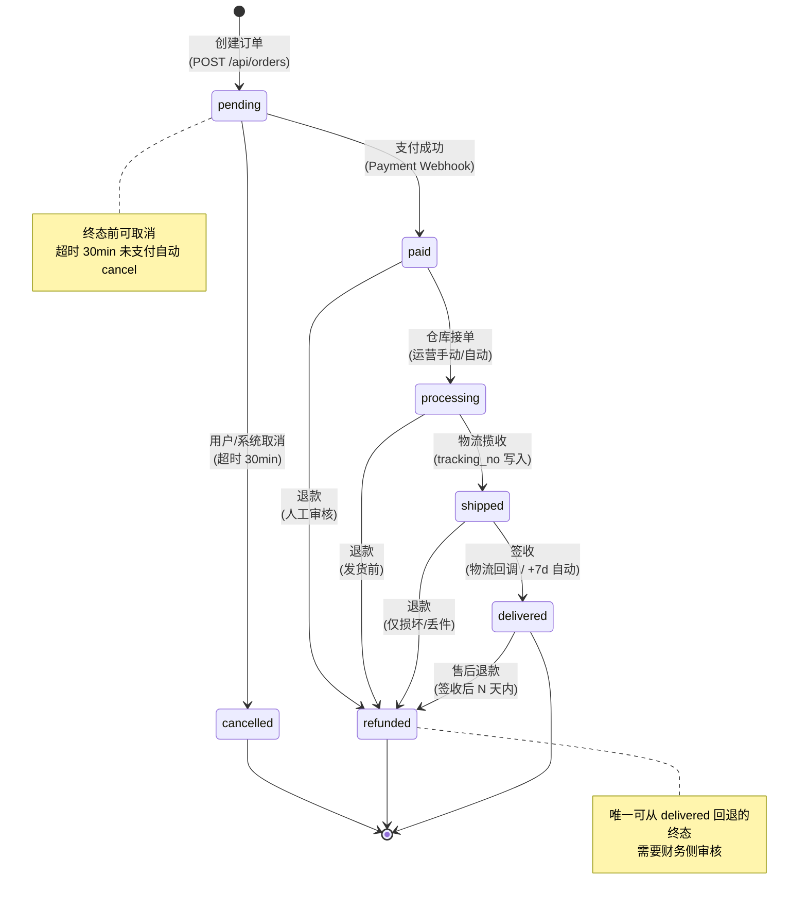
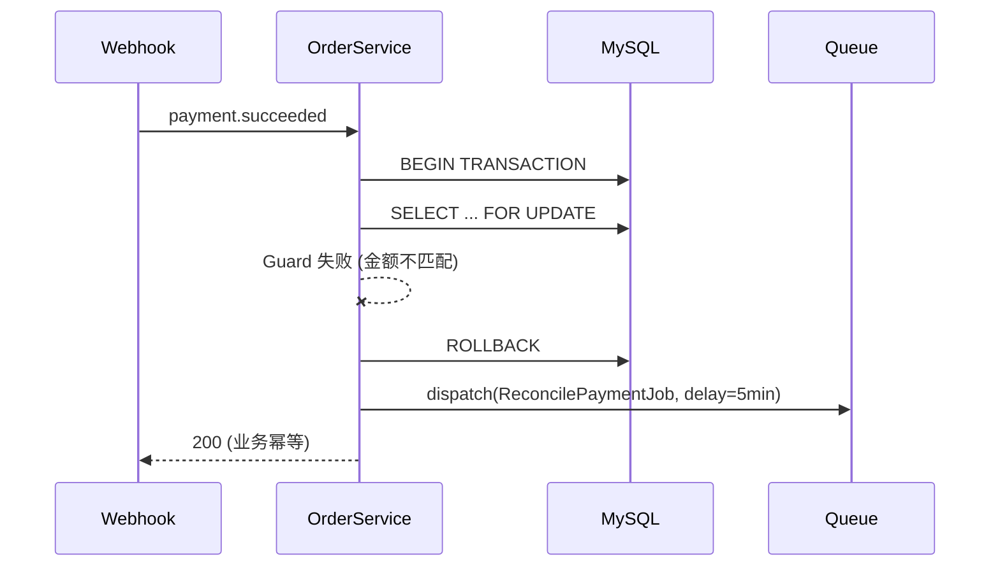
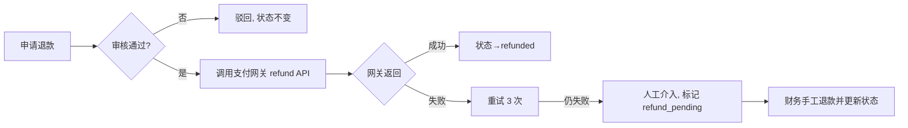
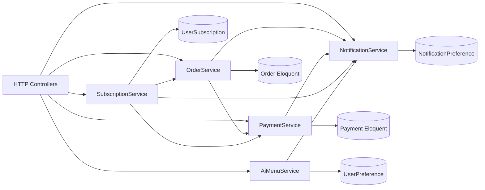

> **元信息**：创建人 architect-agent | 版本 v0.1 (Sprint 0) | 日期 2026-06-12
> **框架**：fdd-bmad-custom（Architect 阶段产物：Domain Logic → State Machine）
> **基线模型**：`App\Models\Order`（已存在 `status` 字段，类型 `string`，默认 `pending`）

# GreenBite 订单状态机（order-state-machine.md）

## 1. 状态总览



## 2. 状态枚举与定义

| 状态 | 含义 | 是否终态 | 触发进入的入口 |
|---|---|---|---|
| `pending` | 已下单待支付 | 否 | `POST /api/orders` 成功 |
| `paid` | 已支付待处理 | 否 | 支付 webhook 成功 |
| `processing` | 仓库处理中 | 否 | 运营接单 |
| `shipped` | 已发货运输中 | 否 | 物流揽收 |
| `delivered` | 已签收 | 是（可退款） | 签收回调 / +7d 自动 |
| `cancelled` | 已取消 | 是 | 用户取消 / 超时 |
| `refunded` | 已退款 | 是 | 任意阶段审核通过 |

## 3. 状态转移矩阵

| 源状态 | 目标状态 | 触发器（Trigger） | 守卫条件（Guard） | 回滚策略（Rollback） |
|---|---|---|---|---|
| `pending` | `paid` | Stripe/PayMe webhook `succeeded` | 1) 订单存在 2) 当前状态=`pending` 3) 支付金额 = 订单金额 4) 支付币种 = HKD | 释放预占库存（若已预占）并保留支付记录供对账 |
| `pending` | `cancelled` | 用户 `DELETE /api/orders/{id}` 或 30min 定时任务 | 1) 订单存在 2) 当前状态=`pending` 3) 无进行中支付 | 释放库存；如 webhook 后到则进入 `refund_required` 状态并触发自动退款 |
| `paid` | `processing` | 运营后台点击"接单" 或 自动调度 | 1) 库存已锁定 2) 地址校验通过 | 回退到 `paid`，记录审计日志 |
| `paid` | `refunded` | 财务审核通过 | 1) 支付成功未发货 2) 退款原因已记录 | 触发支付网关退款 API；状态机不再前进 |
| `processing` | `shipped` | 仓库系统写入 `tracking_no` | 1) `tracking_no` 合法 2) 物流商已对接 | 人工修正 `tracking_no`，不退回状态 |
| `processing` | `refunded` | 财务审核通过 | 1) 未发货 或 2) 用户同意拦截 | 同 `paid→refunded` |
| `shipped` | `delivered` | 物流 webhook `delivered` 或 +7d 无异常 | 1) 当前状态=`shipped` 2) 物流事件存在 | 维持 `shipped` 并告警，等待物流侧澄清 |
| `shipped` | `refunded` | 客服工单（仅丢件/严重损坏） | 1) 售后审核通过 2) 用户提供凭证 | 触发退款 + 物流侧索赔流程 |
| `delivered` | `refunded` | 售后工单 | 1) 签收 ≤ 7 天 2) 商品问题凭证齐全 | 触发退款 + 退货物流（可选） |

## 4. 守卫条件（Guard）详解

### 4.1 通用守卫

- **GUARD-G0 订单归属**：`user_id == auth()->id()` 或 `is_admin=true`
- **GUARD-G1 状态合法性**：当前状态必须是合法的源状态
- **GUARD-G2 幂等性**：相同 `transition_key`（如 `payment_intent_id`）在 5min 内重复请求直接返回当前状态

### 4.2 库存守卫

- **GUARD-I1 进入 `pending`**：库存预占（`stock -= quantity`，`reserved_stock += quantity`）
- **GUARD-I2 进入 `cancelled`/`refunded`（未发货）**：库存释放（`stock += quantity`，`reserved_stock -= quantity`）
- **GUARD-I3 进入 `shipped`**：库存从 `reserved_stock` 扣减（实物出库）

### 4.3 支付守卫

- **GUARD-P1 进入 `paid`**：`payments.status = succeeded` 且 `amount` 完全匹配
- **GUARD-P2 进入 `refunded`**：存在 `payment.provider_txn_id` 可用于调用退款 API
- **GUARD-P3 币种一致**：`payments.currency == 'HKD'` 且等于订单计价币种

## 5. 回滚策略（Rollback）

### 5.1 自动回滚（系统检测到状态转移失败）



### 5.2 手动回滚（运营介入）

| 场景 | 操作 | 数据修复 |
|---|---|---|
| `processing→shipped` 物流单号错误 | 修正 `tracking_no`，状态保持 `shipped` | 仅改字段，不改状态 |
| `shipped→delivered` 误触发 | 强制回退到 `shipped`（admin 权限） | 写 `audit_logs` |
| 任意→`cancelled` 误操作 | 强制回退到原状态（admin + 原因） | 写 `audit_logs` 并通知用户 |

### 5.3 退款回滚



## 6. 实现规范（Service 层签名）

```php
namespace App\Services;

use App\Models\Order;
use App\Enums\OrderStatus;

class OrderService
{
    /**
     * 唯一状态转移入口
     * @throws InvalidTransitionException
     * @throws GuardFailedException
     */
    public function transition(
        Order $order,
        OrderStatus $to,
        string $trigger,
        array $context = []
    ): Order;

    public function canTransition(Order $order, OrderStatus $to, string $trigger): bool;
    public function getAllowedTransitions(Order $order): array;
}
```

**不变量（Invariants）**

1. 状态字段只能由 `OrderService::transition()` 写入，其他位置只读
2. 每次转移必须写 `order_status_logs`（含 from/to/trigger/user_id/timestamp）
3. 终态（`cancelled`/`refunded`/`delivered` 超过 7 天）禁止再转移

## 7. 自动化与监控

| 任务 | 触发 | 行为 |
|---|---|---|
| `CancelExpiredOrdersJob` | 每 5min | 30min 未支付订单 → `cancelled` |
| `AutoDeliverOrdersJob` | 每日 02:00 | `shipped` 超 7 天无异常 → `delivered` |
| `ReconcilePaymentJob` | 5min 延迟 | 支付成功但订单未 `paid` → 重试 |
| 告警 | 实时 | 任何 `refunded` 转移触发企业微信/邮件通知财务 |

## 8. 测试要点（移交 qa-agent）

- ✅ 所有合法转移的 happy path
- ✅ 全部非法转移的拒绝（assert 抛 `InvalidTransitionException`）
- ✅ 库存守卫：并发扣减无超卖
- ✅ 幂等性：同一 webhook 重复调用 100 次仅一次状态变更
- ✅ 超时取消：模拟 30min+1s 状态变 `cancelled`
- ✅ 退款流程：未发货 / 已发货 / 已签收 三种路径
- ✅ 自动确认收货：7 天边界用例

---

## 附录 A：跨文档状态对照表（Cross-Document Status Reference）

> 用途：消除 order-state-machine.md / api-contract.md / er-diagram.md / prd-mvp.md 之间的状态口径分歧。
> 所有架构、API、ER、PRD 文档必须以本表为唯一真相源（Single Source of Truth）。

| 状态值 | 中文名 | 终态？ | SQL 默认值 | API 合法来源转移 | API 合法目标转移 | PRD 章节定位 |
|---|---|---|---|---|---|---|
| `pending` | 待支付 | 否 | `orders.status` DEFAULT | `[*]`（创建订单）| `paid`, `cancelled` | prd-mvp §4.3 订单生命周期 |
| `paid` | 已支付 | 否 | — | `pending` | `processing`, `refunded` | prd-mvp §4.3 |
| `processing` | 处理中 | 否 | — | `paid` | `shipped`, `refunded` | prd-mvp §4.3 |
| `shipped` | 已发货 | 否 | — | `processing` | `delivered`, `refunded` | prd-mvp §4.3 |
| `delivered` | 已签收 | 是（可退款）| — | `shipped` | `refunded` | prd-mvp §4.3 |
| `cancelled` | 已取消 | 是 | — | `pending` | （无）| prd-mvp §4.4 取消规则 |
| `refunded` | 已退款 | 是 | — | `paid`, `processing`, `shipped`, `delivered` | （无）| prd-mvp §4.5 退款规则 |

> **NEW-P1-01 决议（2026-06-12 Sprint 1 Day 2 站会）**：
> - `refund_required` 是 `pending → cancelled` 路径中发现的**内部 sentinel 状态**（webhook 晚到导致），**不入 7 态 SSOT**，不入 SQL CHECK 约束，不入 API 错误码。
> - 实现方式：在 `OrderStatusLog.context` JSON 字段记录 `{"refund_required": true}`，由 `PaymentService::onChargeRefunded` 检测后**异步**调用 `OrderService::transition` 走 `*→refunded` 路径。
> - 不修改 7 态枚举；保留当前 7 态 SSOT 稳定性。
> - 详见 §3 第 2 行 + §A.2 状态机不变量。

### A.1 字段值约束（er-diagram.md §2.6 `orders.status` 补充注释）

```sql
-- 建议在 Sprint 1 迁移中加 CHECK 约束（MySQL 8.0.16+）
ALTER TABLE orders
  ADD CONSTRAINT chk_orders_status
  CHECK (status IN ('pending','paid','processing','shipped','delivered','cancelled','refunded'));
```

### A.2 API 端点合法状态码引用（api-contract.md 引用本表）

- `POST /api/orders/{id}/pay` 触发 `pending → paid`：返回 `200` + `payment`；源状态非 `pending` 时返回 `422 BUSINESS_RULE`，错误明细 `allowed_from: ["pending"]`
- `DELETE /api/orders/{id}`（隐式取消）：源状态必须为 `pending`，否则 `409 CONFLICT`，明细 `allowed_from: ["pending"]`
- `POST /api/orders/{id}/refund`（财务后台）：源状态 ∈ `{paid, processing, shipped, delivered}`；状态机按本表执行；落 `order_status_logs`

### A.3 一致性校验规则

1. `api-contract.md` 中任何状态枚举值必须能在本表找到
2. `er-diagram.md` 中 `orders.status` 字段注释必须引用本附录
3. `prd-mvp.md` §4.3 状态流转图必须与本附录 1:1 对应
4. 任何状态机变更需先改本附录，再同步三方文档

---

## 附录 B：Service 依赖图与 Sprint 1 实施顺序

> 响应 reviewer-agent 改进建议，约束 Sprint 1 Day 1 的 Service 层落地路径。
> 当前仓库 `app/Services/` 仅含 `AiMenuService.php`（其余 4 个 Service 待新建）。



### B.1 Sprint 1 实施顺序（强建议）

1. **Day 1-2 `OrderService`**：状态机 + 守卫 + 转移日志（核心，其余服务依赖）
2. **Day 2-3 `PaymentService`**：支付网关编排 + 幂等键 + Webhook 入口（依赖 OrderService 的状态转移）
3. **Day 3-4 `SubscriptionService`**：订阅创建/取消/续期；履约任务调度（依赖 OrderService + PaymentService）
4. **Day 4 `AiMenuService` 增强**：当前 stub 已存在，补 Redis 缓存 + 限流 + 重试降级
5. **Day 5 `NotificationService`**：邮件 + 站内通知 + 队列消费者（最易并行）

### B.2 接口签名约束（仅声明，不实现）

```php
// app/Services/OrderService.php — 详见 order-state-machine.md §6
interface OrderServiceContract {
    public function transition(Order $order, OrderStatus $to, string $trigger, array $context = []): Order;
    public function canTransition(Order $order, OrderStatus $to, string $trigger): bool;
    public function getAllowedTransitions(Order $order): array;
}

// app/Services/PaymentService.php
interface PaymentServiceContract {
    public function createIntent(Order $order, string $provider, string $returnUrl): Payment;
    public function handleWebhook(string $provider, array $payload): void;  // Stripe/PayMe 统一入口
    public function refund(Payment $payment, int $amountHkd, string $reason): bool;
}

// app/Services/SubscriptionService.php
interface SubscriptionServiceContract {
    public function subscribe(User $user, SubscriptionPlan $plan, Carbon $startDate, bool $autoRenew = true): UserSubscription;
    public function cancel(UserSubscription $sub, string $reason): UserSubscription;
    public function fulfillDueSubscriptions(): int;  // 队列任务入口
}

// app/Services/AiMenuService.php（已存在，需增强）
interface AiMenuServiceContract {
    public function generateDailyMenu(array $preferences, array $availableProducts): string;
    public function regenerate(User $user, ?array $overridePreferences = null): DailyMenu;
}

// app/Services/NotificationService.php
interface NotificationServiceContract {
    public function sendOrderUpdate(Order $order, string $event): void;
    public function sendMenuReminder(User $user, DailyMenu $menu): void;
    public function sendSubscriptionRenewal(UserSubscription $sub): void;
}
```
