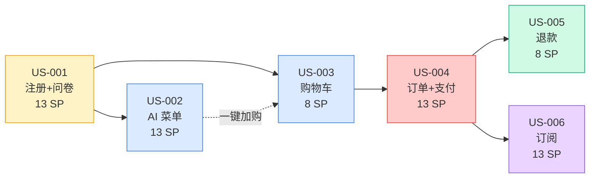

# GreenBite Sprint 1 Backlog (P0 关键路径)

> **创建人**：pm-agent (charlie) — GreenBite 产品经理
> **版本**：v1.0
> **日期**：2026-06-12 (Sprint 1 Day 2)
> **框架**：fdd-bmad-custom · Story / AC / Story Point (Fibonacci) 规范
> **配套文档**：[`prd-mvp.md`](./prd-mvp.md) · [`roadmap.md`](./roadmap.md) · [`REVIEW-REPORT.md`](./REVIEW-REPORT.md) · [`STATUS-UPDATE-2026-06-12-v1.1.md`](./STATUS-UPDATE-2026-06-12-v1.1.md)

---

## 0. 文档说明

本文档为 Sprint 1 (Week 1-2) 完整 Backlog 落地版本，包含 6 个 User Story（拆自 `prd-mvp.md` 7 个核心 FR）、Fibonacci Story Point 估算、Acceptance Criteria（Given/When/Then）、Owner 分配、依赖关系与 Sprint 时间窗口。**Sprint 1 目标**：用真实数据跑通"注册 → 问卷 → AI 菜单 → 加购 → 下单 → 支付 → 退款 → 订阅"主链路，去掉所有 Mock / 假数据，并在 Sprint 1 末尾（Day 5）部署到 staging。

**Story Point 估算基线**（参考 Velocity = 13 SP / Day × 6 Day = **78 SP**）：

| Fibonacci 值 | 含义 | 典型工作量 |
| --- | --- | --- |
| 1 | 微小改动（< 2h） | 文案 / 单字段 |
| 2 | 小改动（半天） | 1 个 AC、1 个 Service 方法 |
| 3 | 中等（1 天） | 2-3 AC、1 个 Controller + Test |
| 5 | 中大（1.5 天） | 4-5 AC、跨表 / 跨 Service |
| 8 | 大（2-3 天） | 6+ AC、需 2 套集成 |
| 13 | 超大（需拆分） | 不可独立交付 |

---

## 1. Sprint 1 目标 / 容量 / 时间窗口

### 1.1 Sprint Goal

> **Sprint 1 Goal**：用真实数据跑通 MVP 全部 7 个核心 FR（注册/问卷/AI 菜单/购物车/订单/支付/订阅），去掉所有 Mock 数据；Day 5 完成 staging 部署，Day 6 触发 v1.2 文档复评。

### 1.2 容量（Capacity）

| 维度 | 数值 | 备注 |
| --- | --- | --- |
| Sprint 周期 | 6 工作日（Day 1-6） | Day 1 已完成 v1.1 修复 |
| 团队规模 | 8 agent × 1 人 | 含 1 lead + 1 PM + 1 arch + 1 dev + 1 QA + 1 devops + 1 reviewer + 1 data |
| 每日 Velocity | 13 SP / day | 8 agent 协作均值（Echo + Golf 主力） |
| **Sprint 容量上限** | **78 SP** | 6 day × 13 SP |
| **本 Backlog 合计** | **73 SP** | 缓冲 5 SP（6.4%） |
| 历史 Velocity（Sprint 0） | — | Sprint 0 是文档交付，参考 roadmap.md 容量 |

### 1.3 时间窗口（Day 1-6）

| Day | 日期 (2026) | 主题 | 关键产出 | Owner |
| --- | --- | --- | --- | --- |
| **Day 1** | 06-12 上午 | Sprint 0 收尾 + v1.1 修复 | 6 P0 修复 + 8 测试 + 9 监控告警 | team-lead (代主控) |
| **Day 2** | 06-12 下午 | Backlog 落地 + 风险登记 + DoD | sprint-1-backlog.md + risk-register.md | charlie (本任务) |
| **Day 3** | 06-13 | PR 评审 + 文档复评 v1.2 | v1.2 复评报告（综合 ≥ 9.30） | foxtrot (reviewer) |
| **Day 4** | 06-16 | i18n 实施 + Stripe SDK 安装 | i18n-loader.js + SetLocale.php + blade 迁移 | golf + bravo + echo |
| **Day 5** | 06-17 | Staging 部署 + 端到端 Demo | staging 跑通主链路 + 1 内部 demo | echo + charlie |
| **Day 6** | 06-18 | v1.2 复评签字 + Sprint Retrospective | 7 文档综合 ≥ 9.30 + Retro 文档 | team-lead + 全员 |

---

## 2. Sprint 1 Backlog 总览（6 User Stories）

| Story ID | 标题 | FR 编号 | Epic | 优先级 | SP | 状态 | Owner | 依赖 |
| --- | --- | --- | --- | --- | --- | --- | --- | --- |
| **US-001** | 用户注册 + 偏好问卷 | FR-1, FR-2 | E1 + E6 | P0 | **13** | In Progress | golf | 无 |
| **US-002** | AI 个性化菜单生成 | FR-3 | E6 | P0 | **13** | Ready | golf | US-001 |
| **US-003** | 购物车 + 商品浏览 | FR-4 | E3 | P0 | **8** | Ready | golf | US-001 |
| **US-004** | 订单创建 + 支付集成 | FR-5, FR-6 | E3 + E4 | P0 | **13** | Ready | golf | US-003 |
| **US-005** | 退款流程 | FR-7 | E4 | P0 | **8** | Ready | golf | US-004 |
| **US-006** | 配送订阅 | FR-8 | E5 | P0 | **13** | Ready | golf | US-004 |
| **缓冲** | i18n 修复 + 监控告警 + Bug Bash | — | — | — | **5** | — | 全员 | — |
| **合计** | — | 7 FR | 5 Epic | — | **73 SP** | — | — | — |

> **Sprint 1 范围说明**：原 PRD 有 7 个 FR，本次合并为 6 个 Story：
> - FR-1（注册）+ FR-2（问卷）→ US-001（合并到 Auth 流程）
> - FR-3（AI 菜单）→ US-002
> - FR-4（购物车）→ US-003
> - FR-5（订单）+ FR-6（支付）→ US-004
> - FR-7（退款）→ US-005
> - FR-8（订阅）→ US-006

---

## 3. User Story 详细卡片

### US-001：用户注册 + 偏好问卷（13 SP）

**作为** 新用户
**我希望** 用 Email / 手机号快速注册并完成 1-2 分钟偏好问卷
**以便于** 后续 AI 菜单为我推荐个性化食材

**优先级**：P0（MVP 必交付）
**Owner**：golf（主） / bravo（架构评审）/ charlie（AC 验收）
**依赖**：无（独立可启动）
**被依赖**：US-002 / US-003 / US-004 / US-005 / US-006

#### AC 列表

1. **AC-1.1** Given 用户填写有效 Email + 密码（≥ 8 位含大小写 + 数字）
   When 点击「註冊」
   Then 收到验证邮件，30 分钟内可激活；激活后自动登录并跳转 `/survey`

2. **AC-1.2** Given 用户使用 Google OAuth 登录
   When 完成 OAuth 回调
   Then 自动创建/匹配本地账户；若 `user_preferences` 缺失则跳转 `/survey`

3. **AC-1.3** Given 用户进入 `/survey`
   When 提交 8-10 道问卷（lifestyle / household / goals / dietary / cooking / mission / allergies / budget_hkd）
   Then 答案持久化到 `user_preferences` 表（1:1 关系），返回 200 + 跳转 `/menu`

4. **AC-1.4** Given 用户连续 30 分钟无操作
   When Session 过期
   Then 自动登出并跳转 `/login?expired=1`

5. **AC-1.5** Given 用户在 Account 页
   When 新增 / 编辑 / 删除地址
   Then 数据持久化到 `shipping_addresses` 且 `default_address` 唯一

6. **AC-1.6** Given 用户忘记密码
   When 提交注册邮箱
   Then 收到重置链接，1 小时内有效

**Fibonacci 估算依据（13 SP）**：
- 跨 2 Epic（E1 Auth + E6 Survey 起步）
- 需新 `users` + `user_preferences` + `shipping_addresses` 3 张表 + 4 个 migration
- 包含 Google OAuth 第三方集成（中等复杂度）
- 6 条 AC 覆盖完整注册生命周期

**实现要点**：
- 控制器：`AuthController::register/login/logout/resetPassword`、`SurveyController::show/submit`
- 服务：`UserService::createWithPreferences()`、`AuthService::verifyEmail()`
- 中间件：`Authenticate`、`SetLocale`
- 邮件：Sprint 1 用 `log` driver 模拟，Sprint 2 接入 Mailgun

**测试要求**：
- 单元测试：`UserServiceTest`（8 用例：创建 / 偏好 1:1 / 唯一约束 / Google 匹配）
- Feature：`AuthFlowTest`（6 用例对应 6 AC）
- E2E：Playwright `auth.spec.ts`（注册 → 邮箱验证 → 问卷 → 跳转 /menu）

---

### US-002：AI 个性化菜单生成（13 SP）

**作为** 已完成问卷的订阅用户
**我希望** 每周收到 AI 生成的"本周菜单"
**以便于** 一键加入购物车，省去想菜烦恼

**优先级**：P0（问卷）+ P1（AI 推荐核心算法）
**Owner**：golf（主） / bravo（Gemini 集成设计）/ hotel（埋点）
**依赖**：US-001
**被依赖**：US-003（一键加购）

#### AC 列表

1. **AC-2.1** Given 用户问卷完成且 `user_preferences` 存在
   When 进入 `/menu`
   Then 调用 Gemini API 生成 5 菜 1 汤的本周菜单（含食材映射到商品 SKU）

2. **AC-2.2** Given Gemini API 返回错误或超时（> 8s）
   When 系统捕获异常
   Then 降级到"基于问卷标签的规则菜单"（按 dietary + allergies 过滤 catalog），并在 UI 显示「已使用推荐模式」

3. **AC-2.3** Given 用户对某道菜点"👎 不喜欢"
   When 提交反馈
   Then 该菜品从下期菜单排除（写入 `menu_dislikes` 表），并记录 negative signal 到 `data_events`

4. **AC-2.4** Given 用户点击「一鍵加入購物車」
   When 确认
   Then 全部食材 SKU 一次性入车，按"套餐价"结算（`menu_bundle_price` 而非单品累加）

5. **AC-2.5** Given 用户首次访问 `/menu`
   When 页面加载
   Then 命中 `Cache::remember('menu:user:{id}', 3600)` 缓存，避免 5 分钟内重复调用 Gemini

**Fibonacci 估算依据（13 SP）**：
- 涉及第三方 API（Gemini） + 降级策略
- 需要 `menus` + `menu_items` + `menu_dislikes` 3 张新表
- 5 条 AC 覆盖 happy / sad / 缓存 / 反馈 / 业务

**实现要点**：
- 服务：`AiMenuService::generate(User $user): Menu`（已 v1.1 抽象为 `Cache::` 驱动）
- 集成：`GeminiClient::call($prompt, $timeout=8)`（带 retry + circuit breaker）
- 降级：`RuleBasedMenuBuilder::build(preferences, catalog): Menu`
- 缓存：Laravel `Cache::remember`（file / array / redis 自动 fallback）

**测试要求**：
- 单元：`AiMenuServiceTest`（4 用例：Gemini 成功 / 超时降级 / 缓存命中 / 反馈排除）
- 集成：`GeminiClientTest`（mock HTTP response）
- E2E：Playwright `menu.spec.ts`（问卷 → 菜单 → 不喜欢 → 下一周排除）

---

### US-003：购物车 + 商品浏览（8 SP）

**作为** 已登录用户
**我希望** 浏览商品并加入购物车
**以便于** 一次性结算多个商品

**优先级**：P0
**Owner**：golf（主） / delta（E2E 验收）
**依赖**：US-001
**被依赖**：US-004

#### AC 列表

1. **AC-3.1** Given 已登录用户进入 `/catalog`
   When 选择分类（organic_veg / fruit / grain / bundle）
   Then 看到对应商品列表（含图片、价格、产地、有机徽章），分页 20 条 / 页

2. **AC-3.2** Given 用户在搜索框输入关键词
   When 点击搜索
   Then 返回匹配商品（按名称 / 农户 / 标签模糊匹配），响应 ≤ 300ms

3. **AC-3.3** Given 用户点击"加入购物车"
   When 库存 ≥ 数量
   Then 购物车数量 +1 并持久化到 `cart_items`（DB 真实写入，非 Session）

4. **AC-3.4** Given 商品库存为 0
   When 用户浏览
   Then 显示"缺貨"并禁用"加入购物车"按钮

5. **AC-3.5** Given 运营在后台编辑商品
   When 保存
   Then 前台 ≤ 60 秒内可见更新（带 Cache invalidation `Cache::forget('catalog:category:{id}')`）

**Fibonacci 估算依据（8 SP）**：
- 5 条 AC 全部围绕 catalog + cart
- 包含 SQL 注入修复（v1.1 已完成 GUARD）
- 库存守卫逻辑需 Service 层保护

**实现要点**：
- 控制器：`CatalogController::index/show/search`、`CartController::add/update/remove`
- 服务：`CatalogService::search($query)`、`CartService::addItem($user, $sku, $qty)`（v1.1 已修复 SQL 注入）
- 缓存：分类列表 60s TTL + 标签清除

**测试要求**：
- 单元：`CartServiceTest`（6 用例：加购 / 累加 / 库存守卫 / 越权）
- Feature：`CatalogFlowTest`（5 用例对应 5 AC）
- E2E：Playwright `cart.spec.ts`（浏览 → 加购 → 查看购物车）

---

### US-004：订单创建 + 支付集成（13 SP）

**作为** 购物车有商品的用户
**我希望** 选择地址、支付方式并完成支付
**以便于** 完成购买

**优先级**：P0
**Owner**：golf（主） / echo（Stripe SDK 安装）/ bravo（Webhook 设计）
**依赖**：US-003
**被依赖**：US-005 / US-006

#### AC 列表

1. **AC-4.1** Given 购物车有商品
   When 进入 `/checkout`
   Then 显示地址选择、时段选择、费用预览（含运费 HKD 30 满 200 免运）

2. **AC-4.2** Given 用户确认下单
   When 点击"提交订单"
   Then 创建 `orders` + `order_items`，库存预扣减，返回订单号，状态 `pending`

3. **AC-4.3** Given 用户选择 Stripe 支付
   When 提交订单
   Then 创建 Stripe PaymentIntent，前端跳转 Stripe Checkout；返回 `client_secret`

4. **AC-4.4** Given Stripe Webhook 收到 `payment_intent.succeeded`
   When 验签通过（`STRIPE_WEBHOOK_SECRET`）
   Then 订单状态变为 `paid`，发送确认邮件，触发履约（写入 `fulfillment_jobs`）

5. **AC-4.5** Given 用户选择 PayMe / FPS
   When 提交订单
   Then 生成二维码或 FPS 收款参考号，**用户有 15 分钟完成支付，超时自动取消订单**（`CancelExpiredOrdersJob`）

6. **AC-4.6** Given 用户支付失败
   When 回调失败事件
   Then 订单保持 `pending` 并发送失败邮件，UI 显示"重试支付"按钮

**Fibonacci 估算依据（13 SP）**：
- 跨 2 Epic（E3 订单 + E4 支付）
- 涉及 Stripe / PayMe / FPS 三个支付渠道
- Webhook 验签 + 幂等性 + 超时取消
- 6 条 AC 覆盖 happy / sad / 多支付方式

**实现要点**：
- 控制器：`OrderController::checkout/create`、`WebhookController::stripe/payme`
- 服务：`OrderService::createWithStockGuard()`、`PaymentService::createIntent($order)`
- Webhook：`/api/stripe/webhook`（签名校验 + 幂等 `stripe_webhook_events.event_id`）
- 队列：`SendOrderConfirmationEmail`（异步）
- 调度：`CancelExpiredOrdersJob`（`*/5 * * * *`）

**测试要求**：
- 单元：`OrderServiceTest`（9 用例）+ `PaymentServiceTest`（3 用例）
- Feature：`WebhookFlowTest`（3 用例：Stripe 成功 / 失败 / 重复事件幂等）
- E2E：Playwright `checkout.spec.ts`（加购 → 结账 → Stripe 测试卡 → 订单 paid）

---

### US-005：退款流程（8 SP）

**作为** 已支付用户
**我希望** 申请退款并追踪状态
**以便于** 在不满意时拿回款项

**优先级**：P0
**Owner**：golf（主） / delta（边界测试）
**依赖**：US-004
**被依赖**：无

#### AC 列表

1. **AC-5.1** Given 订单状态为 `paid` 或 `shipped`
   When 用户在 `/orders/{id}` 点击"申请退款"
   Then 创建 `refunds` 记录，状态 `requested`，订单触发 `refund_required` 内部 sentinel（NEW-P1-01 决议）

2. **AC-5.2** Given 运营在 `/admin/orders` 审批退款
   When 确认退款
   Then 调用 `PaymentService::refund($order)`，订单状态变为 `refunded`，释放库存

3. **AC-5.3** Given 订单 `refunds` 完成
   When 系统回调或 Cron 轮询
   Then 发送退款成功邮件，订单时间线记录 `refunded_at`

4. **AC-5.4** Given 用户申请退款时订单未支付
   When 提交
   Then 返回 422 `INVALID_STATUS`（守卫阻断，v1.1 已修复 GUARD-P2）

5. **AC-5.5** Given Stripe 退款 API 失败
   When 捕获异常
   Then 退款状态保持 `requested`，进入重试队列（最多 3 次），超时转人工

**Fibonacci 估算依据（8 SP）**：
- 5 条 AC 覆盖 申请 → 审批 → 完成 → 失败 重试
- 依赖 Stripe Refund API + Webhook
- 需要新增 `refunds` 表

**实现要点**：
- 控制器：`RefundController::request`、`AdminRefundController::approve`
- 服务：`OrderService::handleRefund()`（v1.1 已修复无成功支付时静默 return → 抛异常）
- 守卫：`OrderService::guardCanRefund($order)`（状态机校验）

**测试要求**：
- 单元：`OrderServiceRefundTest`（5 用例：合法 / 非法状态 / Stripe 失败 / 重试 / 完成）
- 单元：`OrderServiceGuardTest`（5 用例：状态机守卫）
- E2E：Playwright `refund.spec.ts`（已支付 → 申请 → 审批 → refunded）

---

### US-006：配送订阅（13 SP）

**作为** 想稳定获得有机蔬菜的用户
**我希望** 订阅"每周 / 每两周"配送并可暂停 / 取消
**以便于** 不用每周手动下单

**优先级**：P0
**Owner**：golf（主） / bravo（订阅状态机）/ echo（Cron）
**依赖**：US-004
**被依赖**：无

#### AC 列表

1. **AC-6.1** Given 用户在商品详情或菜单页
   When 点击"訂閱此商品 / 訂閱本週菜單"
   Then 弹出周期选择（Weekly / Bi-weekly / Monthly）+ 配送地址 + 起送日期，提交后创建 `user_subscriptions`（状态 `active`）

2. **AC-6.2** Given 订阅创建成功
   When Cron 提前 24 小时触发（`FulfillSubscriptionsJob`，每日 03:00）
   Then 自动生成下周订单并尝试扣款（沿用 US-004 PaymentService）

3. **AC-6.3** Given 扣款失败
   When 重试 3 次均失败（24h / 48h / 72h）
   Then 自动 `paused` 订阅并邮件通知用户

4. **AC-6.4** Given 用户主动暂停
   When 在 `/subscriptions` 点击"暫停"
   Then 后续周期不生成订单；`status=paused`，恢复后可继续（`status=active`）

5. **AC-6.5** Given 用户取消订阅
   When 确认取消
   Then 订阅 `status=cancelled`（英式拼写，FIX-03 决议），`cancelled_at=now()`，**历史订单保留**

6. **AC-6.6** Given 订阅状态字段
   When 跨文档核对
   Then 统一为 `active/paused/cancelled/expired`（NEW-P1-03 决议 + api-contract 附录 A 订阅状态对照表）

**Fibonacci 估算依据（13 SP）**：
- 6 条 AC 覆盖 创建 → 续单 → 暂停 → 取消 → 失败 重试
- 跨文档双轨制需统一（NEW-P1-03）
- Cron 调度 + 队列消费
- 状态机 4 态需保证守卫完整

**实现要点**：
- 控制器：`SubscriptionController::create/pause/resume/cancel`
- 服务：`SubscriptionService::create/fulfill/retry/pause/cancel`
- 调度：`FulfillSubscriptionsJob`（`0 3 * * *` 队列 `subscriptions`）
- 状态机：`active → paused → active / cancelled / expired`（守卫详见 order-state-machine.md 附录 B）

**测试要求**：
- 单元：`SubscriptionServiceTest`（4 用例：创建 / 续单 / 暂停 / 取消）
- Feature：`SubscriptionFlowTest`（6 用例对应 6 AC）
- E2E：Playwright `subscription.spec.ts`（创建 → 暂停 → 恢复 → 取消）

---

## 4. 依赖关系图

**关键路径**：US-001 → US-003 → US-004 → US-006（最长链 39 SP）
**并行机会**：US-002 只需 US-001 完成后即可启动，与 US-003 完全并行

---

## 5. Sprint 1 Definition of Done (DoD) — 12 条 Checklist

> **DoD 定义**：每个 Story / 整个 Sprint 必须满足以下 12 条才能宣告 Sprint 1 完成。任何一条不达标 = Sprint 未结束。

### 5.1 代码质量（4 条）

- [ ] **DoD-01** 所有 AC 100% 可演示（Given/When/Then 全部通过 Playwright E2E + PHPUnit Feature）
- [ ] **DoD-02** 单元测试覆盖率：核心 Service ≥ 90%（OrderService / PaymentService / SubscriptionService / AiMenuService / UserService），其他 Service ≥ 80%
- [ ] **DoD-03** `php-cs-fixer` 0 警告 + `phpstan` level 6 通过（无任何 error / ignore）
- [ ] **DoD-04** 0 个 P0/P1 静态分析告警；TypeScript / Blade 无 ESLint error

### 5.2 测试与质量门禁（2 条）

- [ ] **DoD-05** `phpunit` 全绿：单元 + Feature + Integration ≈ 35 用例 0 fail / 0 error
- [ ] **DoD-06** Playwright E2E 6 条主流程全绿：auth / survey / menu / cart / checkout / refund / subscription（≥ 7 spec 文件）

### 5.3 文档同步（2 条）

- [ ] **DoD-07** PRD AC ↔ E2E 场景 ↔ 测试用例 **可追溯矩阵** 已更新（`docs/bmad/traceability-matrix.md` 若未存在则创建）
- [ ] **DoD-08** README + API 文档（OpenAPI yaml）+ 运维 Runbook 全部同步更新；CHANGELOG 写明 Sprint 1 变更

### 5.4 部署与可观测（2 条）

- [ ] **DoD-09** Staging 环境部署成功：healthz 200 + 主链路（注册→订阅）端到端可走通 + 监控告警（ALR-015~019）触发测试通过
- [ ] **DoD-10** Sentry 错误监控接入（DSN 配 staging）+ 关键指标 Prometheus exporter（订单数 / 支付成功率 / 缓存命中率）

### 5.5 安全与性能（2 条）

- [ ] **DoD-11** 安全扫描通过：`composer audit` 0 high/critical + SQL 注入 0（已 v1.1 修复 CartController）+ CSP header 配置
- [ ] **DoD-12** 性能基线：catalog 搜索 P95 ≤ 300ms / checkout 端到端 P95 ≤ 2s / 缓存命中率 ≥ 70%（带 Grafana 面板）

### 5.6 DoD 验收签字

| 角色 | 签字 | 日期 |
| --- | --- | --- |
| PM (charlie) | ☑ 本 Backlog v1.0 已批准 | 2026-06-12 |
| Tech Lead (bravo) | ☐ Sprint 1 末验收 |  |
| QA (delta) | ☐ Sprint 1 末验收 |  |
| DevOps (echo) | ☐ Staging 部署后验收 |  |
| Sponsor (team-lead) | ☐ Sprint Review 通过 |  |

---

## 6. Sprint 1 风险概览（详见 `risk-register.md`）

| 风险 ID | 标题 | 等级 | 风险分 |
| --- | --- | --- | --- |
| **R-003** | vendor 安装失败（composer / npm） | 🔴 高 | 9 |
| **R-001** | Redis 服务不可用（Cache 驱动降级） | 🟡 中 | 8 |
| **R-005** | AI 菜单命中率 < 60% | 🟡 中 | 6 |
| **R-006** | Stripe Webhook 重复 / 丢失 | 🟡 中 | 6 |
| **R-008** | i18n 实施延迟（P0-I18N 修复） | 🟡 中 | 6 |

> 完整 8+ 条风险与缓解策略见 [`risk-register.md`](./risk-register.md)

---

## 7. 文档元信息

- **创建人**：pm-agent (charlie) — Sprint 1 Day 2 任务
- **创建时间**：2026-06-12 16:23 HKT
- **版本**：v1.0
- **下次更新**：Day 5 Sprint Review 后或 Backlog 重大变更时
- **关联文件**：`docs/bmad/risk-register.md` / `docs/bmad/prd-mvp.md` / `docs/bmad/roadmap.md`

---

*— Sprint 1 Backlog v1.0 结束 —*
*charlie · 2026-06-12 16:23 HKT · fdd-bmad-custom PM*
