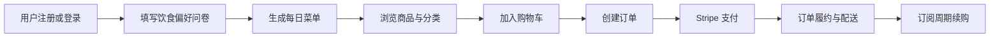
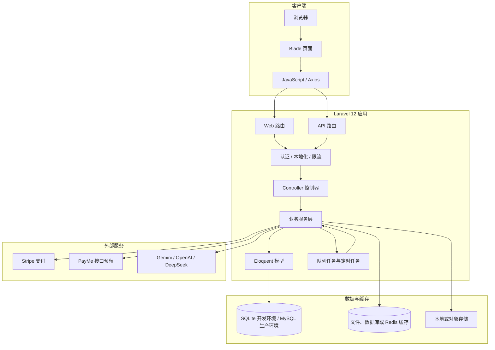
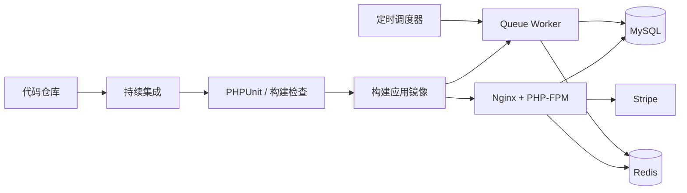

# GreenBite 技术架构

## 1. 系统定位

GreenBite（项目名 FreshToday-AI）是面向香港本地市场的有机农产品电商平台。系统以商品浏览、购物车、订单支付和订阅配送为基础，同时结合饮食偏好问卷与每日菜单功能，为用户提供从饮食偏好收集、菜单生成到商品购买的完整服务流程。

系统的核心业务链路如下：

平台采用 Laravel 单体应用架构。页面渲染、接口服务、业务逻辑、数据访问和后台管理功能统一部署在同一应用中，适合当前项目规模，也便于后续围绕订单、支付和菜单服务逐步拆分。

## 2. 总体系统架构

系统采用浏览器、Laravel 应用、关系型数据库和外部服务组成的分层结构。用户通过浏览器访问 Blade 页面，也可以通过 JSON API 完成购物车、订单、菜单和订阅等交互；所有业务请求均由 Laravel 统一处理。

请求进入系统后，先经过认证、权限、本地化和限流等中间件，再由控制器完成参数接收和响应组织。控制器不直接处理复杂业务，订单状态变更、库存扣减、支付确认、订阅履约和菜单生成等逻辑统一放在服务层，模型主要负责数据关系和持久化。

## 3. 技术栈

| 层次 | 技术选型 | 主要用途 |
|---|---|---|
| 服务端框架 | Laravel 12 | 路由、中间件、控制器、队列和任务调度 |
| 运行环境 | PHP 8.2 及以上 | 执行业务代码与框架组件 |
| 页面层 | Blade、Tailwind CSS 4、原生 JavaScript | 服务端渲染页面和局部交互 |
| 前端构建 | Vite、Axios | 静态资源构建和 API 请求 |
| 数据库 | SQLite / MySQL 8.0 | 用户、商品、订单、支付及订阅数据存储 |
| 认证 | Laravel Sanctum | SPA Cookie 会话和 API Token 认证 |
| 缓存与队列 | 文件、数据库或 Redis | 菜单缓存、限流计数、会话及异步任务 |
| 支付 | Stripe | 在线支付、支付状态回调和退款流程 |
| AI 菜单 | Gemini、OpenAI、DeepSeek | 根据饮食偏好生成每日菜单 |
| 部署 | Docker、Nginx、PHP-FPM 或 Laravel Forge | 应用发布与生产运行 |
| 质量保障 | PHPUnit、GitHub Actions | 单元测试、功能测试和持续集成 |

开发环境默认使用 SQLite，降低本地启动成本；生产环境使用 MySQL 8.0，保证订单、支付和库存等关键业务具备可靠的事务能力。缓存和队列驱动通过环境变量配置，系统可以在开发阶段使用文件或数据库驱动，在生产环境切换到 Redis。

## 4. 应用分层与模块划分

### 4.1 表现层

表现层由 Blade 页面和 API 接口组成。Web 页面包括首页、商品目录、登录、购物车、结账、订单、订阅、用户中心和后台商品管理；API 则提供用户认证、商品查询、购物车操作、订单创建、支付发起、问卷提交、菜单生成和订阅管理等能力。

浏览器端使用 Tailwind CSS 组织页面样式，使用原生 JavaScript 和 Axios 完成局部数据刷新，不额外引入大型前端框架。这样既保留了服务端渲染的加载速度，也能满足购物车和结账页面的交互需求。

### 4.2 业务服务层

业务服务层是系统的核心，主要包括以下模块：

- `OrderService`：负责订单创建、库存预占、优惠券使用、订单状态流转、发货、收货和退款。
- `PaymentService`：负责支付记录、支付状态校验和退款处理，并与订单状态机协同工作。
- `SubscriptionService`：负责订阅计划、用户订阅关系和周期履约。
- `AiMenuService`：负责读取用户偏好、生成每日菜单、缓存结果和失败降级。
- `NotificationService`：为订单、支付和后续营销通知提供统一的通知入口。

服务层通过事务、模型锁和业务守卫保护关键操作，避免控制器或外部回调直接修改订单状态。

### 4.3 数据访问层

系统使用 Eloquent ORM 访问数据库。模型覆盖用户、用户偏好、商品、分类、购物车、订单、订单明细、支付、订阅、优惠券、每日菜单、通知偏好和订单状态日志等实体。数据库结构通过 Laravel Migration 管理，测试数据通过 Factory 和 Seeder 生成。

订单状态采用固定状态机管理，状态包括待支付、已支付、处理中、已发货、已送达、已取消和已退款。所有状态变更必须经过 `OrderService::transition()`，并写入订单状态日志，保证库存、支付、退款和审计信息同步更新。

## 5. 核心业务模块实现

### 5.1 用户与饮食偏好

用户通过 Sanctum 完成登录认证。登录后的用户可以提交饮食目的、饮食习惯、目标、烹饪能力和预算等信息，系统将其保存到用户偏好表中。菜单生成前会检查用户是否已经完成问卷，未完成时不进入生成流程，并返回明确的业务提示。

### 5.2 商品、分类与购物车

商品模块提供公开的商品列表、分类筛选和商品详情查询。后台管理员可以创建和编辑商品，商品权限由认证和产品策略共同控制。购物车以用户为边界保存商品和数量，修改数量时再次校验商品状态和库存，避免展示库存与实际可售库存不一致。

### 5.3 订单与库存

订单创建在数据库事务中完成。系统先锁定商品记录，检查库存和购买数量，再扣减库存并写入订单及订单明细；如果订单创建失败，事务会自动回滚。订单取消或退款时，系统通过同一套业务服务释放库存，避免重复释放或漏释放。

订单状态转换包含状态合法性检查、订单归属检查、支付金额校验和货币校验。并发场景下使用 `lockForUpdate` 保护订单和商品记录，确保重复支付回调、重复退款和同时下单不会破坏订单数据。

### 5.4 支付与 Webhook

系统当前以 Stripe 作为主要支付渠道。用户在结账页面创建订单并发起支付，支付服务记录支付流水；Stripe 完成支付后向系统发送 Webhook，系统验证签名，确认事件未被处理过，再根据支付结果推动订单状态变化。

Webhook 事件通过 `provider_event_id` 唯一约束实现幂等处理。即使支付平台重复发送同一事件，也不会重复创建支付记录、重复推进订单状态或重复执行退款。PayMe 接口已经预留路由和服务边界，后续可在不改变订单核心流程的情况下补充具体签名和回调逻辑。

### 5.5 每日菜单生成

每日菜单服务按照“缓存—数据库—外部 Provider—本地模板”的顺序执行。当天菜单优先从缓存读取；缓存未命中时读取数据库；数据库没有记录时才调用配置好的 AI Provider。外部服务调用失败、超时或未配置密钥时，系统使用本地菜单模板返回结果，保证用户仍能继续使用平台的商品和订单功能。

AI Provider 通过统一接口和工厂类接入，支持 Gemini、OpenAI 和 DeepSeek。系统可以通过环境变量显式指定 Provider，也可以按照配置顺序自动选择已配置的 Provider。每日菜单缓存 24 小时，用户每天最多重新生成 3 次，避免重复调用外部服务并控制调用成本。

### 5.6 订阅与后台任务

订阅功能以订阅计划和用户订阅关系为基础，记录订阅周期、状态和下一次履约时间。周期履约、过期订单取消、自动配送和每日菜单生成等工作通过 Laravel Job 和 Scheduler 执行，业务请求只负责创建任务或记录状态，不长时间占用用户请求。

## 6. 数据安全与可靠性设计

系统通过 HTTPS 保护浏览器与服务端之间的传输，使用 Sanctum 进行用户身份认证。登录、注册、Webhook 和高风险接口配置限流；输入参数经过 Laravel 验证，数据库访问使用 Eloquent 和参数绑定，降低 SQL 注入风险；页面输出遵循 Blade 转义规则，减少 XSS 风险。

支付密钥、AI 密钥和数据库密码只通过环境变量注入，不写入代码仓库。订单、支付、退款和状态日志分开保存，便于对账和问题追踪。生产环境应配置数据库自动备份、错误日志集中保存和敏感字段访问控制，并定期检查 Webhook 失败、队列积压、库存异常和订单状态异常。

## 7. 部署与运行

应用支持 Docker 部署，也可以采用 Nginx、PHP-FPM、队列 Worker 和定时调度器组成的常规 Laravel 部署方式。生产环境建议将 Web 请求、队列消费和定时调度分开运行：Web 进程负责页面和 API，Worker 负责订单、订阅和菜单任务，Scheduler 负责按时间触发任务。

部署时先安装 Composer 和前端依赖，构建 Vite 静态资源，再执行数据库迁移和配置缓存。版本发布后需要检查应用健康状态、数据库连接、队列 Worker、定时任务和 Stripe Webhook。生产环境应保留上一版本，以便在应用异常时快速回滚；数据库结构变更采用向前兼容的方式，避免代码版本切换期间出现字段缺失。

## 8. 后续演进方向

当前单体架构可以满足 MVP 和早期运营阶段的功能需求。随着商品数量、订单量和用户规模增长，可以优先从以下方向演进：将图片和商品媒体迁移到对象存储与 CDN；将队列、缓存和会话统一迁移到 Redis；为订单、支付 Webhook 和 AI 菜单增加更完整的监控指标；将 AI 菜单生成拆分为独立服务；在订单量达到一定规模后，再考虑拆分支付、订阅和通知模块。

推荐系统也可以在现有每日菜单和用户偏好数据的基础上逐步完善，例如加入历史购买、菜单点击和商品转化数据。但在业务规模较小时，优先保证库存、支付、订单状态和订阅履约的准确性，比过早引入复杂推荐模型更重要。

总体而言，GreenBite 的技术架构以 Laravel 单体应用为基础，通过服务层划分业务边界，以 MySQL 保证交易数据一致性，以缓存和队列处理性能与异步任务，以 Provider 抽象和降级机制控制菜单生成的不确定性。该架构能够覆盖现阶段的核心业务，也为后续的性能优化、服务拆分和运营能力建设保留了清晰的扩展路径。
